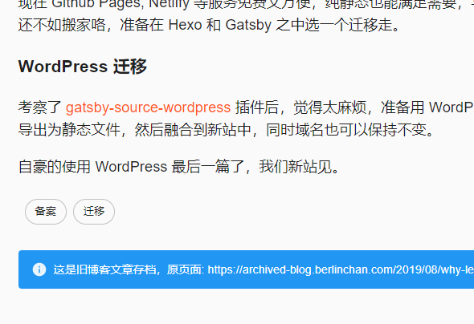
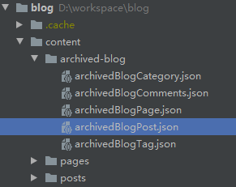

<!-- endExcerpt -->

之前[为什么弃用WordPress并搬离阿里云](https://www.berlinchan.com/2019/08/why-leave-wordpress-and-aliyun/)中记的三点问题，
导致我决定迁移网站，弃用 Wordpress 的替代方案比较过 Jekyll/Hexo/Gatsby 三种框架。

- Jekyll，虽然是 GitHub Pages 官方支持的静态内容生成框架，但是我对 Ruby 语言不熟悉，所以首先排除。
- Hexo，上手容易有很多中文教程，但是文档写的不好，很多 API 说明不容易找到，不过 StackOverflow 上有很多热心人的补充。
    我试着用 Hexo 搭建[旧站博物馆](https://museum.berlinchan.com)，期间不喜欢主题中的模板引擎语法。
- Gatsby，是我迁移的选择。基于 React 优雅的组件构建，既能轻松搭上 SPA PWA 的现代化便车，也顺便在迁移中感受一下 GraphQL。

## 迁移工作
迁移的前提是**保证旧博客内容访问正常**，最后方案可分为两部分工作：

1. 脱离 Wordpress 程序，将旧文章生成为静态文件
2. 搭建新站，将旧文章保持原来路径的导入到新站

第一步脱离 Wordpress 程序，我用插件 WP2Static 将整站生成为静态 HTML 文件，注意生成前先将评论和不必要的插件关掉，
我的阿里云虚主机全天处于半死的状态，所以我将文件和数据库放到本地的 WAMP 环境中运行，
调大内存后，剩下工作这个插件做的已经很好了，有时候生成错误多试几次就好。

生成的静态 HTML 页面中有很多冗余的 SVG 图标数据，还有其他冗余的标签，可以批处理精简掉，
另外批量替换 URL 为存档地址，最后部署到 GitHub Pages。

## 基于 Gatsby 搭建新站
Gatsby 有很多 [starter 项目](https://www.gatsbyjs.org/starters/)，最初我用[gatsby-starter-lumen](https://github.com/alxshelepenok/gatsby-starter-lumen)作为 starter 开始的，
它集成了我不准备使用的 Netlify CMS 功能，因为之前建[旧站博物馆](https://museum.berlinchan.com)时候，
发现 Netlify 的 CDN 加速，在大陆访问反而还没有 GitHub Pages 本身快，所以决定不使用 Netlify 服务。

还有 Flow 和 Jest 也被我移除。起初想多用用测试框架和静态检查的，但发现频繁变动中写这些测试和检查太过繁琐。

UI 方案引入 [Material-UI](https://material-ui.com/)进行改造，并形成最终的样子。

## 将旧文章导入到 Gatsby 新站
得益于 Gatsby 的

> Pull data from anywhere

Wordpress 的旧文章很容易接入 GraphQL 并为生成器提供数据，使用 `gatsby-source-wordpress` 就行了，
安装和配置见官方教程 [WordPress Source Plugin Tutorial](https://www.gatsbyjs.org/tutorial/wordpress-source-plugin-tutorial/)。

然后我用接入的 Wordpress 旧站数据生成了目录及文章，并在文章中添加指向原存档旧页面的链接，像下图这样：

但这样接入 Wordpress 数据有个问题，每次更新生成网站都需要运行 Wordpress REST API。我的解决办法是将 GraphQL 查询结果存为 JSON 文件，
而后用 `gatsby-transformer-json` 接入到 GraphQL，就可以完全脱离开 Wordpress 运行了。我存为的 JSON 文件如下图：

## 添加评论功能
考虑过 Gitalk/Disqus/多说/Firebase/野狗，Firebase/Disqus 大陆用不了，Gitalk 只能用 GitHub 账号登陆，
多说已经无法说🤐，野狗已停止运营。

权衡后还是选择业界领先的 Disqus，反正这博客站访问的人少🤣

## 其它的尝试
最开始尝试直接将 WP2Static 生成的静态 HTML 页放到 Gatsby 项目的 `/static` 目录下，因为该目录的内容会不经处理的直接拷贝至生成目录。
然后用新站 Gatsby 生成目录指向这些旧文章，但这些链接就不在 SPA 的治下，前端路由会 404 找不到页面。

或者使用 `gatsby-plugin-meta-redirect` `gatsby-plugin-client-side-redirect` 生成一个 redirect 的空页面用于重定向。
但这样既然生成“空页面”了，还不如生成一篇完整的文章页，还能利用上 PWA 的 pre-fetch 特性。

我在这些尝试上费了很多时间。

## GitHub 上好用的工具
Gatsby 是一个快速发展中的新框架，将代码托管在 GitHub 上时，用市场中的 [Dependabot Preview](https://github.com/marketplace/dependabot-preview)
或者 [Renovate](https://github.com/marketplace/renovate)，能很好帮我们更新 npm 依赖。
[使用 ImgBot 自动为 Github Pages 项目优化图片](https://www.berlinchan.com/2019/08/imgBot-optimize-image-asset-for-github-pages-project)，
还有持续集成工具 [Travis CI](https://github.com/marketplace/travis-ci)。

这些市场中的工具设计的简单易用，自动化的工作为我节省了大量时间。

## 总结
Gatsby 是个非常不错的框架，框架自身和插件轻松实现 SPA PWA 特性，静态页先天的 SEO 优化。
我的迁移工作大概用了一个月业余时间，新站部署在 GitHub Pages 上，用阿里云 CDN 加速，访问速度体验较以前快了不少，Lighthouse 评分如下，并还可进一步改善：

