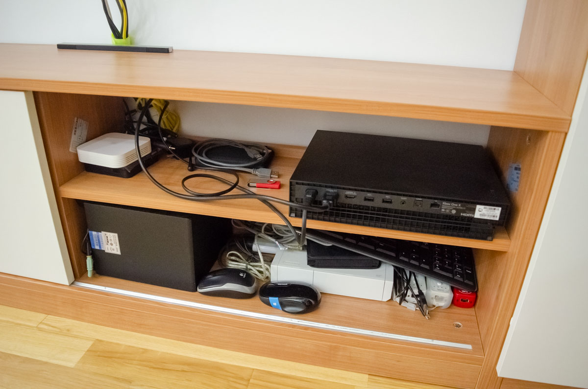

<!-- endExcerpt -->

## Xbox One X 开箱
`video: https://www.youtube.com/embed/MUpySG1rE8g`

## 一年使用情况
其实我也不完全算主机新手，之前有台 Nintendo Wii，现在偶尔朋友们来还会拿出来玩马里奥赛车，而掌机则是陪伴我整个学生时代，
不过那都是以前了，所以"新手"针对的是"次世代主机"。

购买后一年时间里，平均每周约玩3小时，算比较少的。有时候很久不玩，但抓住机会了，哼哼，可一日茶饭不思。

我对于游戏的视听效果要求较高，所以目前最强性能的 Xbox One X 是我的首选，而下一代 Scarlett 预计仍将领跑主机性能。

我购买的游戏都是数字版，比光盘便宜容易购买，购买的游戏从 Store 安装也很容易，用支付宝在 Store 购买游戏很方便。

## 满意的方面
- 手柄按键、握感非常好，再拿 PS4 手柄感觉像塑料玩具
- 大量 4K 游戏支持，不断更新的重制游戏，次世代画质。像刺客信条、古墓丽影、战地这类游戏，看画面都是享受
- 国行转区为港版，通玩各种游戏
- Store 中可用支付宝购买，且常有游戏大作折扣，我的游戏都是折扣时候买的
- 向下兼容 Xbox 360，怀念老游戏的有福了，不过我没用到过

## 目前为止购买的游戏
|       游戏      |       评价      |
|----------------|----------------|
| Power Star Golf    |   主机商家赠送，兑换后再未玩过  |
| 决战喵星          |   主机商家赠送，兑换后再未玩过   |
| Forza Horizon 4   |   买的第一个游戏，体验 Xbox 必玩，较少玩    |
| Assassin Creed - Unity    |   冲这个系列买的主机，主线通关，期间看了不少法国大革命历史   |
| Assassin Creed - Origins  |   主线通关，期间看了些托勒密王朝末期的历史 |
| Halo - The Master Chief Collection    |   冲着名气买的，玩了一点    |
| Halo 5: Guardians    |   冲着名气买的，玩了一点 |
| Rise of the Tomb Raider - 20 year celebration    |   之前电脑上拖不动，中文语音业界良心，正玩主线过半    |
| Ori and the Blind Forest: Definitive Edition    |   网友推荐，较少玩 |
| Battle Field 1    |   主线剧情通关，了解一战的好材料    |
| Battle Field 5    |   主线过半，了解二战的好材料  |
| Metro 2033 Redux    |   独特的 RPG FPS，喜欢小说的末日废土故事背景，主线通关   |
| Metro Last Light Redux    |   主线通关   |
| Hellblade: Senua's sacrifice    |   Game Pass 试用时玩的，被未修复的 [torch bug 卡住剧情](https://www.youtube.com/watch?v=PZsMbxvDjLQ)玩不下去。很多感受[单独写了篇文章](/2019/09/hellblade-senuas-sacrifice)   |
| Overcooked    |   在朋友 Switch 上玩了的，准备再买个手柄来和女朋友一起玩    |

## 值得关注的
- [攻壳Gamker唯一官方频道](https://www.youtube.com/channel/UCLgGLSFMZQB8c0WGcwE49Gw)，有很多对游戏的深刻解读
- [游研社YYSTV](https://www.youtube.com/channel/UCnq0zNFkSa8YFc3f1-7Q3mg)，有很多对游戏的深刻解读
- [游戏早知道](http://www.yxzzd.com/)，最新折扣第一时间知晓，一边玩游戏一边捂好钱包，经常看到小编在凌晨发微信文章

## Xbox 近况照片

我把 Xbox 塞到电视柜里，平时电视柜移门都关着在，我不喜欢灰尘多。
但是我电视柜不够深，Xbox 正面朝里放，下半部分凹进去的正好贴在柜子后板，才能关上门。

中间红色是买家给的换区U盘，128MB的U盘，现在这么小的很少见呢！下面白色是 Wii，偶尔还玩一玩。
