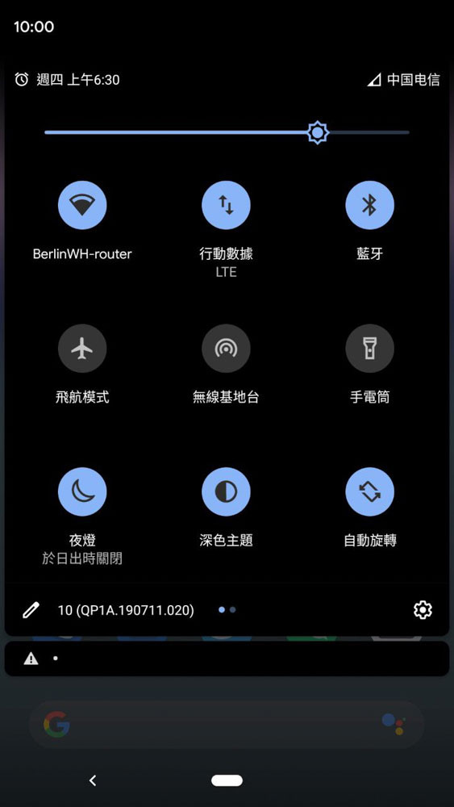

<!-- endExcerpt -->

## 不以甜点命名的版本
我的 Pixel 欧版今天中午收到了 [Android 10 的 OTA 推送](https://cn.engadget.com/2019/09/03/android-10-official-release-google-pixels/)，这是首个不以甜点命名的安卓版本，以免"棉花糖"、"棒棒糖"之类的命名方式让人无法区分版本先后，[Android 10结束了Google甜点命名的传统](https://zhuanlan.zhihu.com/p/79546951)。今年也是 Android 10周年哦。

## 更新
晚上回家后直接点开始更新，下载安装一切顺利。由于这是个完整的系统更新，会将我之前刷的 TWRP、modem 覆盖，为安全起见我先用 TWRP 备份数据。备份虽然后面没用到，但也很必要。

更新完后果然 电信4G 无连接了，但是打电话可以。于是我尝试按照之前网友分享的 Android 9 破解方法破解之。

## 破解电信4G
破解的方法见 Gfan 帖子：[傻瓜都会超简单的破解方法](http://bbs.gfan.com/android-9531535-1-1.html)，屡试不爽直接成功了。

以前的破解还参考过这篇：[Google Pixel android 9 破解电信4G](https://tuzhao.org/article/49)

## 体验
新版加入的黑暗主题

Google Photos APP 中已经自动适配的黑色主题，但是 Gmail 却还没有，微信同样也没有，各厂商应该会逐渐跟进软件的更新

其他改变包括更细致的权限设置、手势导航等暂时未体验到。还有低功耗蓝牙传输等估计也不会用上了，毕竟 Pixel 老矣，省电流畅才是我看中的。

## 问题
之后按照 [TWRP官网](https://twrp.me/google/googlepixel.html)安装了 3.3.0-0，
但备份时会报错 `Failed to mount /system` `Failed to mount /vender`，暂时没有研究到底怎么回事。

