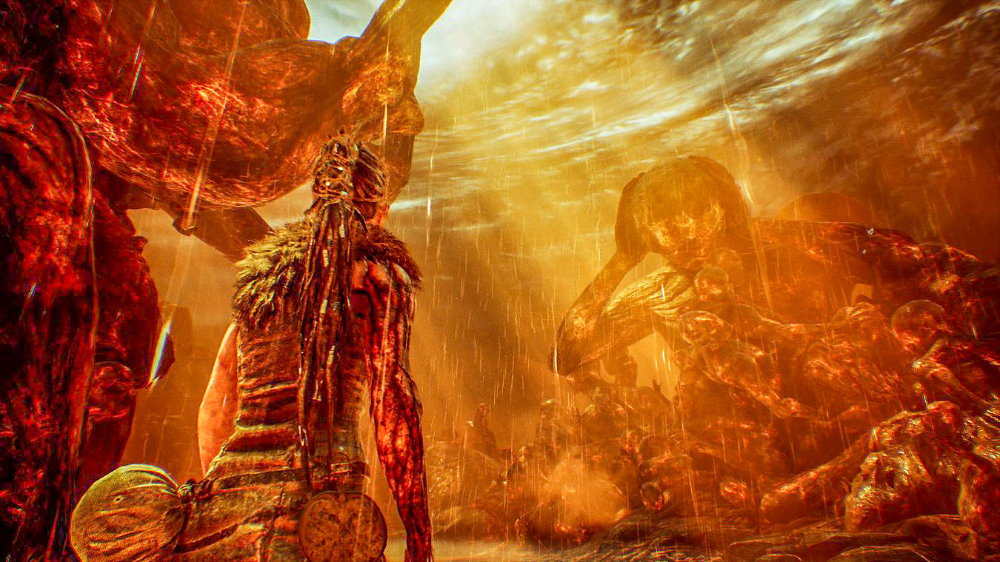
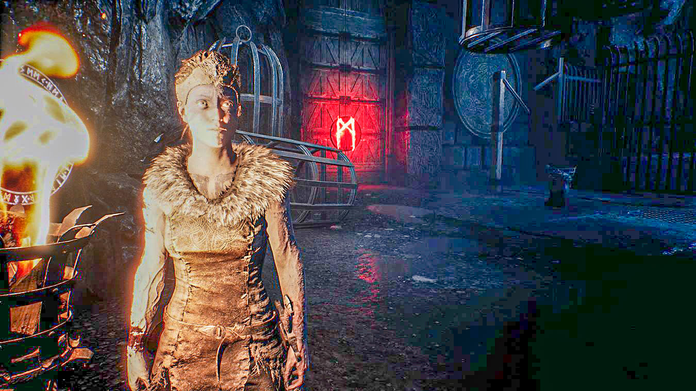

<!-- endExcerpt -->

## 初次印象
初次在 [Unreal Engine 的运动捕捉实时渲染演示](https://youtu.be/JbQSpfWUs4I?t=273)上见过，但没注意到是这个游戏。
因为之前对[渲染和运动捕捉研究](/2015/04/memo-of-qq-april-fool-fun/)过一点，所以对整个系统的实时性和画面效果留下很深印象。

后来[买 Xbox](/2019/08/talk-about-xbox-1x-after-1-year) 了试用 Game Pass 时候又看到，于是开始深入体验这款游戏。
游戏环境氛围音效动画非常棒，带耳机听[萦绕在主角脑海的耳语](https://www.hellblade.com/development-diary-24-hearing-voices/)都会有高潮。
喜欢凯尔特、北欧神话背景世界观的独特风格。

画面氛围与主角 Senua 分裂人格而萦绕的多个耳语声音，让我深深体会到她的迷惑、绝望和痛苦，而跟随剧情的推进却又无不透露出她的坚强、执着和勇敢。
进入上图那个场景时被震撼到了。

## 背景历史与文化
游戏故事背景来自于凯尔特、北欧历史与神话，这个看[“就知道玩游戏”的解读视频](https://www.youtube.com/watch?v=KQUwYYS4QyE)说的很好，
特别是对游戏结局 Senua 与 海拉，到底是谁杀死谁的解读独到且深刻，我很赞同这个解读。对剧情的截然不同解读，和游戏标题 Hellblade 细想耐人寻味。

像我这种没法通关的人，只好看这个解读来“云通关”了。 

## Bug 卡住剧情

在黑暗恶魔的侵袭下，我一路乱冲，从一处木板桥上掉下去，掉落的过程中（我猜掉落有2秒钟）我想估计是死了，结果掉到这里。
没有火把，无法解开这个门的谜题，无限循环卡死在这里了。

看别人视频，这里应该是在洞口点燃火把，然后靠火光的庇护再往前的。我是被黑暗恶魔侵袭下，只想着快点冲没注意到这个点火处，结果慌乱之中就冲掉下去了。

这有一段 [torch bug 卡住剧情](https://www.youtube.com/watch?v=PZsMbxvDjLQ)的演示视频。

忍者理论不应该遗留这种问题啊，倒霉还让我给碰上了!
