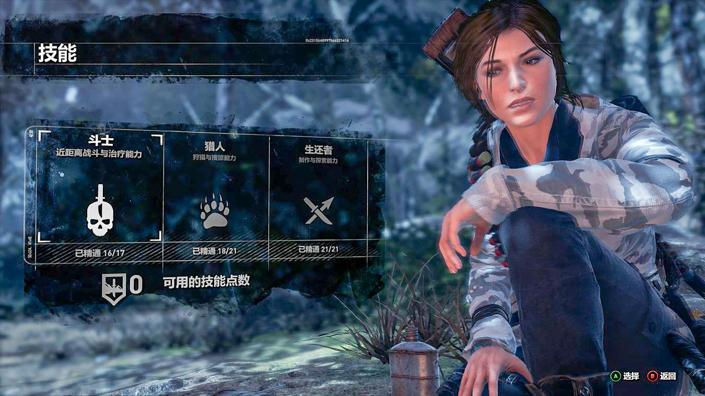
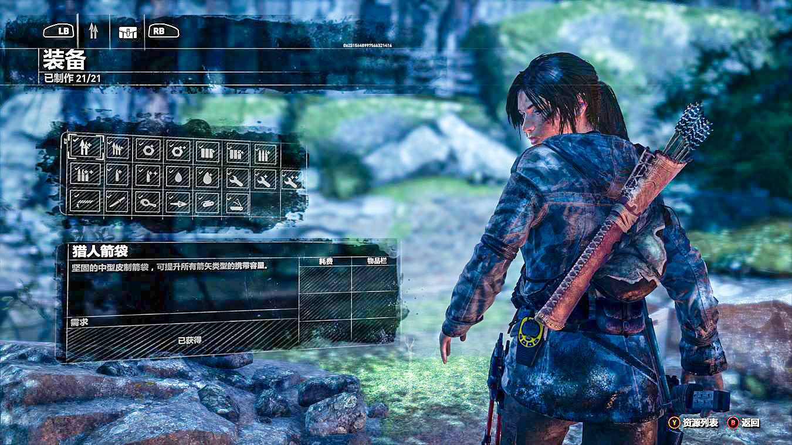
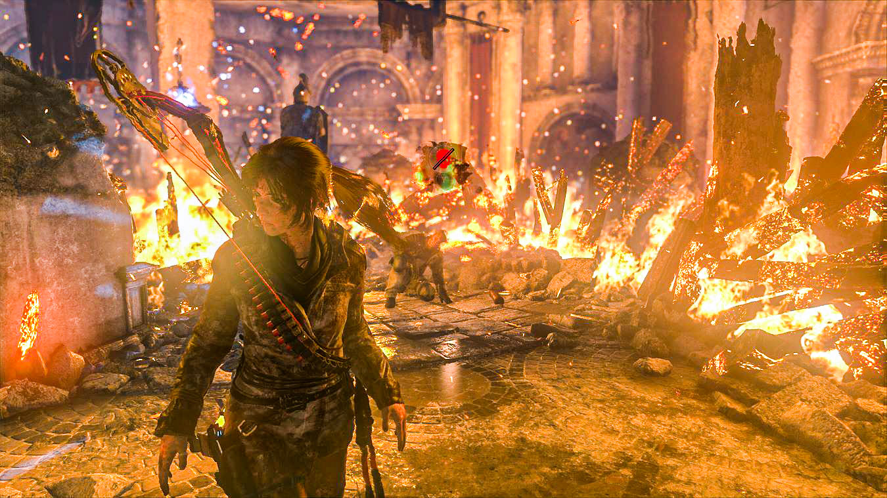

<!-- endExcerpt -->

## 通关状况
- 通关用时 36小时。时间应该算长的，因为途中的任务、古墓挑战、收集要素都不想错过
- “古墓丽影”难度通关，关闭辅助瞄准。刚开始没有辅助瞄准很不习惯，熟悉一下就好些
- 斗士、猎人、生存者还有 4个未升级

- 装备制作全部完成、武器升级大半

- 古墓挑战 9个全部完成。
- 我很依赖求生本能视觉，几乎在奔跑中不断用求生本能过关，不错过任何互动物品。有说法 UI提示 会损害游戏沉浸感，我的游玩习惯偏 light user，所以不介意这一点。因为中文语音的原因，相比于以前我算是深度体验剧情了，但仍没有耐心仔细地探索场景。不过对于《荒野大镖客：救赎2》，这种连快速旅行都没有的劝退特性，又好奇又期待。
- 遇到 Bug 包括：敌人 T-pose 不动、音效无限循环、劳拉头发渲染黑块、画面卡死。可接受范围内，重启大法好，不像玩 [Hellblade 剧情卡死](/2019/09/hellblade-senuas-sacrifice)

## 扫除语言障碍
中文语音对我了解背景剧情、世界观非常有帮助，相比之前的刺客信条、地铁2033、战地系列来说，游戏代入感更加强烈。**感叹学好英语太重要了，没文化连游戏都玩不好**。反过来则是我在游戏中学习了英语与不同历史文化背景的知识，这是我玩游戏的目的之一。

古墓丽影系列之前只玩过 GBA平台的《古墓丽影-预言》，我记得是在模拟器上一路突突突，典型的 light user，对话剧情一概不看。

这次在 Xbox 强大性能支持下，剧情以风格鲜明的场景和富含感情的角色互动来演绎，加上中文语音，我不愿错过任何一个从文献、文物中了解故事背景的机会，包括剧情中多条故事线：劳拉的回忆、圣三一、先知的追随者、蒙古人、苏联红军、雅阁与原住民、狩猎老师。

## 游玩感受
攀爬、跑动、潜水操作流畅、手感好，我基本是一路快跑、快速游泳、攀爬时跳跃来加速的，加快游戏流程。

在与人类敌人战斗中很有紧逼压迫感，敌人会主动推进或冲过来肉搏，会丢手榴弹将人从掩体中赶出来。远程攻击时我喜欢用手枪瞄准爆头，近身群攻霰弹枪扫一片，要是扛得住一个个肉搏再终结技，省弹药也蛮好，不过游戏期间很少有缺少弹药的情况。

很喜欢游戏中的动画、交互细节，这些不起眼之处也是用心之处。例如：
- 劳拉在父亲的办公室与约拿研究资料时过场动画，快速翻书时，有张纸条掉落，劳拉快速抓起并夹回去
- 解谜题时开求生本能视觉有适当劳拉自言自语语音提示
- 摄像机角度根据场景自动合理调整
- 从水中出来有扎辫子动作
- 靠近大本营篝火会烤火
- 走路靠近墙壁时扶墙
- 路过可互动物品时视线注视
- 黑暗处自动点亮荧光棒
- 有敌人时自动伏下身子

但从悬崖高处掉落摔死的动画做的很僵硬，摔落后直接就像一块板往下落。

过场动画与游戏之间过度自然，必要时利用预渲染的动画衔接游戏与过场，避免加载中断。剧情尾声时，甚至有两次过场动画中，我都不清楚是否开始游戏，这样又太过了吧。

用钱币秘宝在补给小屋购买道具，觉得最有用的就是索道攀爬辅助，绳索攀爬时按 X 可快速向上爬升，要比自己爬快多了。后来又买了手枪消声器、榴弹发射器和武器升级工具。

## 剧情感悟
在对神圣之源的抢夺中角色各有动机。安娜重病渴望被治愈，康斯坦丁表面是为了妹妹安娜，深处则是为满足对力量、权力的追求，安娜与康斯坦丁的分裂从找到的文献自白录音中听得出。劳拉的动机是为圆满父亲的遗志，还父亲一个清白，并将先知的失落文明与力量公诸于世、造福大众。

这些角色动机要么符合人性欲望，要么正义。虽然有牵强之处，例如圣三一总是能突然空降夺取成果，但对于游戏剧情，我觉得可以接受。讲故事讲到模糊了绝对的正与邪、超越善与恶的对立的地步，我觉得就比较成功了。每个角色的行为都有足够合理的动机支撑，才能从角色自身的矛盾、角色与角色之间的矛盾中，感受到故事戏剧化的冲突，进而推广发散地感受到人生矛盾、混乱的本质。

先知的化身雅各为保护神圣之源的秘密，创造不死士兵，却导致了无法控制的杀戮。劳拉为洗清父亲的污名和救赎自己的悔恨想将神圣之源公诸于众，却总是帮助圣三一离完成邪恶目的更进一步。又让我想起这句

> 通往地狱的路都是善意铺就的

在重伤的雅各说出“也许神圣之源一开始就不应该存在”，然后劳拉毅然决然砸毁神圣之源时，终于结束了这一拥有强大力量却总是带来悲剧的神物，终结了一条“地狱之路”。

片尾剧情交代，病重的安娜命丧圣三一的子弹而非疾病，真是人祸可怕于天灾。劳拉在基特城阻止安娜带走神圣之源时说“死亡是生命的一部分”，借劳拉之口道出了生死问题的真理。

最后，与康斯坦丁的一战中我没有亲手了结他，他被仇恨与野心吞噬，扭曲了思想走入歧途，这样的人会自取灭亡。
