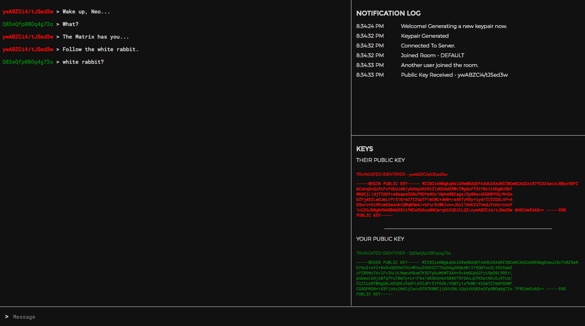
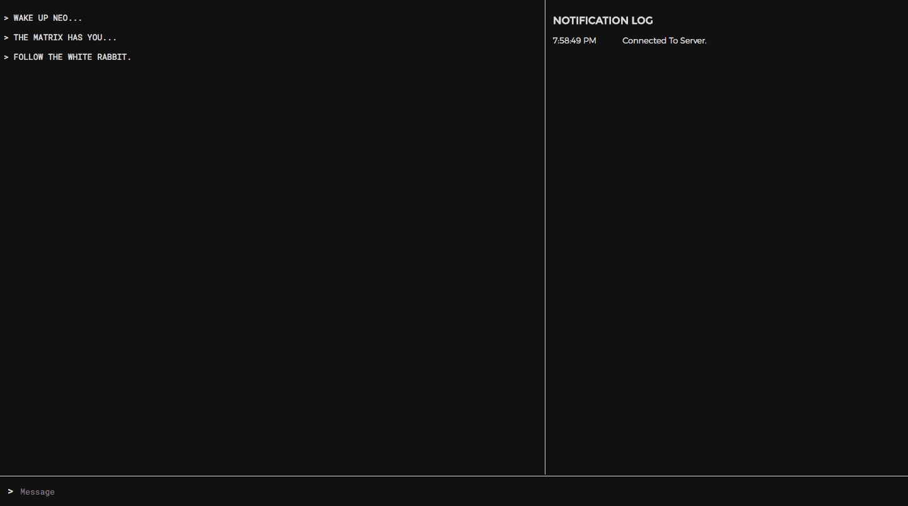
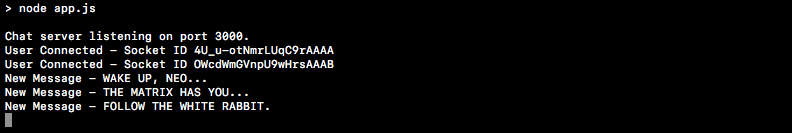
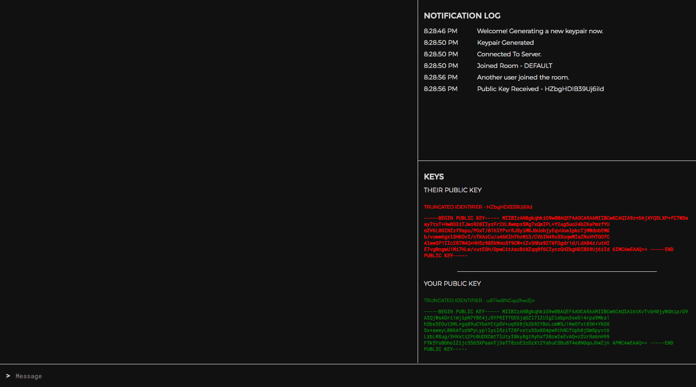
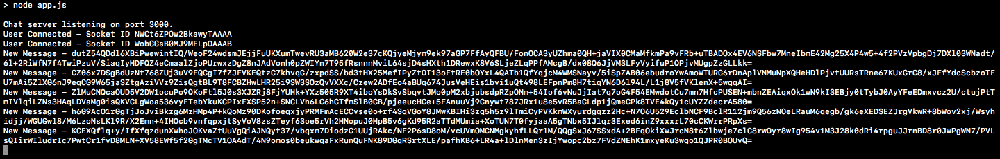
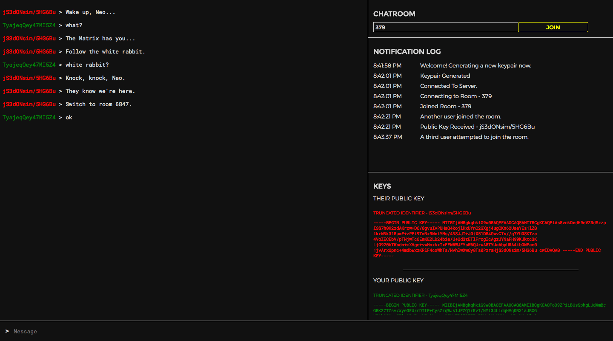

<!-- endExcerpt -->

<style type="text/css">
    pre {max-height: 30em; overflow: auto;}
</style>
 
这是一篇翻译。  
作者：[Patrick Triest](https://blog.patricktriest.com/author/patrick/)  
原文：[https://blog.patricktriest.com/building-an-encrypted-messenger-with-javascript/](https://blog.patricktriest.com/building-an-encrypted-messenger-with-javascript/)

---

## 端到端加密聊天程序 - 教程

密码学很重要。没有密码学，就没有 Internet —— 在线发送的数据就像在拥挤的房间里大声喊叫一样容易被截获。
密码学也是当前时事中的主要话题，在[执法调查](https://en.wikipedia.org/wiki/FBI%E2%80%93Apple_encryption_dispute)和[政府立法](https://www.politico.com/tipsheets/morning-cybersecurity/2017/11/10/texas-shooting-could-revive-encryption-legislation-223290)中日益发挥中心作用。

对于记者、活动人士、国家、企业和需要保护数据不受黑客、间谍和广告机构威胁的普通人来说，加密是一种无价的工具。

了解如何利用强加密对于现代软件开发至关重要。
在本教程中，我们不会深入研究底层的数学和密码学理论；相反，重点将放在如何在您自己的应用程序利用这些技术。



本教程中，我们将介绍端到端 2048位 [RSA加密](https://en.wikipedia.org/wiki/RSA_(cryptosystem))消息收发工具的基本概念和实现。
我们将利用 [Vue.js](https://vuejs.org/) 协调前端功能，在 [Node.js](https://nodejs.org/en/) 后端环境中使用 [Socket.io](https://socket.io/)，用于在用户间收发消息。

* 演示 - [https://chat.patricktriest.com](https://chat.patricktriest.com)
* Github 仓库 - [https://github.com/triestpa/Open-Cryptochat](https://github.com/triestpa/Open-Cryptochat)

本教程涉及的概念用 Javascript 实现，该语言具有平台无关特性。
我们将构建一个传统的基于浏览器的 Web 应用，但是如果您担心基于浏览器应用程序的安全性，可以修改此代码以使其在预构建的桌面(使用 [Electron](https://electronjs.org/))或移动应用程序([React Native](https://facebook.github.io/react-native/)，[Ionic](https://ionicframework.com/)，[Cordova](https://cordova.apache.org/))二进制文件中工作。<sup>[[1]](#fn1)</sup><a id="fnref1"></a>
用另一种编程语言实现类似的功能应该也简单，因为大多数语言都有著名的开源加密库可用；
虽然语法不同，但核心概念是相同的。

> 免责声明 - 本文旨在入门端到端加密的实现，不是构建像诺克斯堡(译注：[Fort Knox](https://zh.wikipedia.org/zh-cn/%E8%AF%BA%E5%85%8B%E6%96%AF%E5%A0%A1))般固若金汤般浏览器聊天应用程序的权威指南。  
> 我致力于为您的 Javascript 应用程序提供有关加密的有用信息，但不保证应用的 100% 安全。  
> 在构建应用程序过程的各个阶段，有很多可能出现问题的地方，特别是在本教程未涵盖的阶段，例如设置 Web主机和保护服务器安全。  
> 如果您是安全专家，且在教程代码中找到漏洞，请随时通过邮件(patrick.triest#gmail.com)或下面评论部分与我联系。

## 1 - 项目设置

### 1.1 - 安装依赖

你需要安装 [Node.js](https://nodejs.org/en/)(版本 6 或更高) 来运行本应用的后端。

为该项目创建一个空目录，并添加包含如下内容的文件 `package.json`。

```json
{
  "name": "open-cryptochat",
  "version": "1.0.0",
  "node":"8.1.4",
  "license": "MIT",
  "author": "patrick.triest#gmail.com",
  "description": "End-to-end RSA-2048 encrypted chat application.",
  "main": "app.js",
  "engines": {
    "node": ">=7.6"
  },
  "scripts": {
    "start": "node app.js"
  },
  "dependencies": {
    "express": "4.15.3",
    "socket.io": "2.0.3"
  }
}
```

在命令行中运行 `npm install`，安装两个 Node.js 依赖。

### 1.2 - 创建 Node.js 应用

创建文件 `app.js`，添加如下内容。

```javascript
const express = require('express')

// 设置 Express 服务器
const app = express()
const http = require('http').Server(app)

// 将 Socket.io 附加到服务器
const io = require('socket.io')(http)

// 伺服 Web 应用目录
app.use(express.static('public'))

// 这里插入 SOCKET.IO 代码

// 启动服务
const port = process.env.PORT || 3000
http.listen(port, () => {
  console.log(`Chat server listening on port ${port}.`)
})
```

这就是服务的核心逻辑。现在，它要做的就是启动服务，并使本地 `/public` 目录中的所有文件可供 Web客户端访问。

> 生产环境中，我强烈建议你将前端代码与 Node.js 后端应用分开伺服，使用 [Apache](https://httpd.apache.org/) 和 [Nginx](https://www.nginx.com/) 等久经沙场的服务器软件，或将网站托管在 [AWS S3](https://aws.amazon.com/s3/) 等文件存储服务上。本教程为简单起见，使用 Express 静态文件服务器来伺服前端程序。

### 1.3 - 添加前端

创建新目录 `public`。这里放所有前端应用代码。

##### 1.2.0 - 添加 HTML 模板

新建文件 `/public/index.html`，添加如下内容。

```html
<!DOCTYPE html>
<html lang="en">
  <head>
    <meta charset="utf-8">
    <title>Open Cryptochat</title>
    <meta name="description" content="A minimalist, open-source, end-to-end RSA-2048 encrypted chat application.">
    <meta name="viewport" content="width=device-width, initial-scale=1, maximum-scale=1, user-scalable=no">
    <link href="https://fonts.googleapis.com/css?family=Montserrat:300,400" rel="stylesheet">
    <link href="https://fonts.googleapis.com/css?family=Roboto+Mono" rel="stylesheet">
    <link href="/styles.css" rel="stylesheet">
  </head>
  <body>
    <div id="vue-instance">
      <!-- Add Chat Container Here -->
      <div class="info-container full-width">
        <!-- Add Room UI Here -->
        <div class="notification-list" ref="notificationContainer">
          <h1>NOTIFICATION LOG</h1>
          <div class="notification full-width" v-for="notification in notifications">
            <div class="notification-timestamp">{{ notification.timestamp }}</div>
            <div class="notification-message">{{ notification.message }}</div>
          </div>
        </div>
        <div class="flex-fill"></div>
        <!-- Add Encryption Key UI Here -->
      </div>
      <!-- Add Bottom Bar Here -->
    </div>
    <script src="https://cdnjs.cloudflare.com/ajax/libs/vue/2.4.1/vue.min.js"></script>
    <script src="https://cdnjs.cloudflare.com/ajax/libs/socket.io/2.0.3/socket.io.slim.js"></script>
    <script src="https://cdnjs.cloudflare.com/ajax/libs/immutable/3.8.1/immutable.min.js"></script>
    <script src="/page.js"></script>
  </body>
</html>
```

该模板设置基础 HTML 结构并下载客户端 JS 依赖项。等添加客户端 JS 代码后，它还会显示一个简单的通知列表。

##### 1.2.1 - 创建 Vue.js 应用程序

新建 `/public/page.js` 并添加如下内容。

```javascript
/** 控制 UI 的 Vue 实例 */
const vm = new Vue ({
  el: '#vue-instance',
  data () {
    return {
      cryptWorker: null,
      socket: null,
      originPublicKey: null,
      destinationPublicKey: null,
      messages: [],
      notifications: [],
      currentRoom: null,
      pendingRoom: Math.floor(Math.random() * 1000),
      draft: ''
    }
  },
  created () {
    this.addNotification('Hello World')
  },
  methods: {
    /** 在 UI 中追加一条通知消息 */
    addNotification (message) {
      const timestamp = new Date().toLocaleTimeString()
      this.notifications.push({ message, timestamp })
    },
  }
})
```

该脚本将初始化 Vue.js 应用，并在 UI 中显示一个 "Hello World" 通知。

##### 1.2.2 - 添加样式

新建文件 `/public/styles.css`，粘贴进如下样式。

```scss
/* Global */
:root {
  --black: #111111;
  --light-grey: #d6d6d6;
  --highlight: yellow;
}

body {
  background: var(--black);
  color: var(--light-grey);
  font-family: 'Roboto Mono', monospace;
  height: 100vh;
  display: flex;
  padding: 0;
  margin: 0;
}

div { box-sizing: border-box; }
input, textarea, select { font-family: inherit; font-size: small; }
textarea:focus, input:focus { outline: none; }

.full-width { width: 100%; }
.green { color: green; }
.red { color: red; }
.yellow { color: yellow; }
.center-x { margin: 0 auto; }
.center-text { width: 100%; text-align: center; }

h1, h2, h3 { font-family: 'Montserrat', sans-serif; }
h1 { font-size: medium; }
h2 { font-size: small; font-weight: 300; }
h3 { font-size: x-small; font-weight: 300; }
p { font-size: x-small; }

.clearfix:after {
   visibility: hidden;
   display: block;
   height: 0;
   clear: both;
}

#vue-instance {
  display: flex;
  flex-direction: row;
  flex: 1 0 100%;
  overflow-x: hidden;
}

/** Chat Window **/
.chat-container {
  flex: 0 0 60%;
  word-wrap: break-word;
  overflow-x: hidden;
  overflow-y: scroll;
  padding: 6px;
  margin-bottom: 50px;
}

.message > p { font-size: small; }
.title-header > p {
  font-family: 'Montserrat', sans-serif;
  font-weight: 300;
}

/* Info Panel */
.info-container {
  flex: 0 0 40%;
  border-left: solid 1px var(--light-grey);
  padding: 12px;
  overflow-x: hidden;
  overflow-y: scroll;
  margin-bottom: 50px;
  position: relative;
  justify-content: space-around;
  display: flex;
  flex-direction: column;
}

.divider {
  padding-top: 1px;
  max-height: 0px;
  min-width: 200%;
  background: var(--light-grey);
  margin: 12px -12px;
  flex: 1 0;
}

.notification-list {
  display: flex;
  flex-direction: column;
  overflow: scroll;
  padding-bottom: 24px;
  flex: 1 0 40%;
}

.notification {
  font-family: 'Montserrat', sans-serif;
  font-weight: 300;
  font-size: small;
  padding: 4px 0;
  display: inline-flex;
}

.notification-timestamp {
  flex: 0 0 20%;
  padding-right: 12px;
}

.notification-message { flex: 0 0 80%; }
.notification:last-child {
  margin-bottom: 24px;
}

.keys {
  display: block;
  font-size: xx-small;
  overflow-x: hidden;
  overflow-y: scroll;
}

.keys > .divider {
  width: 75%;
  min-width: 0;
  margin: 16px auto;
}

.key { overflow: scroll; }

.room-select {
  display: flex;
  min-height: 24px;
  font-family: 'Montserrat', sans-serif;
  font-weight: 300;
}

#room-input {
    flex: 0 0 60%;
    background: none;
    border: none;
    border-bottom: 1px solid var(--light-grey);
    border-top: 1px solid var(--light-grey);
    border-left: 1px solid var(--light-grey);
    color: var(--light-grey);
    padding: 4px;
}

.yellow-button {
  flex: 0 0 30%;
  background: none;
  border: 1px solid var(--highlight);
  color: var(--highlight);
  cursor: pointer;
}

.yellow-button:hover {
  background: var(--highlight);
  color: var(--black);
}

.yellow > a { color: var(--highlight); }

.loader {
    border: 4px solid black;
    border-top: 4px solid var(--highlight);
    border-radius: 50%;
    width: 48px;
    height: 48px;
    animation: spin 2s linear infinite;
}

@keyframes spin {
    0% { transform: rotate(0deg); }
    100% { transform: rotate(360deg); }
}

/* Message Input Bar */
.message-input {
  background: none;
  border: none;
  color: var(--light-grey);
  width: 90%;
}

.bottom-bar {
  border-top: solid 1px var(--light-grey);
  background: var(--black);
  position: fixed;
  bottom: 0;
  left: 0;
  padding: 12px;
  height: 48px;
}

.message-list {
  margin-bottom: 40px;
}
```

这里不深入讨论 CSS，但我向您保证它相当简单。

简单起见，我们不需要在前端中添加构建系统。在我看来，对于一个如此简单的应用程序来说，构建系统并不是必须的(完成应用程序的 gzip 压缩总负载小于 100kb)。
非常欢迎(并鼓励，因为它将允许应用程序向后兼容过时的浏览器)你添加一个构建系统，如 [Webpack](https://webpack.js.org/)、 [Gulp](https://gulpjs.com/) 或 [Rollup](https://rollupjs.org/)，如果您决定将此代码应用到您自己的项目中。

### 1.4 - 试试看

在命令行中运行 `npm start`。应该能看到命令行输出 `Chat server listening on port 3000.`。
在浏览器中访问 [`http://localhost:3000`](http://localhost:3000)，应该能看到一个空的黑色界面，在页面上显示 "Hello World"。


## 2 - 基础消息收发

现在项目脚手架已就绪，我们将开始添加基础的(非加密)实时消息收发功能。

### 2.1 - 设置服务器端 Socket 监听器

在文件 `/app.js` 的注释 `// 这里插入 SOCKET.IO 代码` 处，添加如下代码。

```javascript
/** 管理每个客户端 socket 连接的行为 */
io.on('connection', (socket) => {
  console.log(`User Connected - Socket ID ${socket.id}`)

  // 储存 socket 连接到的聊天室
  let currentRoom = 'DEFAULT'

  /** 处理加入聊天室的请求. */
  socket.on('JOIN', (roomName) => {
    socket.join(currentRoom)

    // 通知用户，加入聊天室成功
    io.to(socket.id).emit('ROOM_JOINED', currentRoom)

    // 通知聊天室，用户加入成功
    socket.broadcast.to(currentRoom).emit('NEW_CONNECTION', null)
  })

  /** 在聊天室广播一条收到的消息 */
  socket.on('MESSAGE', (msg) => {
    console.log(`New Message - ${msg.text}`)
    socket.broadcast.to(currentRoom).emit('MESSAGE', msg)
  })
})
```

此代码块将创建一个连接监听器，管理从前端应用程序连接到服务器的所有客户端。
目前，它只将用户添加到 `DEFAULT` 聊天室中，然后将接收到的所有消息重新发送给聊天室中的其他用户。

### 2.2 - 设置客户端 Socket 监听器

在前端中，我们将添加一些连接到服务器的代码，用如下代码替换文件 `/public/page.js` 中的 `created` 函数。

```javascript
created () {
  // 初始化 socket.io
  this.socket = io()
  this.setupSocketListeners()
},
```

接着，我们要添加一些自定义函数来管理客户端 Socket 连接并收发消息。
在文件 `/public/page.js` 中 Vue 应用的 `methods` 代码块中添加如下。

```javascript
/** 设置 Socket.io 事件监听器 */
setupSocketListeners () {
  // 连接时自动加入默认聊天室
  this.socket.on('connect', () => {
    this.addNotification('Connected To Server.')
    this.joinRoom()
  })

  // 通知用户丢失 socket 连接
  this.socket.on('disconnect', () => this.addNotification('Lost Connection'))

  // 接收消息并显示
  this.socket.on('MESSAGE', (message) => {
    this.addMessage(message)
  })
},

/** 发送消息 */
sendMessage () {
  // 消息为空时不发送
  if (!this.draft || this.draft === '') { return }

  const message = this.draft

  // 重置输入文本
  this.draft = ''

  // 将消息立即显示到本地 UI
  this.addMessage(message)

  // 发送消息
  this.socket.emit('MESSAGE', message)
},

/** 加入聊天室 */
joinRoom () {
  this.socket.emit('JOIN')
},

/** 将消息添加到 UI */
addMessage (message) {
  this.messages.push(message)
},
```

### 2.3 - 将消息显示到 UI

最后，我们为发送与显示消息提供一个 UI。

为在当前聊天中显示所有消息，在文件 `/public/index.html` 的 `<!-- Add Chat Container Here -->` 注释处添加如下。

```html
<div class="chat-container full-width" ref="chatContainer">
  <div class="message-list">
    <div class="message full-width" v-for="message in messages">
      <p>
      > {{ message }}
      </p>
    </div>
  </div>
</div>
```

添加一个文本输入框让用户输入消息，在 `/public/index.html` 的 `<!-- Add Bottom Bar Here -->` 注释处添加如下。

```html
<div class="bottom-bar full-width">
  > <input class="message-input" type="text" placeholder="Message" v-model="draft" @keyup.enter="sendMessage()">
</div>
```

现在重启服务，在浏览器的两个不同标签页或窗口中打开 [`http://localhost:3000`](http://localhost:3000)。
尝试在标签页之间来回发送消息。在命令行中，您应该能够看到正在发送的消息的服务器日志。

  


## 数据加密 101

Cool, 现在我们有了一个实时消息收发应用。在添加端到端加密之前，必须对非对称加密的工作原理有基本的了解。

#### 对称加密 与 单向函数

假设我们在交换一个秘密数字。我们通过第三方发送这个数字，但不想让第三方知道数字是什么。

为实现这一点，我们先共享一个密钥 —— 就用 `7`。

为了加密消息，先用一个随机数字 `n` 与密钥(`7`)相乘，再与 `x` 相加。
该等式中，`x` 表示我们要发送的数字，`y` 表示加密后的结果。

`(7 * n) + x = y`

然后，我们可以使用模运算将加密的输入转换为解密的输出。

`y mod 7 = x`

这里，`y` 是公开的(加密的)消息，`x` 是原始的未加密消息。

如果一方想交换数字 `2`，我们可以计算 `(7*4) + 2` 并发送 `30` 作为消息。
我们都知道密钥 (`7`)，所以都能计算 `30 mod 7`，并确定 `2` 是原始的数字。

原始数字(`2`)实际上是隐藏起来的，因为我们传递的唯一消息是 `30`。
就算第三方能同时得到加密的结果(`30`)和加密的未数字(`2`)，他仍然不知道密钥的值。
本例中，`30 mod 14` 与 `30 mod 28` 都等于 `2`，所以中间人并不能确定密钥是 `7`，`14`还是 `28`，因此无法可靠地破译下一条消息。

因此，取模(Modulo)运算被认为是一个“单向”函数，因为它不能被简单地逆运算。

现代加密算法就是对该通用原理的复杂化应用。
通过使用大质数(large prime numbers)，模幂(modular exponentiation)，长私钥和多轮密码转换，破解这些算法通常要花费非常长的时间(1+百万年)。

> 理论上，量子计算机可以很快破解。详情见 [这里](https://www.infoworld.com/article/3040991/security/mits-new-5-atom-quantum-computer-could-make-todays-encryption-obsolete.html)。
> 这项技术还处于起步阶段，所以我们可能还无需担心加密数据会以这种方式泄露。

上面的示例假设双方都可以提前交换密钥(本例中为7)。这被称为 _对称加密_，因为加密和解密消息都使用相同的密钥。
然而，在 Internet 上，这通常不是可行 —— 我们需要一种不必离线协调获取共享密钥，而加密消息的方法。
这就是非对称加密发挥作用的地方。

#### 公钥加密

与对称加密使用一个共享密钥不同，公钥加密(非对称加密)使用一对密钥(公钥、私钥)，_公钥_ 用于加密数据，_私钥_ 用于解密。

_公钥_ 就像一个有牢不可破锁的公开投信箱。如果有人想给你发消息，就将消息投入这个公开信箱，然后盖上盖子把它锁上。
这时信箱就能让不被信任的第三方传递发送，而不必担心内容被曝光。
一旦我收到信箱，我会用我的 _私钥_ ——只有我有，来打开信箱。

交换 _公钥_ 就像交换这些公开信箱，但 _私钥_ 仅由信箱所有者保管，所以在信箱传递过程中能保证内容的安全。

当然，这是对公钥加密原理的一个简化解释。如果你好奇(特别是关于这些技术的历史和数学基础)，我强烈推荐你从这两个视频开始。

`video: https://youtu.be/YEBfamv-_do`

`video: https://youtu.be/wXB-V_Keiu8`

## 3 - 用 Web Worker 处理加密

加密操作往往是计算密集型的。由于 Javascript 是单线程，在 UI 主线程上处理加密会导致浏览器卡顿几秒钟。

> 将加密操作包装在 Promise 中也没用，因为 Promise 是在单线程中管理异步操作，而不是改善计算密集型任务的性能。

为保证应用程序的性能，我们采用 [Web Worker](https://developer.mozilla.org/en-US/docs/Web/API/Web_Workers_API/Using_web_workers) 在浏览器单独的线程中执行加密运算。
我们将使用 [JSEncrypt](https://github.com/travist/jsencrypt)，这是一个源自斯坦福的著名 Javascript RSA 实现。
使用 JSEncrypt 来创建一些帮助函数，用于加密、解密与生成密钥对。

### 3.1 - 创建 Web Worker 来包装 JSEncrypt 方法

在目录 `public` 中新建文件 `crypto-worker.js`。
这个文件存放 Web Worker 的代码，以便在一个单独的浏览器线程上执行加密操作。

```javascript
self.window = self // 在 Web Worker 中使用 JSEncrypt 库，这行是必须的

// 导入 JSEncrypt 库
self.importScripts('https://cdnjs.cloudflare.com/ajax/libs/jsencrypt/2.3.1/jsencrypt.min.js');

let crypt = null
let privateKey = null

/** Web Worker onmessage 监听器 */
onmessage = function(e) {
  const [ messageType, messageId, text, key ] = e.data
  let result
  switch (messageType) {
    case 'generate-keys':
      result = generateKeypair()
      break
    case 'encrypt':
      result = encrypt(text, key)
      break
    case 'decrypt':
      result = decrypt(text)
      break
  }

  // 返回结果给 UI 线程
  postMessage([ messageId, result ])
}

/** 生成与储存密钥对 */
function generateKeypair () {
  crypt = new JSEncrypt({default_key_size: 2056})
  privateKey = crypt.getPrivateKey()

  // 仅返回公钥，隐藏私钥
  return crypt.getPublicKey()
}

/** 使用目标公钥加密字符串 */
function encrypt (content, publicKey) {
  crypt.setKey(publicKey)
  return crypt.encrypt(content)
}

/** 使用本地私钥解密字符串 */
function decrypt (content) {
  crypt.setKey(privateKey)
  return crypt.decrypt(content)
}
```

该 Web Worker 在 `onmessage` 监听器中接收来自 UI 线程的消息，执行请求的操作，并返回结果到 UI 线程。
私钥永远不会直接暴露给 UI 线程，这有助于减少跨站脚本攻击([XSS](https://www.owasp.org/index.php/Cross-site_Scripting_(XSS)))中私钥被盗的可能性。

### 3.2 - 配置 Vue 应用程序与 Web Worker 通讯

下面，我们配置 UI controller 与 Web Worker 通讯。
使用事件侦听器按顺序的调用/响应通信很难同步。
为简化，我们创建一个工具函数，将整个通讯周期包装到 Promise 中。
在 `/public/page.js` 中的 `methods` 代码块中添加如下。

```javascript
/** 向 Web Worker 发消息，返回一个包含结果的 Promise。 */
getWebWorkerResponse (messageType, messagePayload) {
  return new Promise((resolve, reject) => {
    // 生成一个随机消息 id 来标识相应的事件回调
    const messageId = Math.floor(Math.random() * 100000)

    // 发送消息给 Web Worker
    this.cryptWorker.postMessage([messageType, messageId].concat(messagePayload))

    // 为 Web Worker 消息事件创建句柄
    const handler = function (e) {
      // 仅处理消息 id 匹配的消息
      if (e.data[0] === messageId) {
        // 监听器被调用后移除之
        e.currentTarget.removeEventListener(e.type, handler)

        // Resolve the promise with the message payload.
        resolve(e.data[1])
      }
    }

    // 将句柄分配给 Web Worker 'message' 事件。
    this.cryptWorker.addEventListener('message', handler)
  })
}
```

该代码允许我们在 Web Worker 线程中触发一个操作，并在 Promise 中接收返回结果。
在将调用/响应处理外包给 Web Worker 的任何项目中，这都是非常有用的帮助函数。

## 4 - 密钥交换

在我们的应用中，第一步是为每个用户生成一对密钥。
然后一旦用户进入同一个对话，应用程序会交换用户的 _公钥_，这样每个用户就能解密属于自己的消息，而其他人只能加密。

因此，应用程序始终使用接收者的 _公钥_ 来加密消息，使用用户自己的 _私钥_ 解密消息。

### 4.1 - 添加服务器端 Socket 监听器来传递公钥

在服务器端，需要一个 Socket 监听器接收从客户端发来的公钥，并将其广播给聊天室中其他人。
还需要一个监听器通知客户端，何人何时从当前聊天室中退出。

在 `/app.js` 的 `io.on('connection', (socket) => { ... }` 回调中添加监听器。

```javascript
/** 广播公钥到聊天室 */
socket.on('PUBLIC_KEY', (key) => {
  socket.broadcast.to(currentRoom).emit('PUBLIC_KEY', key)
})

/** 广播断开连接到聊天室 */
socket.on('disconnect', () => {
  socket.broadcast.to(currentRoom).emit('USER_DISCONNECTED', null)
})
```

### 4.2 - 生成密钥对

下一步，替换 `/public/page.js` 中的 `created` 函数，用于初始化 Web Worker 和生成一对密钥。

```javascript
async created () {
  this.addNotification('Welcome! Generating a new keypair now.')

  // Initialize crypto webworker thread
  this.cryptWorker = new Worker('crypto-worker.js')

  // Generate keypair and join default room
  this.originPublicKey = await this.getWebWorkerResponse('generate-keys')
  this.addNotification('Keypair Generated')

  // Initialize socketio
  this.socket = io()
  this.setupSocketListeners()
},
```

这里使用 [async/await 语法](https://blog.patricktriest.com/what-is-async-await-why-should-you-care/) 在一行代码中接收 Web Worker 返回的 Promise。

### 4.3 - 添加公钥帮助函数

还要在 `/public/page.js` 添加一些函数用于发送公钥，并将密钥简化为人类可读的标识符。

```javascript
/** 发送公钥给聊天室中所有用户 */
sendPublicKey () {
  if (this.originPublicKey) {
    this.socket.emit('PUBLIC_KEY', this.originPublicKey)
  }
},

/** 获取用于显示的密钥片段 */
getKeySnippet (key) {
  return key.slice(400, 416)
},
```

### 4.4 - 收发公钥

下面在客户端 Socket 代码中添加一些监听器，用于当有新用户加入聊天室时发送本地公钥，并保存接收到的其他用户的公钥。

在 `/public/page.js` 的 `setupSocketListeners` 函数处添加如下。

```javascript
// 有新用户加入当前聊天室时，向他发送你的公钥
this.socket.on('NEW_CONNECTION', () => {
  this.addNotification('Another user joined the room.')
  this.sendPublicKey()
})

// 加入一个聊天室时广播公钥
this.socket.on('ROOM_JOINED', (newRoom) => {
  this.currentRoom = newRoom
  this.addNotification(`Joined Room - ${this.currentRoom}`)
  this.sendPublicKey()
})

// 收到公钥时保存之
this.socket.on('PUBLIC_KEY', (key) => {
  this.addNotification(`Public Key Received - ${this.getKeySnippet(key)}`)
  this.destinationPublicKey = key
})

// 有用户离开聊天室时删除用户对应公钥
this.socket.on('user disconnected', () => {
  this.notify(`User Disconnected - ${this.getKeySnippet(this.destinationKey)}`)
  this.destinationPublicKey = null
})
```

### 4.5 - 在 UI 中显示公钥

最后，添加一些 HTML 用于显示两个公钥。

在 `/public/index.html` 的 `<!-- Add Encryption Key UI Here -->` 注释后添加如下。

```html
<div class="divider"></div>
<div class="keys full-width">
  <h1>KEYS</h1>
  <h2>THEIR PUBLIC KEY</h2>
  <div class="key red" v-if="destinationPublicKey">
    <h3>TRUNCATED IDENTIFIER - {{ getKeySnippet(destinationPublicKey) }}</h3>
    <p>{{ destinationPublicKey }}</p>
  </div>
  <h2 v-else>Waiting for second user to join room...</h2>
  <div class="divider"></div>
  <h2>YOUR PUBLIC KEY</h2>
  <div class="key green" v-if="originPublicKey">
    <h3>TRUNCATED IDENTIFIER - {{ getKeySnippet(originPublicKey) }}</h3>
    <p>{{ originPublicKey }}</p>
  </div>
  <div class="keypair-loader full-width" v-else>
    <div class="center-x loader"></div>
    <h2 class="center-text">Generating Keypair...</h2>
  </div>
</div>
```

重启应用程序并刷新 `http://localhost:3000`。
打开两个浏览器标签页，应该就能成功模拟一次密钥交换。



> 在多于两个标签页中打开应用，交换密钥应该会失败。我们将进一步解决此问题。

## 5 - 消息加密

现在密钥交换已完成，加密、解密消息就很简单了。

### 5.1 - 发送前加密消息

替换 `/public/page.js` 中的 `sendMessage` 函数为如下。

```javascript
/** 加密并发送当前消息 */
async sendMessage () {
  // 消息为空时不发送
  if (!this.draft || this.draft === '') { return }

  // 使用 Immutable.js来避免意外的副作用。
  let message = Immutable.Map({
    text: this.draft,
    recipient: this.destinationPublicKey,
    sender: this.originPublicKey
  })

  // 重置输入文本
  this.draft = ''

  // 立即将(未加密的)消息显示到本地 UI
  this.addMessage(message.toObject())

  if (this.destinationPublicKey) {
    // 使用其他用户的公钥加密消息
    const encryptedText = await this.getWebWorkerResponse(
      'encrypt', [ message.get('text'), this.destinationPublicKey ])
    const encryptedMsg = message.set('text', encryptedText)

    // 发送加密的消息
    this.socket.emit('MESSAGE', encryptedMsg.toObject())
  }
},
```

### 5.2 - 接收与解密消息

修改 `/public/page.js` 中的 `message` 监听器，用于解密接收到的消息。

```javascript
// 解密与显示接收到的消息
this.socket.on('MESSAGE', async (message) => {
  // 仅解密用用户公钥加密的消息
  if (message.recipient === this.originPublicKey) {
    // 在 Web Worker 线程中解密消息
    message.text = await this.getWebWorkerResponse('decrypt', message.text)

    // 立即将(未加密的)消息显示到本地 UI
    this.addMessage(message)
  }
})
```

### 5.3 - 显示消息列表

修改 `/public/index.html` 中的消息列表 UI(在 `chat-container` 中)，来显示解密的消息和发送者公钥的缩写。

```html
<div class="message full-width" v-for="message in messages">
  <p>
    <span v-bind:class="(message.sender == originPublicKey) ? 'green' : 'red'">{{ getKeySnippet(message.sender) }}</span>
    > {{ message.text }}
  </p>
</div>
```

### 5.4 - 试试看

重启服务并刷新 [`http://localhost:3000`](http://localhost:3000)。
UI 界面应该看起来跟之前没有变化，除了会显示每个消息发送者的公钥片段。

  


在命令行输出中，消息已不再可读 —— 它们现在显示为乱码的加密文本。

## 6 - 聊天室

你大概已经注意到当前应用程序的一个重大缺陷 —— 如果在第三个标签页中打开该应用会使加密系统挂掉。
非对称加密被设计用于一对一的场景；无法加密消息 _一次_ 然后分别被 _两个_ 用户解密。

两个选择 ——

1. 若有多个用户，为每个用户分别加密并发送消息副本。
2. 限制同一时间聊天室中最多有两个用户。

由于本教程已经够长了，我们选择第二个简单的选项。

### 6.1 - 进入聊天室的服务器端逻辑

为执行两个用户限制，修改 `/app.js` 中的服务器端 `JOIN` Socket 监听器，在 Socket 连接监听器代码块的上面加入如下。

```javascript
// 保存 Socket 连接到的聊天室
// 如果需要横向扩展应用程序，需将此变量存储在诸如 Redis 之类的持久存储中。
// 详情见： https://github.com/socketio/socket.io-redis
let currentRoom = null

/** 处理进入聊天室的请求 */
socket.on('JOIN', (roomName) => {
  // 获取聊天室信息
  let room = io.sockets.adapter.rooms[roomName]

  // 若聊天室已经有多于 1 的连接，则拒绝进入
  if (room && room.length > 1) {
    // 通知用户进入聊天室请求被拒绝
    io.to(socket.id).emit('ROOM_FULL', null)

    // 通知聊天室有用户进
    socket.broadcast.to(roomName).emit('INTRUSION_ATTEMPT', null)
  } else {
    // 离开当前聊天室
    socket.leave(currentRoom)

    // 通知聊天室用户已离开
    socket.broadcast.to(currentRoom).emit('USER_DISCONNECTED', null)

    // 进入新聊天室
    currentRoom = roomName
    socket.join(currentRoom)

    // 通知用户进入聊天室成功
    io.to(socket.id).emit('ROOM_JOINED', currentRoom)

    // 通知聊天室用户进入成功
    socket.broadcast.to(currentRoom).emit('NEW_CONNECTION', null)
  }
})
```

修改这段 Socket 逻辑，防止用户进入一个已有两位用户的聊天室。

### 6.2 - 通过客户端进入聊天室

修改客户端 `/public/page.js` 中的 `joinRoom` 函数，使切换聊天室时重置聊天状态。

```javascript
/** 进入指定的聊天室 */
joinRoom () {
  if (this.pendingRoom !== this.currentRoom && this.originPublicKey) {
    this.addNotification(`Connecting to Room - ${this.pendingRoom}`)

    // 重置聊天室状态变量
    this.messages = []
    this.destinationPublicKey = null

    // 发送进入聊天室请求
    this.socket.emit('JOIN', this.pendingRoom)
  }
},
```

### 6.3 - 添加通知

创建两个客户端 Socket 监听器(在 `/public/page.js` 的 `setupSocketListeners` 函数中)，当进入聊天室请求被拒绝时发出通知。

```javascript
// 通知用户试图加入的聊天室已满
this.socket.on('ROOM_FULL', () => {
  this.addNotification(`Cannot join ${this.pendingRoom}, room is full`)

  // 加入一个随机聊天室作为后备
  this.pendingRoom = Math.floor(Math.random() * 1000)
  this.joinRoom()
})

// 通知聊天室有人试图加入
this.socket.on('INTRUSION_ATTEMPT', () => {
  this.addNotification('A third user attempted to join the room.')
})
```

### 6.4 - 添加进入聊天室 UI

最后，添加一些 HTML，为用户提供一个界面来加入他们选择的房间。

在 `/public/index.html` 的 `<!-- Add Room UI Here -->` 注释处添加如下。

```html
<h1>CHATROOM</h1>
<div class="room-select">
  <input type="text" class="full-width" placeholder="Room Name" id="room-input" v-model="pendingRoom" @keyup.enter="joinRoom()">
  <input class="yellow-button full-width" type="submit" v-on:click="joinRoom()" value="JOIN">
</div>
<div class="divider"></div>
```

### 6.5 - 自动滚动

应用程序中还有个烦人的 bug，即通知和聊天列表尚未自动滚动以显示新消息。

在 `/public/page.js` 的 `methods` 代码块中添加如下函数。

```javascript
/** 自动滚动 DOM 元素到底部 */
autoscroll (element) {
  if (element) { element.scrollTop = element.scrollHeight }
},
```

要自动滚动通知和消息列表，我们将在 `add` 方法的末尾调用 `autoscroll`。

```javascript
/** 将消息添加到 UI 并滚动视图以显示新消息。 */
addMessage (message) {
  this.messages.push(message)
  this.autoscroll(this.$refs.chatContainer)
},

/** 在 UI 中添加通知消息 */
addNotification (message) {
  const timestamp = new Date().toLocaleTimeString()
  this.notifications.push({ message, timestamp })
  this.autoscroll(this.$refs.notificationContainer)
},
```

### 6.6 - 试试看

最后一步！重启 Node 应用程序并刷新 [`localhost:3000`](http://localhost:3000)。
现在应该可以自由地在不同聊天室间切换，从第三个浏览器标签页加入同一聊天室的任何尝试都将被拒绝。



## 7 - 接下来？

恭喜！您已经构建了一个功能完整的端到端加密消息收发应用程序。

- 演示 - [https://chat.patricktriest.com](https://chat.patricktriest.com)
- Github 仓库 - [https://github.com/triestpa/Open-Cryptochat](https://github.com/triestpa/Open-Cryptochat)

以该代码为基础，您可以在自己的服务器上部署一个私有消息收发应用程序。
为协调在哪个聊天室见面，一个巧妙的选择是使用基于时间的伪随机数生成器(如 [Google Authenticator](https://play.google.com/store/apps/details?id=com.google.android.apps.authenticator2&hl=en))，
你和对方共享一个 seed(Javascript "Google Authenticator" 教程我正在写，保持关注)。

### 更进一步

以此为起点可以做很多应用：

* 群聊，通过存储多个公钥，并分别为每个用户加密消息。
* 多媒体消息，通过加密一个包含媒体文件的字节数组。
* 将密钥对导入和导出为本地文件。
* 使用发送方身份验证的私钥对消息进行签名。这是一种折衷，因为它增加了伪造消息的难度，但也破坏了 OTR消息传递标准([OTR messaging standard](https://en.wikipedia.org/wiki/Off-the-Record_Messaging))中概述的“可拒绝身份验证”的目标。
* 尝试不同的加密系统，如：
    * [**AES**](https://en.wikipedia.org/wiki/Advanced_Encryption_Standard) - 对称加密，用户之间共享秘密。这是 NSA 和美国军方使用的唯一公开可用的算法。
    * [**ElGamal**](https://en.wikipedia.org/wiki/ElGamal_encryption) - 类似于 RSA，但具有更小的密码文本、更快的解密和更慢的加密。这是在PGP中使用的核心算法。
    * 实现一个  [**Diffie-Helman**](https://en.wikipedia.org/wiki/Diffie%E2%80%93Hellman_key_exchange) 密钥交换。这是一种使用非对称加密(例如 ElGamal)交换共享密钥的技术。在现有项目基础上构建，并在发送每条消息之前交换新的共享密钥是提高应用程序安全性的一种好方法(请参阅 [Perfect Forward Security](https://en.wikipedia.org/wiki/Forward_secrecy))。
* 建立一个应用程序，在任何情况下，中间服务器绝不应有未加密的访问，如密码管理器和 P2P(点对点) 网络。
* 为 [React Native](https://facebook.github.io/react-native/)，[Ionic](https://ionicframework.com/)，[Cordova](https://cordova.apache.org/) 或 [Electron](https://electronjs.org/) 重构应用程序，以便为移动和/或桌面环境提供安全的预构建应用程序包。

请在下面随意评论有关本教程的问题，反馈和/或反馈。

***

<a id="fn1"></a>
1. **基于浏览器的加密安全隐患**  

请谨记。在基于浏览器的 Javascript 应用程序中使用这些协议是试验和了解它们在实际中如何工作的好方法，但此应用程序不适合替代已建立的，经过同行评审的加密协议实现，例如 [OpenSSL](https://en.wikipedia.org/wiki/OpenSSL) 和 [GnuPG](https://en.wikipedia.org/wiki/GNU_Privacy_Guard)。

客户端浏览器 Javascript 加密在安全专家中是个有争议的话题，因为 Web 应用程序交付相比在浏览器外运行的预打包软件存在漏洞。
可通过使用 HTTPS 防止中间人资源注入攻击，并通过避免在浏览器中持久存储未加密的敏感数据来缓解这些问题，但务必注意 Web 平台中潜在的漏洞。[↩](#fnref1)

---

相关参考：
- [RSA算法原理（一） - 阮一峰](https://www.ruanyifeng.com/blog/2013/06/rsa_algorithm_part_one.html)
- [JSEncrypt - OpenSSL RSA 加密的 Javascript 实现](http://travistidwell.com/jsencrypt/)
- [prism-break.org 推荐的加密通信软件](https://prism-break.org/zh-CN/)
- [你真的了解端到端加密么？](https://github.com/mdrights/Digital-rights/blob/master/E%E5%8A%A0%E5%AF%86%E6%8A%80%E8%A1%93/2019-09-21-%E4%BD%A0%E7%9C%9F%E7%9A%84%E4%BA%86%E8%A7%A3%E7%AB%AF%E5%88%B0%E7%AB%AF%E5%8A%A0%E5%AF%86%E4%B9%88.md)
- [OpenPGP.js - OpenPGP 的 Javascript 实现](https://openpgpjs.org/)
