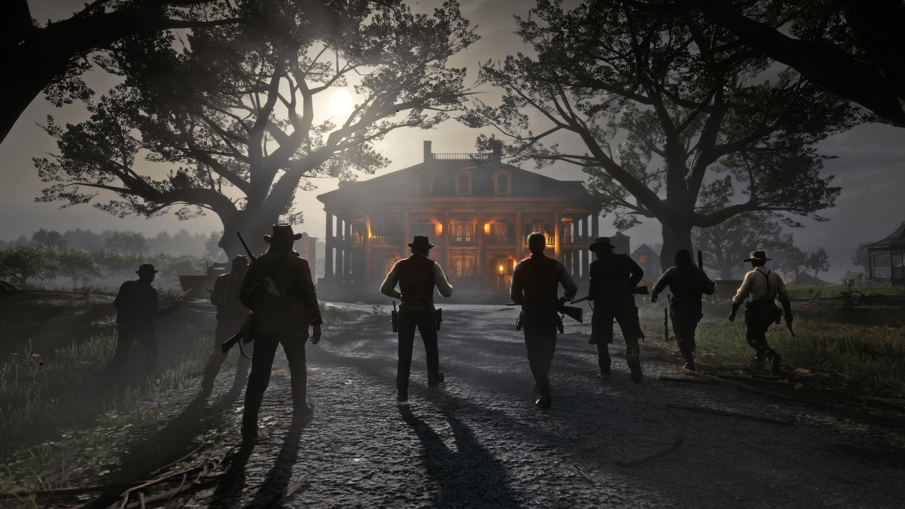
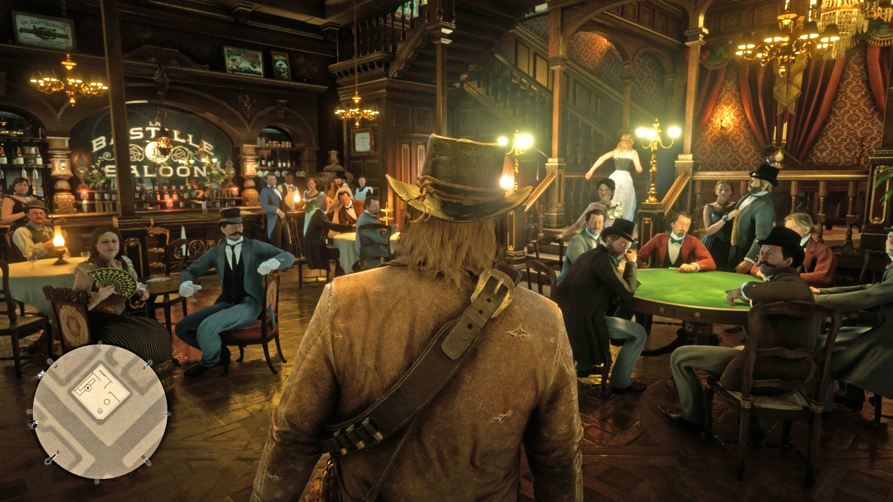
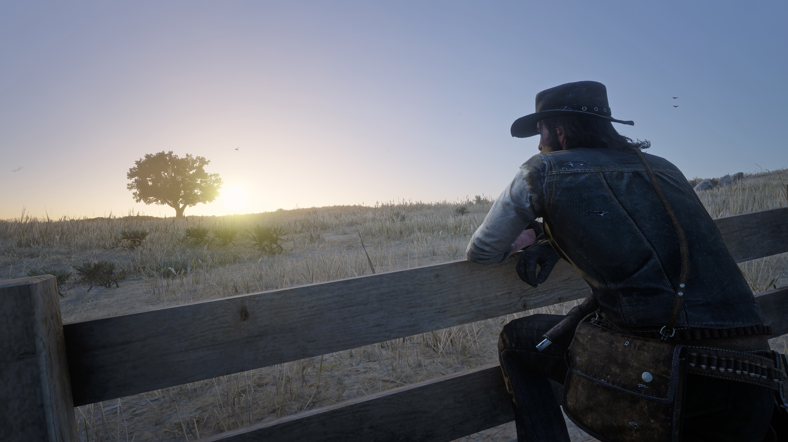
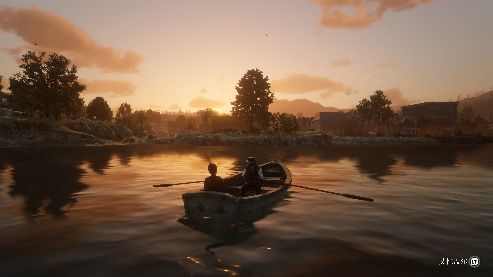

<!-- endExcerpt -->

> 断断续续，**荒野大镖客：救赎** 玩到第四章了，最近有两个场景令我惊艳、感慨。学会了用 Xbox 的截屏和录屏功能，将这两个场景记录下来，与大家分享。

## 大战在即 

第三章 - 克莱蒙斯据点 - 古恨今仇。

在得知杰克被布雷斯韦特家抓走后，达奇带着几乎全体帮派成员一路开到庄园门口，下马步行来到屋前要人。

逆着明亮的月光，树和人都成了阴暗的剪影，画面令人印象深刻。全员出动和对峙谈话间的紧张气氛，很好烘托出为救孩子杰克的心切，这种**倾尽全力保障帮派成员安全，团结一心的情感连结**。

  
_点击图片查看完整 4K 分辨率_

`video: https://youtu.be/6GHwkAUljG4`
[_在腾讯视频上_](https://v.qq.com/x/page/y30219kp9yp.html)

## 我们的时代过去了

第四章 - 圣丹尼斯 - 文明之乐。

之前在营地大篷车旁和玛丽贝斯聊天时，亚瑟就感叹自己的焦虑说，我们的时代已经过去了，现在是文明的世界了。那时我以为游戏世界中都是荒蛮的西部，离现代还远，帮派、义气、手枪是仍是那个社会环境的规则，所以对亚瑟的焦虑没有感受。

但第一次来到圣丹尼斯，发现荒蛮西部和现代工业已经在这个世界并存交替时，开使有点理解亚瑟的焦虑。而推开城里酒吧大门，所有乔装打扮人们停下玩乐对话，用近乎异样的眼神看着"我"的时候，我突然明白亚瑟的意思。

亚瑟的背影满是磨毛的线头，带着牛仔帽、背着子弹夹，一副老土野蛮的形象，与城里人绅士帽、精致西装显得**格格不入**。**现在再想亚瑟说的"我们的时代过去了"，那是悲凉的事实**。

  
_点击图片查看完整 4K 分辨率_

## 主线通关更新：

以 Good Ending 完成主线剧情，即亚瑟在晨曦的山崖上逝去，约翰·马斯顿在比彻之愿农场安顿好妻儿后，与沙迪·阿德勒、查尔斯·史密斯在雪山上找到麦卡，为亚瑟报仇。

  

约翰在比彻之愿开始了平静的农场生活

达奇在雪山小屋前枪指麦卡和约翰时仍然不知所措，在开枪杀死麦卡后再次甩下一言不发的背影离开。**达奇在逃亡和社会变革的环境压力下迷失了**。他挂在嘴边的 “I have a plan” 再三被证明“计划跟不上变化”，特别是任务`第六章-河狸岩洞 最真实的自己`，在圣丹尼斯计划抢的火车未按计划停站却呼啸驶过后，被亚瑟质问是否有计划时，他虽然斩钉截铁地回答“Of course we are”，但内心一定认识到一些问题。

达奇寄期望于搞到一大笔钱然后远走高飞，再过上平静的生活，可剧烈的社会变革已在平淡日常下暗流涌动，文明的“枷锁”步步紧逼着整个帮派，达奇的理想已变成不切实际的幻想。即使（我操作）亚瑟不断外出打猎补充河狸岩洞营地的食物短缺，帮派仍在不断滑向瓦解边缘。不顺应大势所趋地维持现状，最终还是会被现实冲溃。

“我们的时代已经过去了”，达奇始终不愿向这一事实低头，亚瑟在反思转变的可能，但命运没有给他足够的时间。看起来约翰·马斯顿代表着最圆满的任务结局，但铲粪、喂鸡、挤奶、砍柴、家庭争吵等日常琐事是代价。

写到这，让我想起《[麦田里的守望者](https://zh.wikipedia.org/wiki/麥田捕手)》中 Antolini 老师说：

> 一个不成熟的男子的标志是他愿意为某种事业英勇地死去，一个成熟的男子的标志使他愿意为某种事业卑贱地活着

**坚持——冒险人生、远大理想，妥协——平淡无奇、安稳现实，无法分出是非对错**。关于这个主题，印第长老落雨和儿子飞鹰，有着比主角们故事更冲突的对比。无论这些人物选择有多么不同，他们都展现出了人性光辉最闪耀的不同侧面，他们是各自故事中的英雄。

  

约翰向阿比盖尔求婚

荒野大镖客-救赎 2 无疑是 2019 年最令我印象深刻的游戏。
