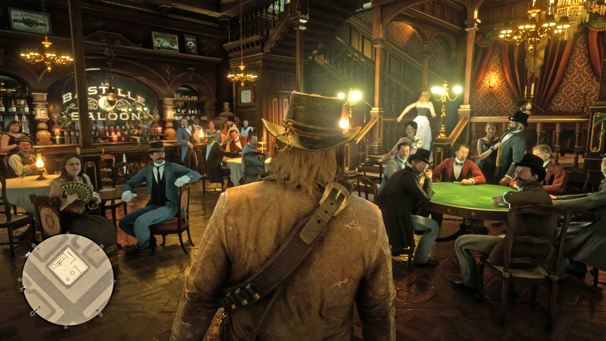

<!-- endExcerpt -->

> 断断续续，**荒野大镖客：救赎** 玩到第四章了，最近有两个场景令我惊艳、感慨。学会了用 Xbox 的截屏和录屏功能，将这两个场景记录下来，与大家分享。

## 大战在即 

第三章 - 克莱蒙斯据点 - 古恨今仇。

在得知杰克被布雷斯韦特家抓走后，达奇带着几乎全体帮派成员一路开到庄园门口，下马步行来到屋前要人。

逆着明亮的月光，树和人都成了阴暗的剪影，画面令人印象深刻。全员出动和对峙谈话间的紧张气氛，很好烘托出为救孩子杰克的心切，这种**倾尽全力保障帮派成员安全，团结一心的情感连结**。

  
_点击图片查看完整 4K 分辨率_

`video: https://youtu.be/6GHwkAUljG4`
[_在腾讯视频上_](https://v.qq.com/x/page/y30219kp9yp.html)

## 我们的时代过去了

第四章 - 圣丹尼斯 - 文明之乐。

之前在营地和某位 NPC 聊天时，亚瑟就感叹自己的焦虑说，我们的时代已经过去了，现在是文明的世界了。那时我以为游戏世界中都是荒蛮的西部，离现代还远，帮派、义气、手枪是仍是那个社会环境的规则，所以对亚瑟对焦虑没有感受。

但第一次来到圣丹尼斯时，却发现荒蛮西部和现代工业已经在这个世界并存交替时，开使有点理解亚瑟但焦虑。而推开城里酒吧大门，所有乔装打扮人们停下玩乐对话，用近乎异样的眼神看着我的时候，我突然明白了亚瑟的意思。

亚瑟的背影满是磨毛的线头，带着牛仔帽穿背着子弹夹，一副老土野蛮的形象，与城里人绅士帽、精致西装显得**格格不入**。**现在再想亚瑟说的"我们的时代过去了"，那是悲凉的事实**。

  
_点击图片查看完整 4K 分辨率_
