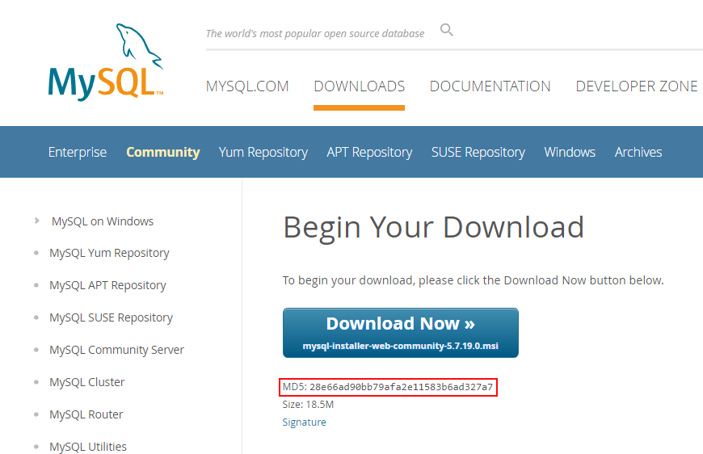
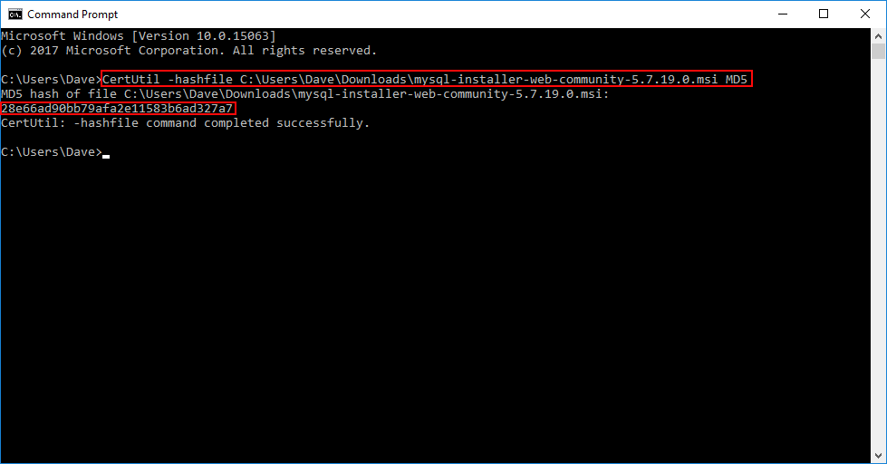

<!-- endExcerpt -->

这是一篇翻译。  
作者：[On The Fence Development](https://onthefencedevelopment.com/)  
原文：[https://onthefencedevelopment.com/2017/08/15/windows-10-builtin-md5-checksum-calculator/](https://onthefencedevelopment.com/2017/08/15/windows-10-builtin-md5-checksum-calculator/)

---

最近我的主开发电脑工作不正常(启动缓慢，一些应用程序打不开等)，在重装软件中我格外小心。

很久前，我安装过各种应用程序，游戏(包括Steam)和实用程序，现在已很难寻找导致问题的原因。可能有多个罪魁祸首。

现在，我要装 MySQL Workbench，因此我去下载，并注意到该链接下面的 MD5 校验和([checksum](https://zh.wikipedia.org/zh-cn/%E6%A0%A1%E9%AA%8C%E5%92%8C))。我总是不检查这些，也许这就是为什么我电脑被搞混乱的原因。但为了使系统尽可能保持整洁，我决定现在起尽量对比检查这些校验和。



那么问题来了，用什么工具来计算下载来的文件的校验和咧？

如果你 Google 搜 "MD5 checker" 会看到许多实用工具，虽然我没怀疑它们的可用性，但我一个也没安装。

每个下载都附带 MD5 校验和便于验证，但过去胡乱安装一堆实用工具把电脑搞乱后，这次我有点担心了。

现在，MD5 并不是什么新鲜事物，您会认为 Windows 10 内置了某实用工具，可以计算哈希值 —— 确实如此。显然，它在 Windows 7 中也可用，但我没有 Win7 系统，因此无法验证(译注：在 Windows 7 SP1 中验证可用)。

打开命令行(译注：或 PowerShell)，输入：

```powershell
CertUtil -hashfile <path to file> MD5
```

根据文件大小计算需要几秒钟，如果成功，MD5 hash值将显示如下：



也可以为其他 hash 算法生成校验和，用以下任意一个参数替换上面使用的 MD5 (注意，如果没有指定值，则默认使用 SHA1)

* MD2
* MD4
* MD5
* SHA1
* SHA256
* SHA384
* SHA512

因此，如果您只是确定一个下载文件的校验和，实际上不必安装另外的实用工具。

---

## 相关文章
- [扫盲文件完整性校验——关于散列值和数字签名](https://program-think.blogspot.com/2013/02/file-integrity-check.html)
