<!-- endExcerpt -->

这是一篇翻译。[未翻译完](#翻译中的事)。  
原文：[10++ TypeScript Pro tips/patterns with (or without) React](https://medium.com/@martin_hotell/10-typescript-pro-tips-patterns-with-or-without-react-5799488d6680)  
作者：[Martin Hochel](https://medium.com/@martin_hotell)  
翻译：陈柏林

---

**🎒 本文使用以下库版本**

```json
{
  "@types/react": "16.4.16",
  "@types/react-dom": "16.0.9",
  "typescript": "3.1.3",
  "react": "16.5.2",
  "react-dom": "16.5.2"
}
```

🎮 [源码见作者的 Github](https://github.com/Hotell/blogposts/tree/master/2018-10/ten-ts-pro-tips-with-react)

* * *

**TypeScript 绝对是当下 JavaScript 最好的版本。**

不幸的是，对于熟悉 Java/C# 的开发者而言，我不能给出相同的评价。👀😳🌀⏱

**为什么 🤨?**

好吧，它的确使熟悉 Java/C# 的开发者感觉像在家一样，让 JavaScript 具备强类型(这太神奇了！)，
然而，这引入的非标准 JavaScript 语言特性，容易令人对 TypeScript 产生错误的偏见，认为它是一门全新的语言。
但以我浅见，非也。

我一直尽量避免使用多种 TS 特性(出于 👉本文谈到的充分理由)，以便尽可能符合 JavaScript 惯用/标准。

本文介绍了我在使用 TypeScript 和 React 构建 UI 时，"发明/学习"到的各种模式与技巧。

> **备注：**  
> 最初，此博客文章仅有 10 个提示，在回顾本文期间，我又添加了其他 8个 💪。  
> 随着 React/TS 的变化、改进、发展，将来我可能会添加其他提示。  
> 一定要不时查看这篇文章的更新哦 😎

## 更新：

> **26.1.2019** 更新
> 9. 👉 使用 type inference 定义组件的 State 或 DefaultProps
> 
> **23.1.2019** 添加
> 19. 👉 使用 type 别名而不是 interface 声明 Props/State
> 20. 👉 不要用 `FunctionComponent<P>` 定义函数组件

整篇文章的编写方式很像"风格指南"，每个技巧提示/模式都有 3个小节，其中包括：

* **_Don’t_** 🚨 (代码示例你**不**应该这么做)
* **_Do_** ✅ or **_Good/Better/Consider_** (代码示例你**应该**这么做)
* **_Why_** 🧐 (原因与解释)

有了这些内容，让我们进入 10+ 条使用 TypeScript 的专业提示(在 React 中)。

* * *

## 1. 不要在类上使用 `public` 修饰符

### Don’t

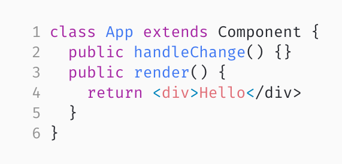

### Do

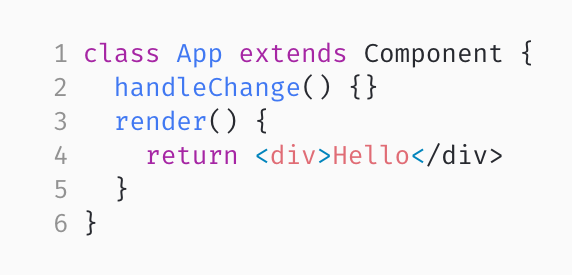

### Why?

默认情况下，类中所有成员都是 `public` 的(并且在运行时始终是 public，TS 中的 private/protected 仅在编译时才"隐藏"特定的类属性/方法)。
不要给你的代码库引入额外的混乱。修饰符 `public` 也不是有效/惯用的 Javascript。

## 2. 不要在 Component class 上使用 `private` 修饰符

### Don’t

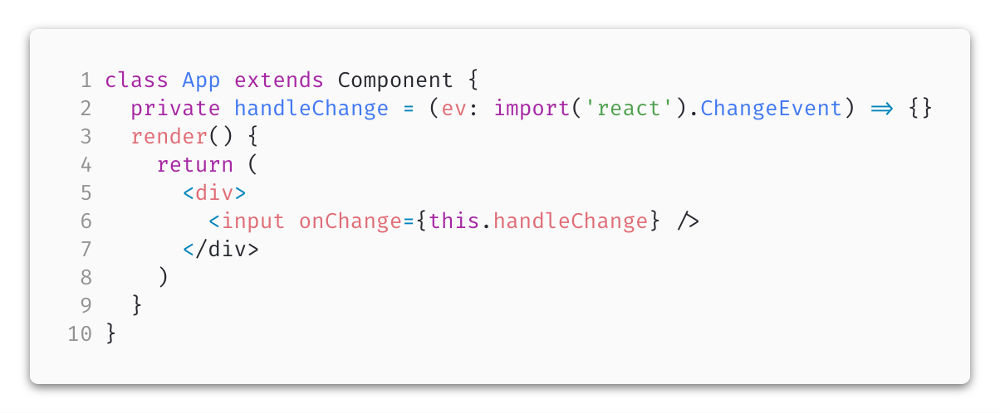

### Good

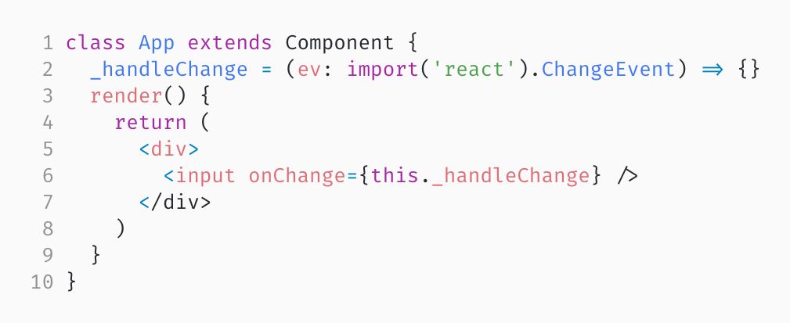

### Better

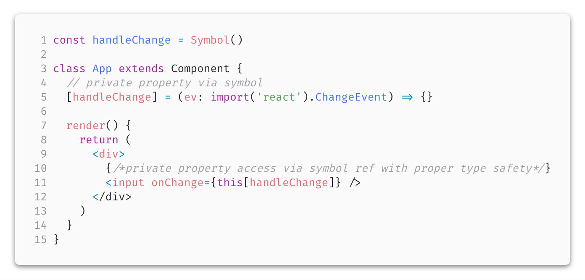

### Why?

修饰符 `private` 不会在运行时将属性/方法设置为私有，这只是 TypeScript 在编译时的模拟。
也不要天真地，使用众所周知的把戏来设置"私有"，比如：

* 名称以下划线开头 👉 `_someProp`
* 或者，如果您真的想将属性设为私有，请使用 `Symbol` 来定义它们。([真正的运行时私有属性将在 ECMAScript 中推出](https://github.com/bloomberg/TypeScript/pull/6))

实际上，您几乎永远不需要直接使用 React Component 实例或访问其类属性。

## 3. 不要在 Component class 上使用 `protected` 修饰符

### Don’t

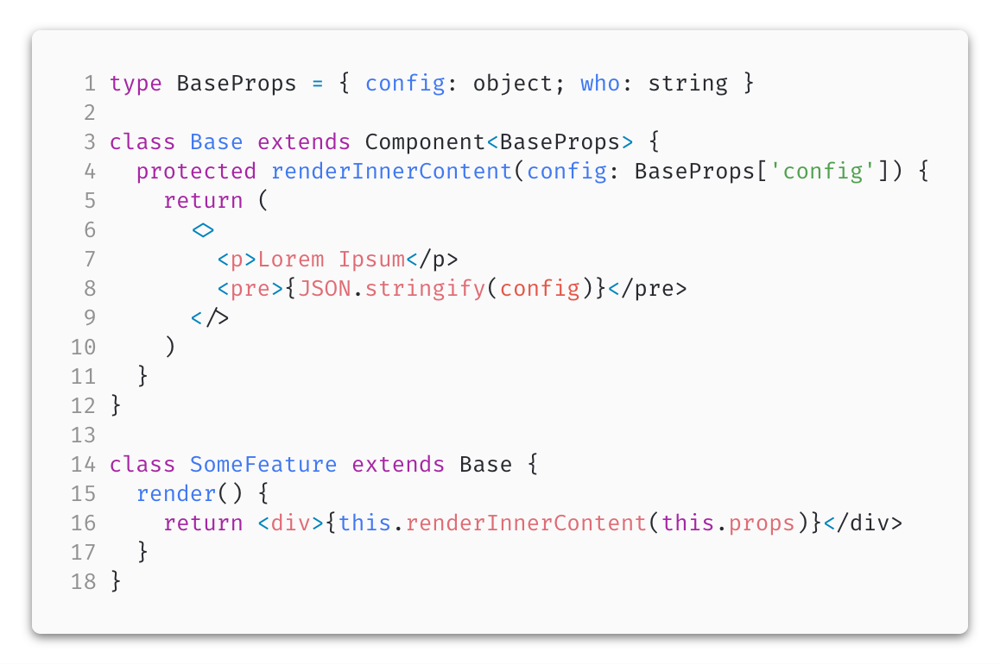

### Do

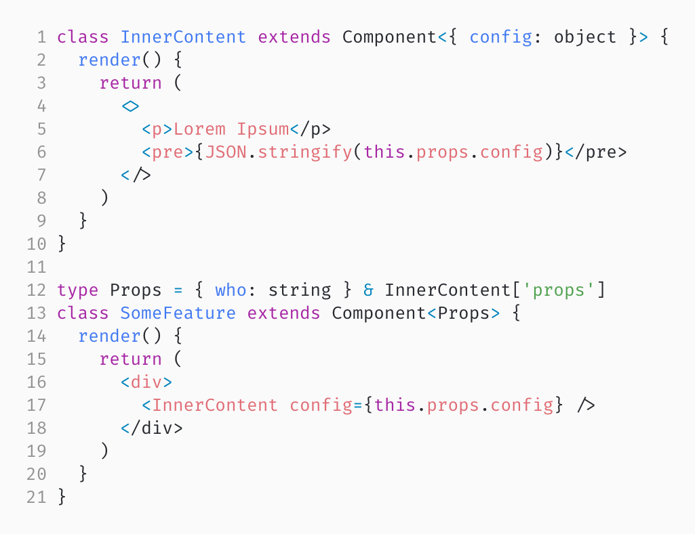

### Why?

在 React 中使用 `protected` 是"红色警报" 🚨🚨🚨，这不符合 React 的函数式模式。有比这更有效的模式来扩展某些组件的行为。比如：

* 提取逻辑以分离组件，并如上所示使用它
* **HoC** (高阶组件) 与 **functional composition**。
* **CaaF** ( children as a function )

## 4. 不要用 `enum`

### Don’t

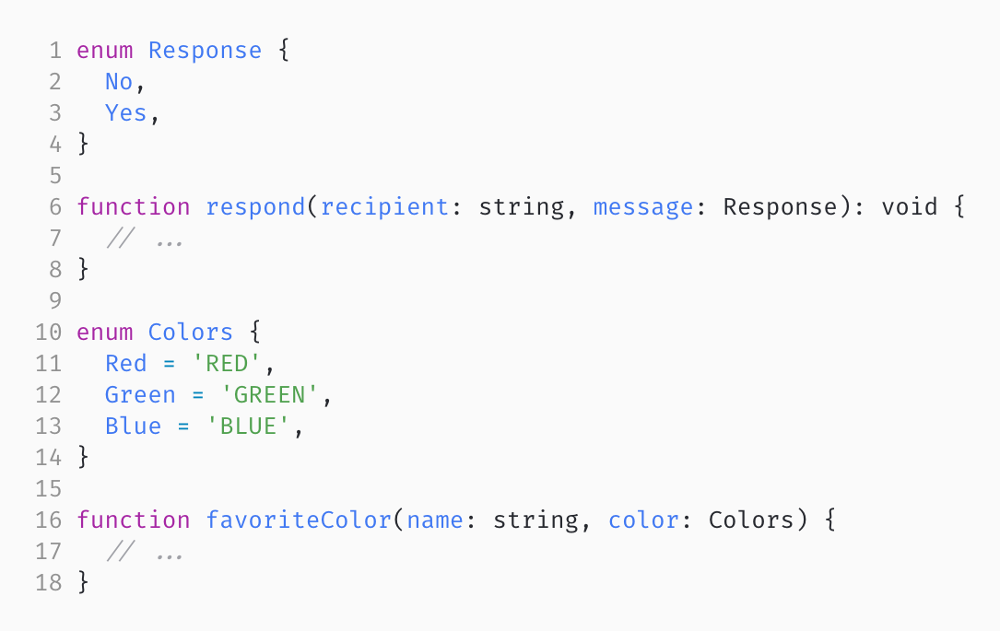

### Good

如果需要支持运行时枚举值，请使用以下模式：

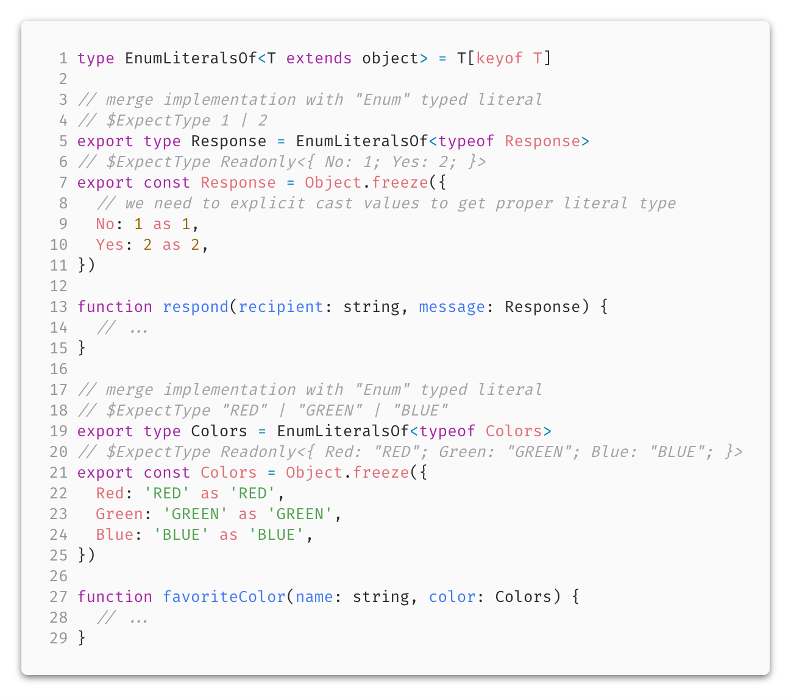

### Better

如果不需要支持运行时枚举值，就用类型字面量就行了：

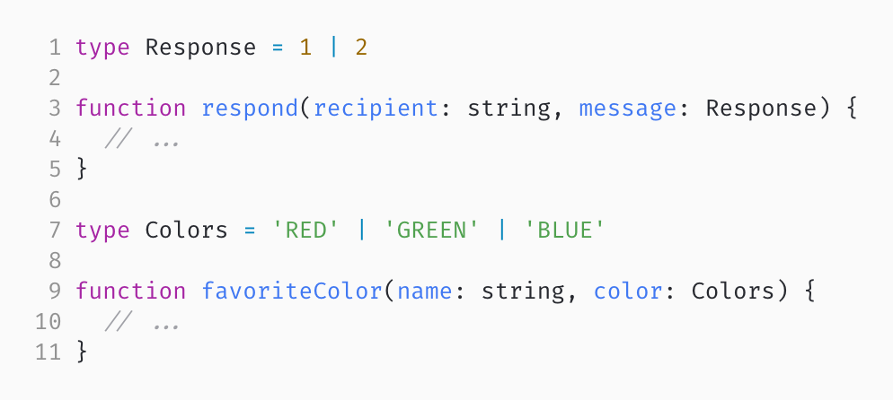

### Why?

在 TypeScript 中使用 `enum` 可能非常诱人，特别是如果您来自 c# 或 Java 这样的语言。但还有更好的方法，既可以使用 JS 惯用模式，又如在 "Better"示例中看到的，只使用编译时类型字面量。

* 对枚举(Enum)类型的编译会生成一些不必要的模板代码(不过可以通过 `const enum` 来缓解这一问题。同样，最好还是用字符串枚举)。
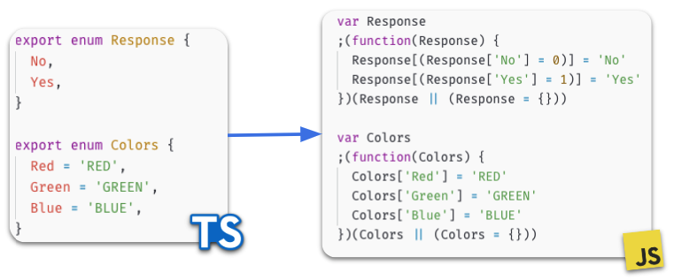
* 非字符串枚举被赋值错误的数字字面量时，会引入未 handle 住的 bug
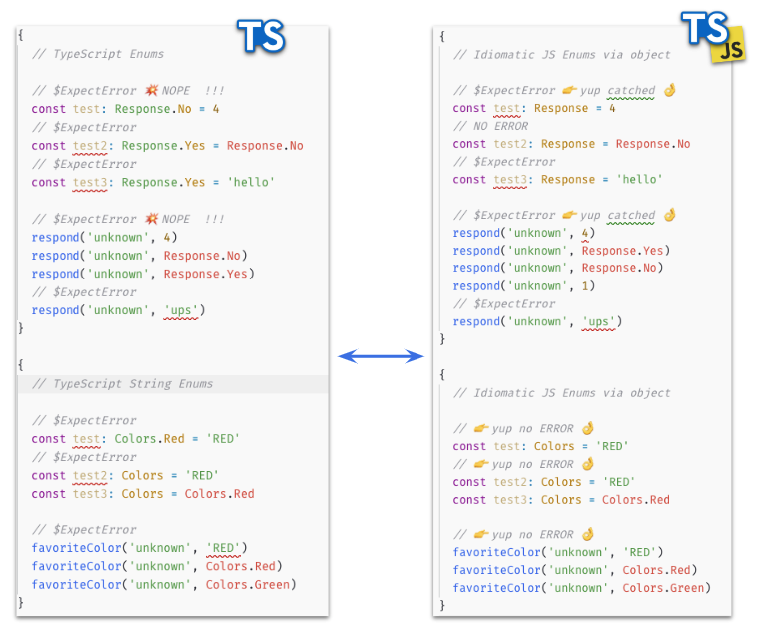
* 它不是 JavaScript 的惯用/标准写法(虽然 `enum` 在 ECMA 标准中是保留字)
* 无法与 [babel for transpiling](https://babeljs.io/docs/en/babel-plugin-transform-typescript) 一起使用 👀

**🙇 ‍Enum 帮助函数**

在 "Good" 例子中，你可能会想，啊~ 这么多模板代码啊！ 🙏

如果出于某原因，你实在需要支持运行时枚举，可以用这个小工具库 [**rex-tils** library](https://github.com/Hotell/rex-tils)，示例：

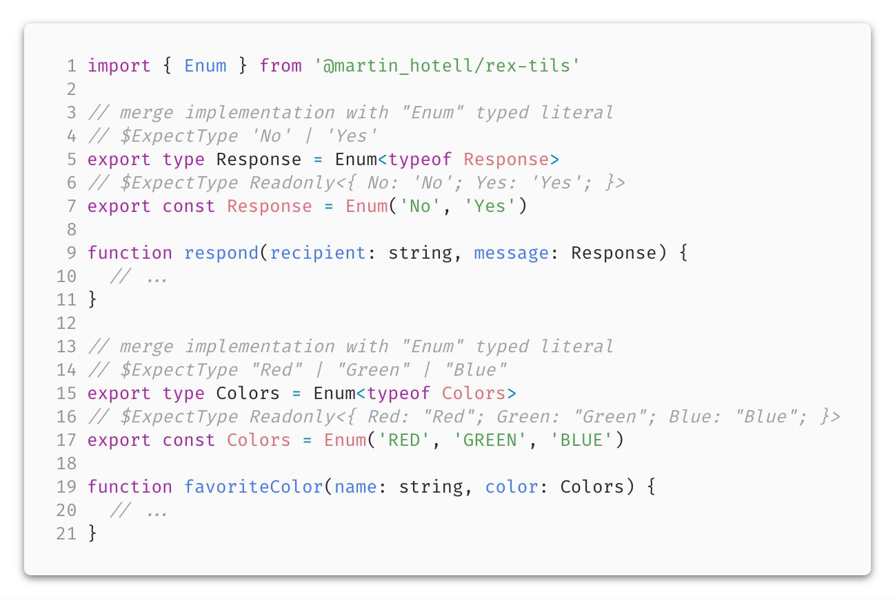

## 5. 不在  class Components 中使用 `constructor`

### Don’t

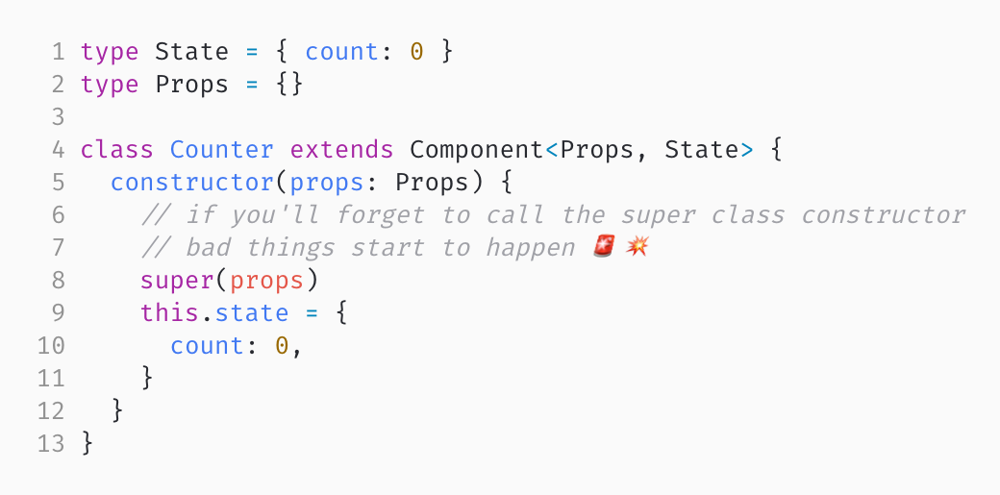

### Do

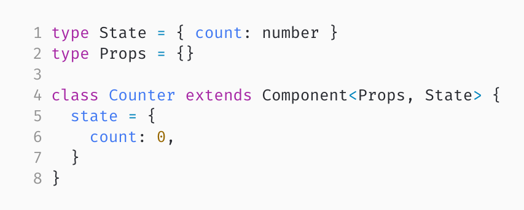

### Why?

在 React Component 实在没有必要用 `constructor`。

如果用了，你必须添加很多模板代码，并且为传入的 props 调用 `super`(若你调用 super 时忘了传参数 props，组件会因 _无法正确传递_ props 而出错)。

> **但是，但是！React 官方文档都用 `constructor` 咧！**  
> 👉 是的(React 官方使用当前的 JS 版本写例子)，**但是，但是，`class` 还不在 Javascript 现今标准中！**  
> 👉 `class` 在 [Stage 3](https://github.com/tc39/proposal-class-fields#consensus-in-tc39) 中，亦其最近才会在 JS 标准中实现

**依据一些逻辑初始化 state**

你可能会问，如果我要依据一些逻辑来初始化组件 state，或依据其他的变量，比如 props，没有 `constructor` 怎么办？

回答这问题很简单：

在组件外定义一个纯函数，用来包含初始化逻辑(当作一个 "副作用 side effect"，这样代码也更容易测试 👌)。

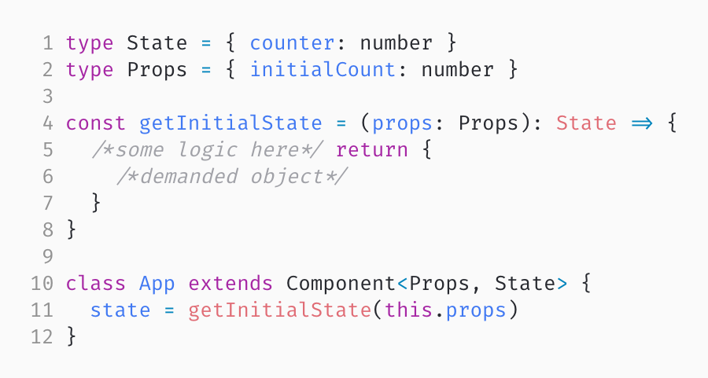

## 6. 不要在 Component class 上使用装饰器(decorator)

### Don’t

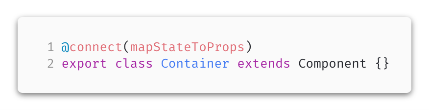

### Good

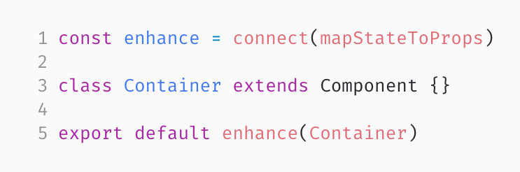

### Better

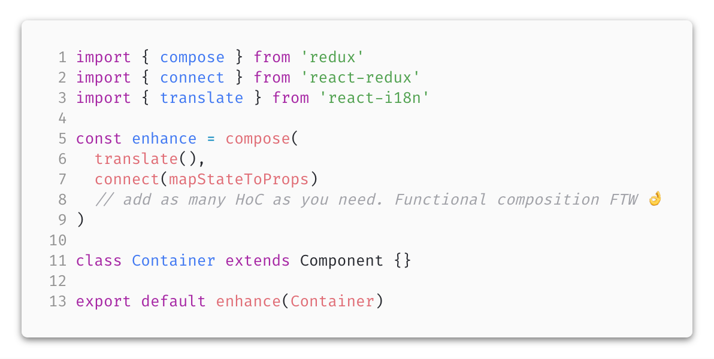

### Why?

装饰器就像寄生虫 🐛 👀 🤢

* 无法获得类的干净、原始版本。
* TypeScript 使用装饰器的老提案版本，这和将在 ECMAScript 标准中实现的有不同 🚨。
* 这增加了运行时处理时间。
* 最重要的是，在 JSX 类型检查的时候，装饰器未扩展类类型定义。意味着(在我们例子中)，Container 组件对其消费的 props 没有相应类型信息。

## 7. 使用查找类型(Lookup types)访问组件的 State/Props 类型

🙇‍ [见 Typescript 2.1 release note 中对 lookup types 的介绍](https://www.typescriptlang.org/docs/handbook/release-notes/typescript-2-1.html#keyof-and-lookup-types)

### Don’t

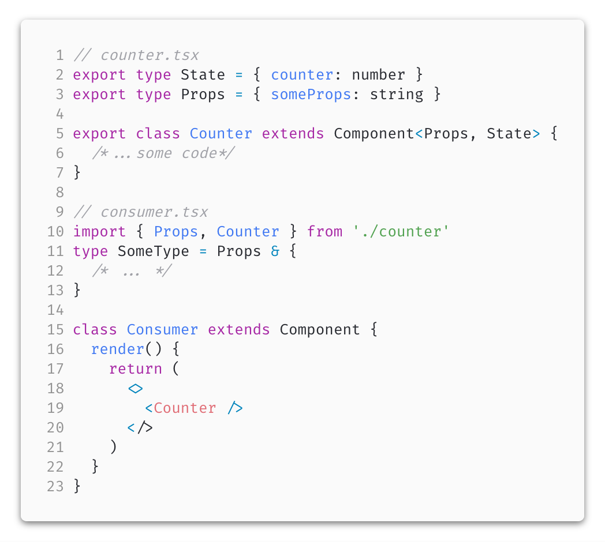

### Do

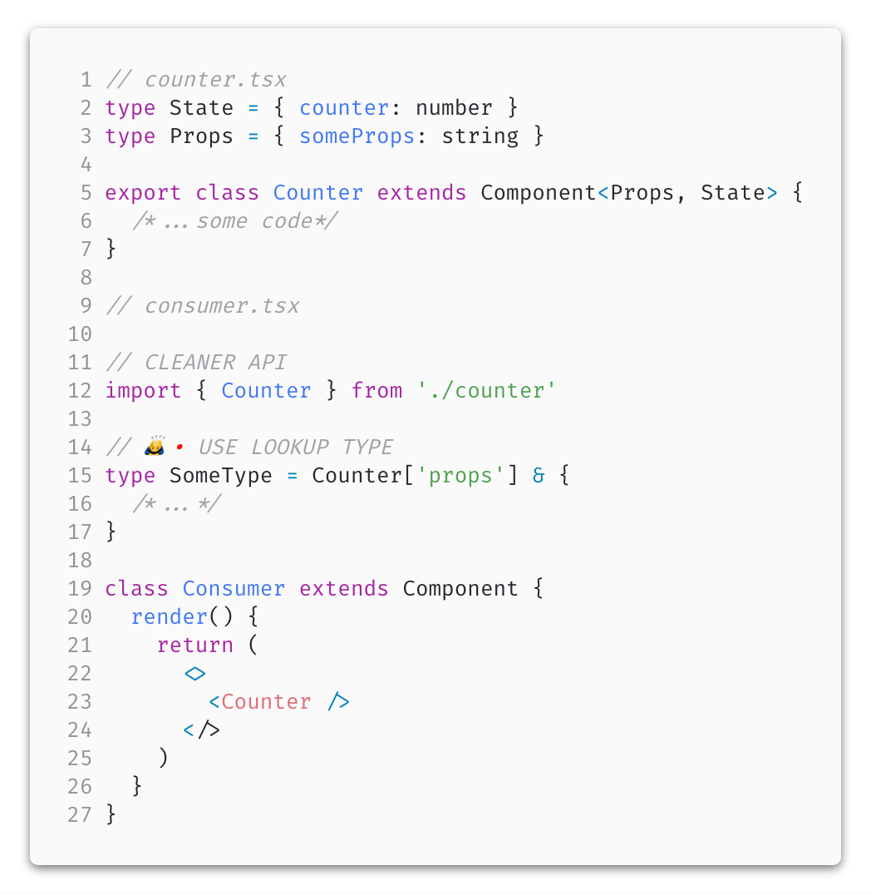

### Why?

* 从组件实现中导出 Props 或 State 会使 API 变得更大。
* 问自己一个问题，为什么消费组件要显式导入 State/Props type？若真的需要，应该通过查找类型功能访问。这样 API 又精简，类型信息又清楚，双赢 💪
* 如果一个 Props type 很复杂，应该提取到类似 `models/types` 公共 API 定义中去。

## 8. 始终为 `children` Props 显式定义类型

### Don’t

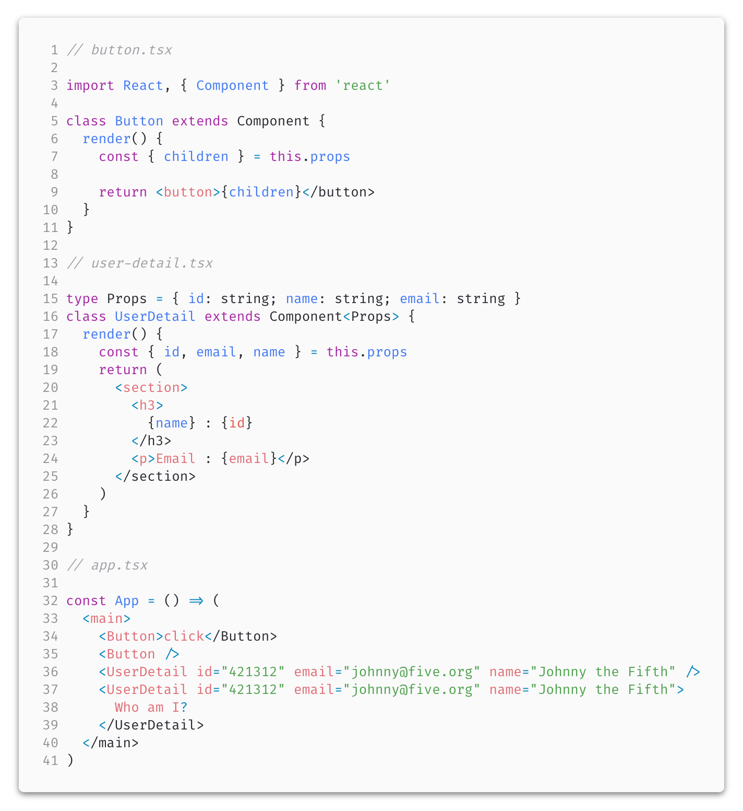

### Do

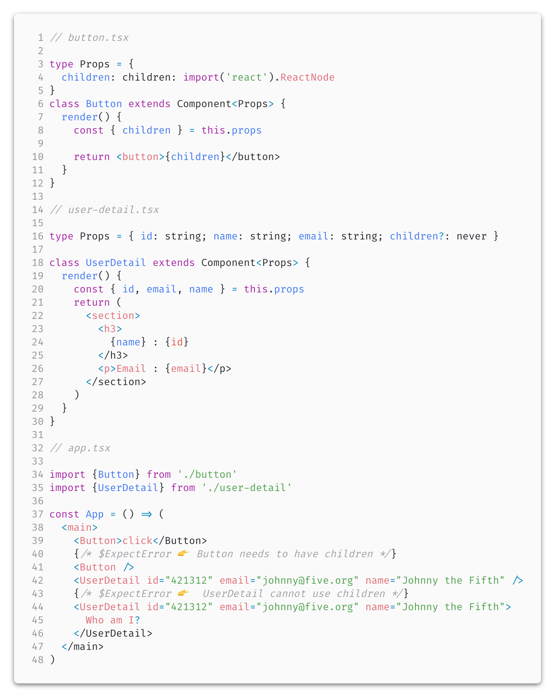

### Why?

* `children` prop 在 react.d.ts 被标注为可选的 React Component 和 Functional Component，这仅反映了 React 如何处理 children 的实现。虽然这样做没有问题，但我更喜欢显式地使用组件API。
* 若组件打算用 `children` 传递内容，确保显式地表达其类型，若不会用，则标注 `never`，防止使用 children。

**Children 类型限制 🚸**

> 嘿，滑板先生！我有个问题 ✋:

在 TypeScript 中 `children` 可被表示为哪些类型呢？我能限制 children 是某个具体的 Component 吗([像在 Flow 中一样](https://flow.org/en/docs/react/children/#toc-only-allowing-a-specific-element-type-as-children))？比如：`Tab` 在 `Tabs` 中，`children: Tab[]` ？

很遗憾，不行 🙃，因为 TypeScript 无法在全局命名空间中解析 `JSX.factory`、`React.createElement` 的返回内容，即 `JSX.Element`。
编译器从 `extends React.ReactElement<any>` 这里只能得到一个 object 类型，所以没有类型检查(警告：每用一次 `any` 就会死一只小猫咪 🙀😅)

如 TypeScript 文档陈述的 👀：

> 默认情况 JSX 最终的类型被标注为 `any`。你可以通过 JSX.Element 接口自定义类型。但是，无法从接口检索该 JSX 的 element、attributes 或 children 的类型信息。这是一个黑盒 ⬛ 📦。
> 
> **_注意：_**  
> TS 2.8 引入了 [locally scoped JSX namespaces](https://www.typescriptlang.org/docs/handbook/release-notes/typescript-2-8.html#locally-scoped-jsx-namespaces)，有助于在未来解决这个问题。

可用这些类型来标注 `children`：

* `ReactNode` | `ReactChild` | `ReactElement`
* `object` | `{[key:string]:unknown}` | `MyModel`
* 原始类型 `string` | `number` | `boolean`
* `Array<T>` 其中 T 可以前者任何一个
* `never` | `null` | `undefined` ( 不过 null 和 undefined 没什么意义 )

## 9. 使用类型推断来定义组件 State 或 DefaultProps

### Don’t

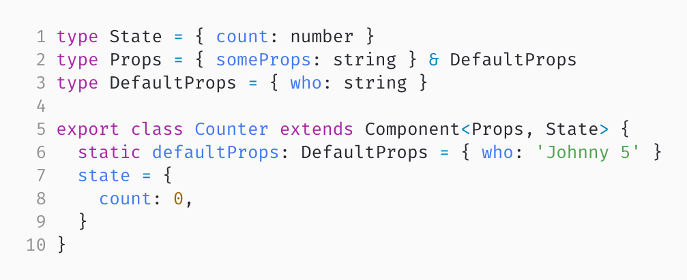

### Good

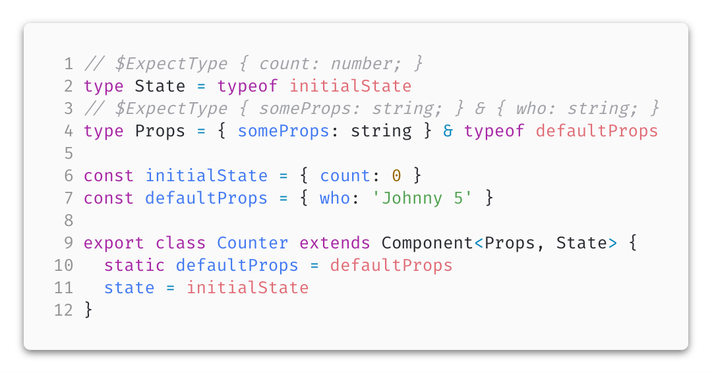

### Better

冻结 initialState/defaultProps 后，TS 会推断其为 `readonly` 类型(当有人意外赋值了，编译会报错)。
把 `static defaultProps` 和 `state` 都加上 `readonly` 也是一个不错的方法，这防止我们在运行时错误地设置 state，比如：`this.state = {...}`

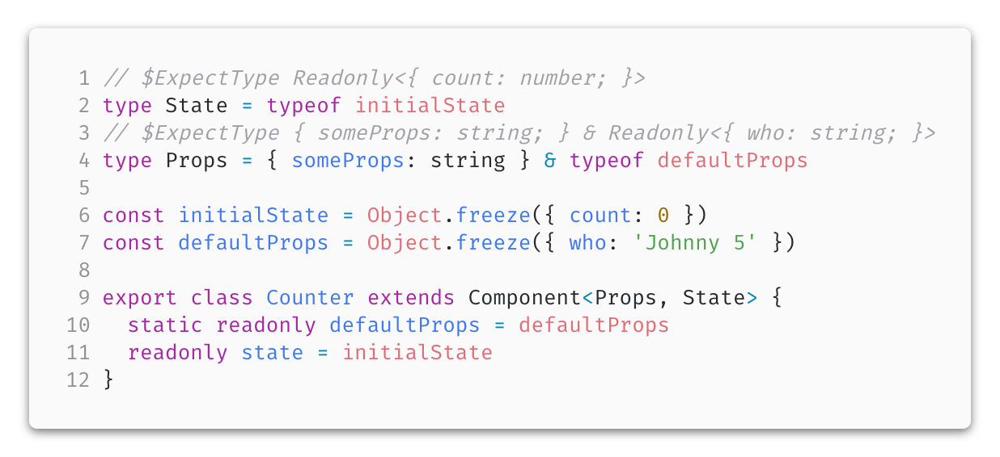

### Why?

* 类型信息总是与实现保持同步，唯一来源就是 👉 **实现**！ 💙
* 更少的模板
* 代码更具可读性
* 标注 readonly 和冻结对象后，组件中任何值改变都会在编译时报错，这样可防止运行时报错，好好享受你的应用把！

**如果要用为 state 或 defaultProps 定义更复杂的类型呢？**

Use `as` operator to cast your properties within the constant.

_Example:_

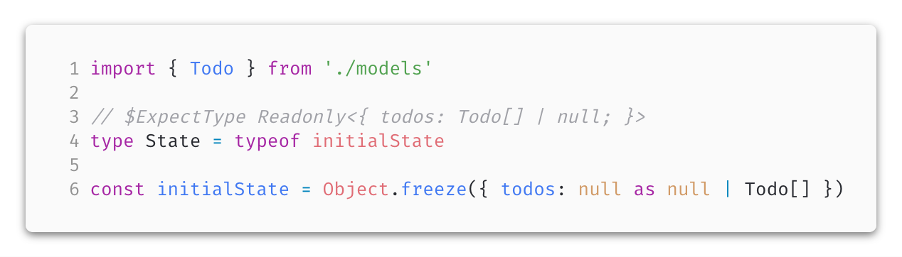

### 从 props 派生 state 时，如何使用自动推断类型？

很容易 😎…… 用技巧 5 中的按条件分支生成类型(标准库 `lib.d.ts` `ReturnType` 映射的类型，推断任何函数的返回类型 ✌)。

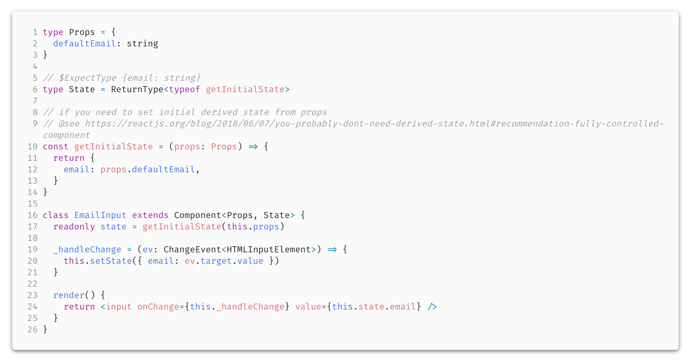

## 10. When using function factories instead of classes for models/entities, leverage declaration merging by exporting both type and implementation

### Don’t

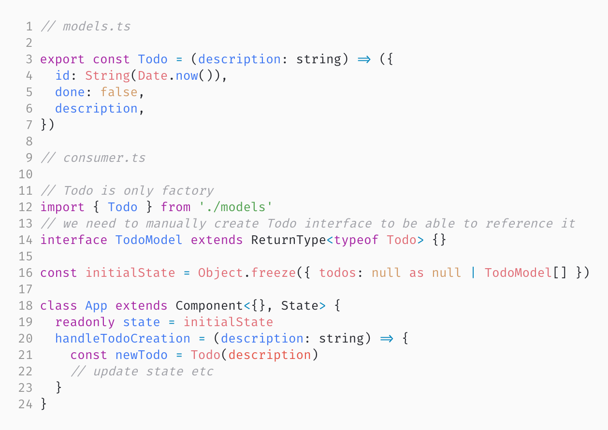

### Do

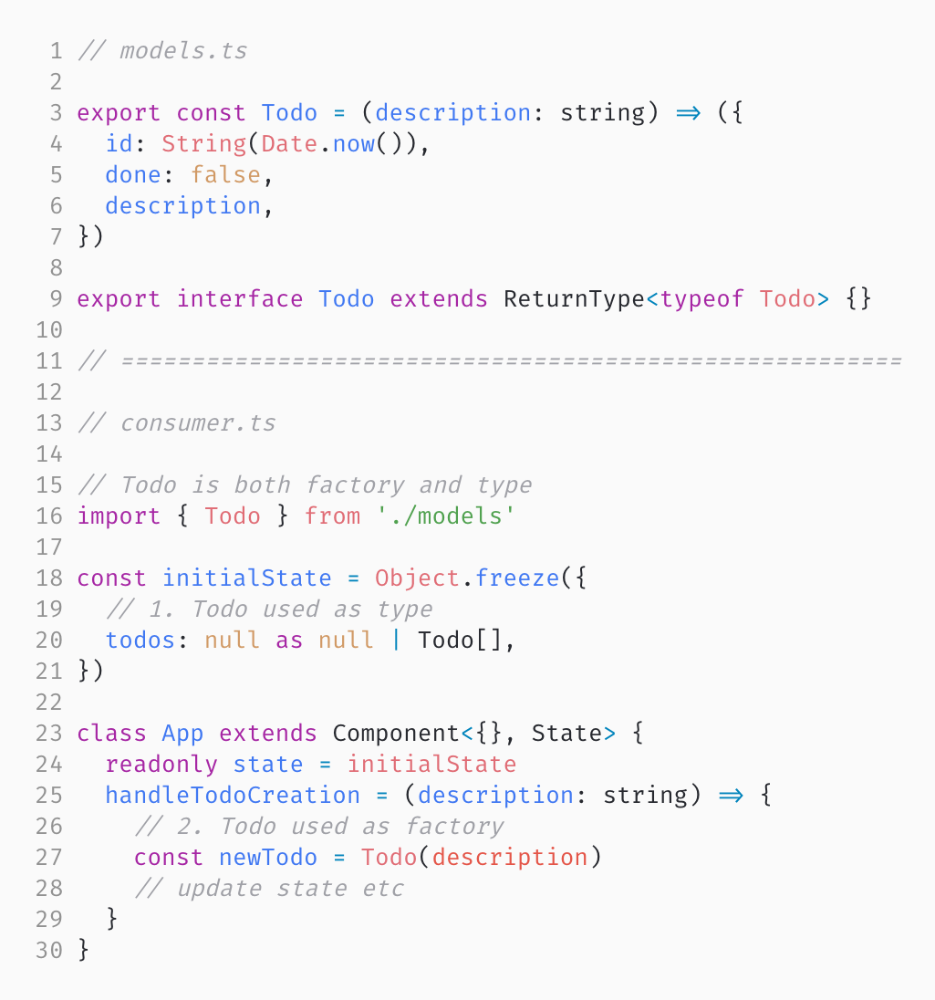

### Why?

* 更少模板代码
* One token for both type and implementation / Smaller API
* 类型与实现保持同步，更重要的是，实现就是真实来源

## 11. 使用 default import 导入 `React`

### Don’t

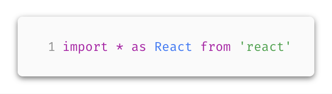

### Do

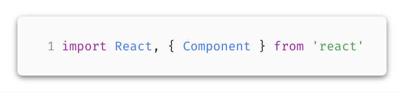

为支持推荐的行为，需在 `tsconfig.json` 中添加如下设置：

```json
{  
  "compilerOptions": {
    /*
       Enables emit interoperability between CommonJS and ES Modules
       via creation of namespace objects for all imports.
       Implies 'allowSyntheticDefaultImports'.
    */
    "esModuleInterop": true // highlight-line
  }
}
```

### Consider

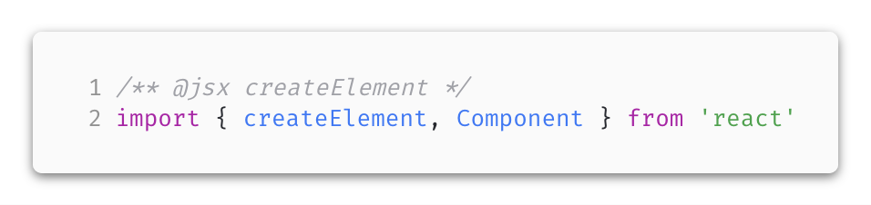

> **备注**  
> - 这种写法风格里，`Fragments` 的语法糖 👉 `<></>` 无效。需要显式导入并这样使用 `<Fragment>...</Fragment>`。
> - I like this approach more as it’s explicit and I can add `key` whenever I want without introducing "too much" changes while doing refactoring.

If you wanna use the “consider section pattern” in whole project without defining jsx pragma per file, you need to set following config within your tsconfig.json file:

```json
{  
  "compilerOptions": {  
    /*   
      Specify the JSX factory function to use   
      when targeting 'react' JSX emit,   
      e.g. 'React.createElement' or 'h'.   
    */  
    "jsxFactory": "createElement"  // highlight-line
  }  
}
```

### Why?

*   It’s confusing to import all contents from react library when you’re not using them.
*   It’s more aligned to “idiomatic JS”
*   You don’t need to import types defined on `React` namespace like you have to do with `Flow` as TS support declaration merging 👌
*   The “consider” example is even more explicit what is used within your module and may improve tree-shaking during compile time.

## 12. Don’t use `namespace`

### Don’t

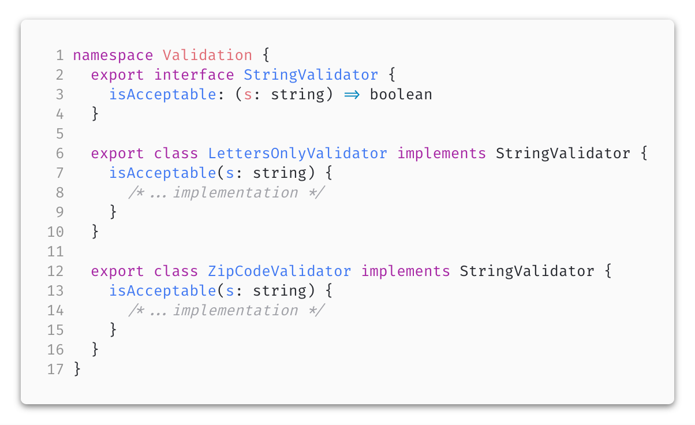

### Do

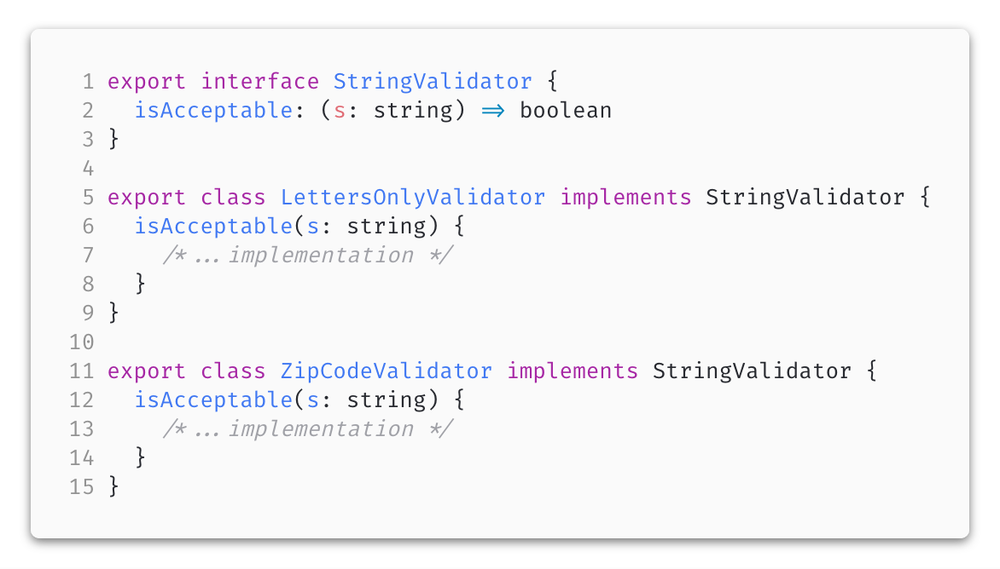

### Why?

*   `namespace` was kinda useful in pre ES2015 modules era. We don't need it anymore.
*   Cannot be used with [babel for transpiling](https://babeljs.io/docs/en/babel-plugin-transform-typescript) 👀

If you really need some kind of namespacing within your module, just use idiomatic JavaScript, like in following example:

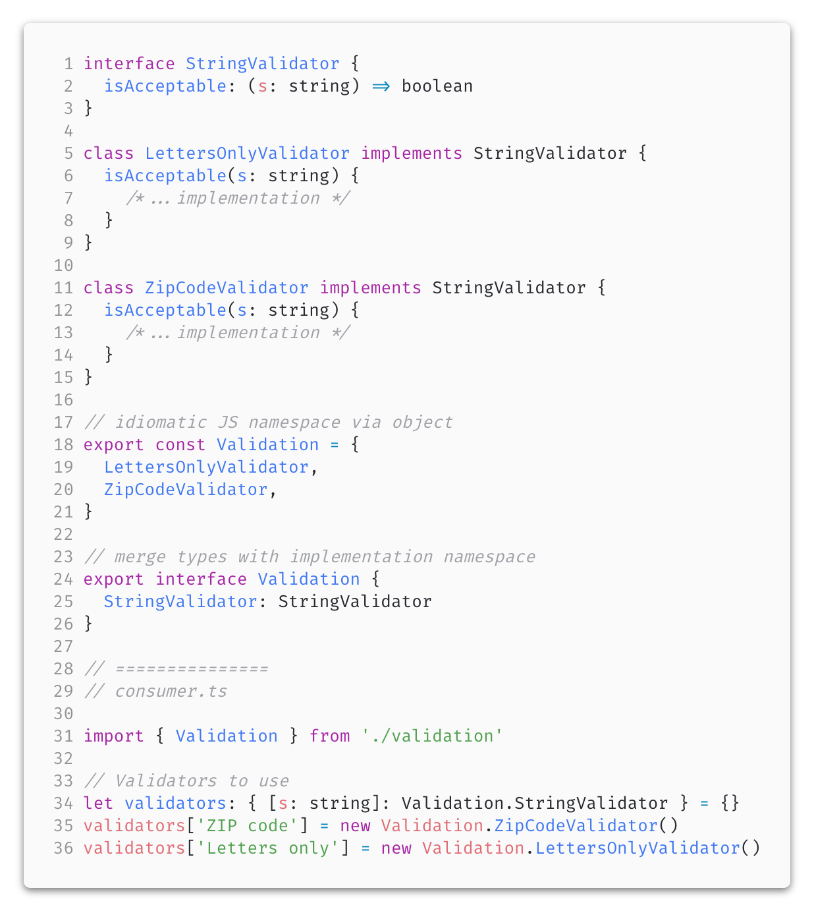

## 13. Don’t use ES2015 module imports when importing types without any run-time code

### Don’t

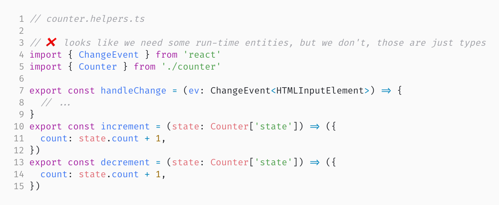

### Do

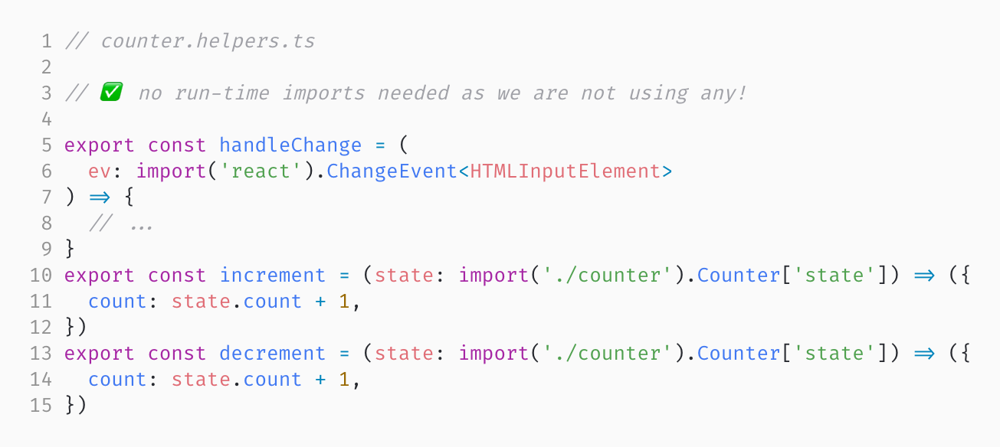

> ### NOTE
> 
> If you’re having many duplicate imports, consider to aliasing them to local type 👉 type `State = import('./counter').Counter['state']`
> 
> 👉 Beware that if you wanna create local type alias from generic type import, you need to mirror that generic type as well, e.g.: 👉 `type ReactElement<T=any> = import('React').ReactElement<T>`

### Why?

* Your code is explicit for both human and machine. If you don’t use any run-time code, annotate your code via only via `import('path')`
* [check this great post from David East](https://davidea.st/articles/typescript-2-9-import-types) to learn more

## 14. Don’t use camelCase/PascalCase for file names

### Don’t

<pre class="ga gb gc gd ge hl hm hn">
<span id="cd6b" class="ho hp co at hq b bl hr hs r ht">SkaterBoy.tsx</span>
<span id="e4f6" class="ho hp co at hq b bl of og oh oi oj hs r ht">userAccessHandlers.ts</span>
</pre>

### Do

<pre class="ga gb gc gd ge hl hm hn">
<span id="2fdd" class="ho hp co at hq b bl hr hs r ht">**skater-boy.tsx**</span>
<span id="ebfb" class="ho hp co at hq b bl of og oh oi oj hs r ht">**user-access-handlers.ts**</span>
</pre>

### Why?

*   readable file names. e.g `MyHalfFixedDedupedDirResolver` vs `my-half-fixed-deduped-dir-resolver` 👀
*   no more weird git conflicts when renaming/deleting/adding files on various OS file systems (case-sensitive/insensitive)
*   consistency (I don’t have to think if this file is component or some helper or service. `tsx` extension tells me that)
*   nicely maps to component implementation name `skater-boy.tsx` 👉 `const SkaterBoy = () => {}`

## 15. Declare types before run-time implementation

### Don’t

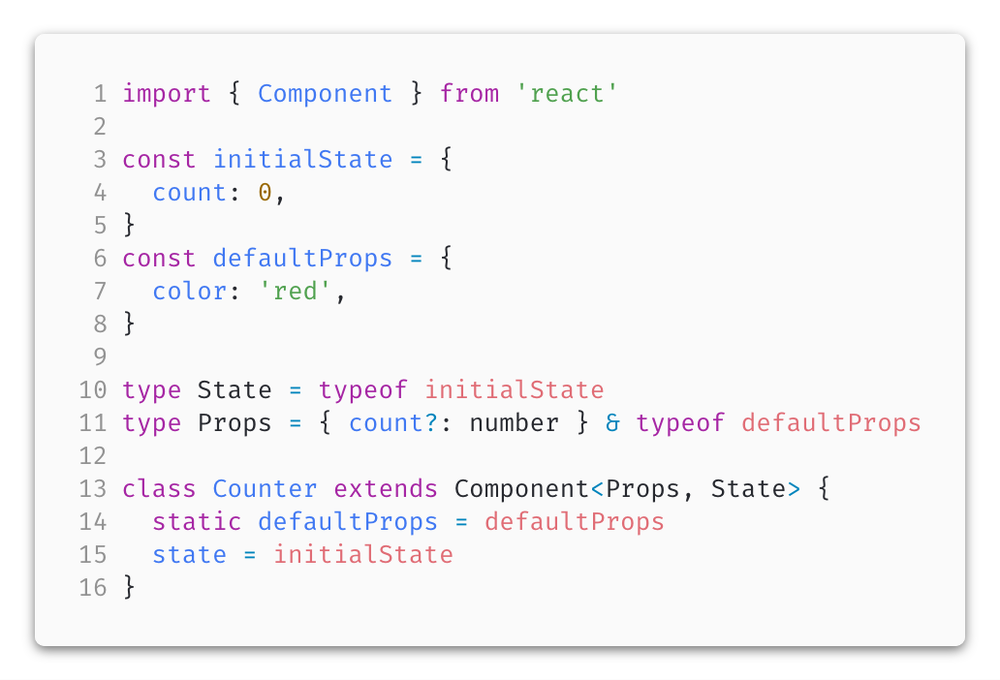

### Do

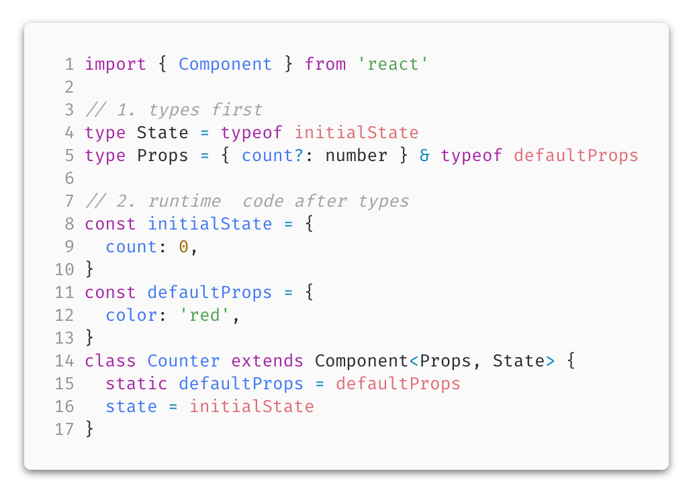

### Why?

*   first lines of document clearly state what kind of types are used within current module. Also those types are compile only code
*   run-time and compile time declarations are clearly separated
*   in component user immediately knows what the component “API” looks like without scrolling

> ### NOTE
> 
> If you’re leveraging declaration merging as part of your API, define type after implementation:

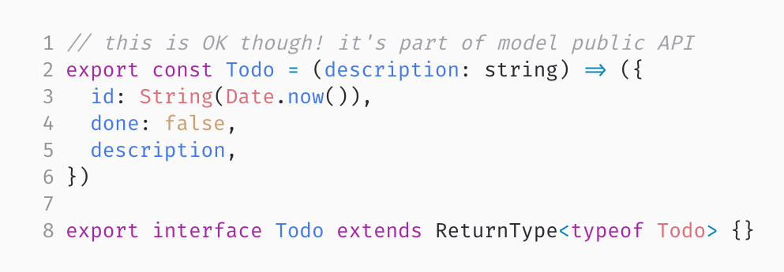

## 16. Don’t use method declaration within interface/type alias

### Don’t


### Do

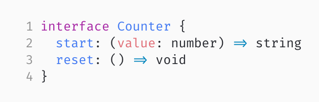

### Why?

*   `--strictFunctionTypes` enforces stronger type checks when comparing function types, but does not apply to methods. [Check TS wiki to learn more](https://github.com/Microsoft/TypeScript/wiki/What's-new-in-TypeScript#strict-function-types)
*   [explanation from TS issue](https://github.com/Microsoft/TypeScript/issues/25296#issuecomment-401517062)
*   consistency, all members of type/interface are defined via same syntax

## 17. Don’t use `_number_` for indexable type key

### Don’t

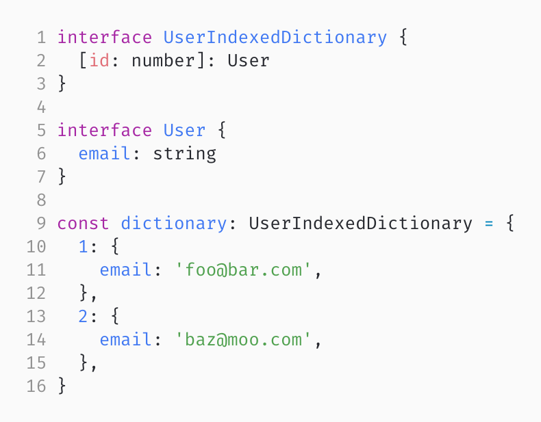

### Do

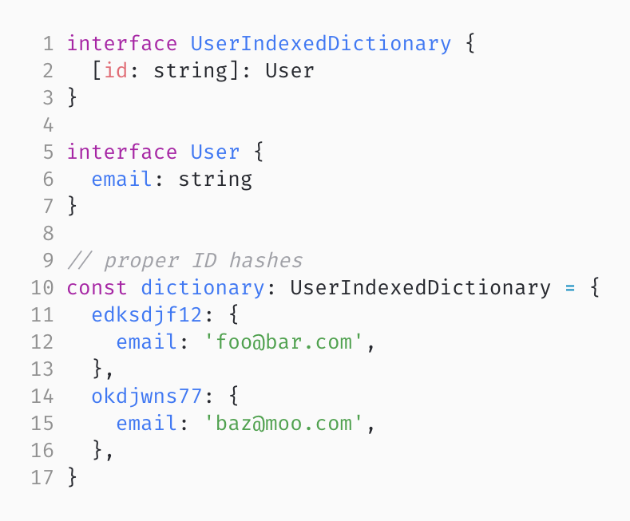

### Why?

*   In JavaScript object properties are always typeof `string`! don't create false type predicates within your apps!
*   Annotating keys with `number` is OK for arrays (array definition from standard .d.ts lib 👉 `[n: number]: T;`), although in real life you should rarely come into situation that you wanna define "custom" array implementation

## 18. Don’t use `JSX.Element` to annotate function/component return type or children/props

### Don’t

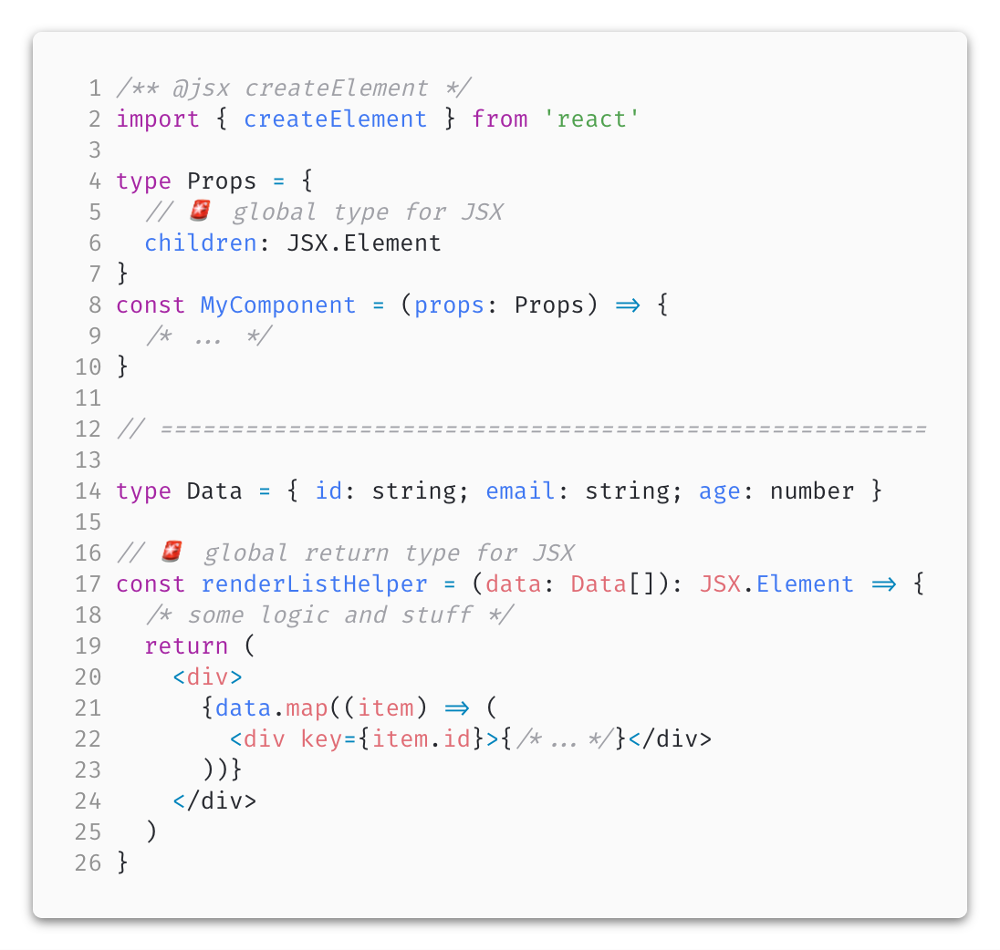

### Do

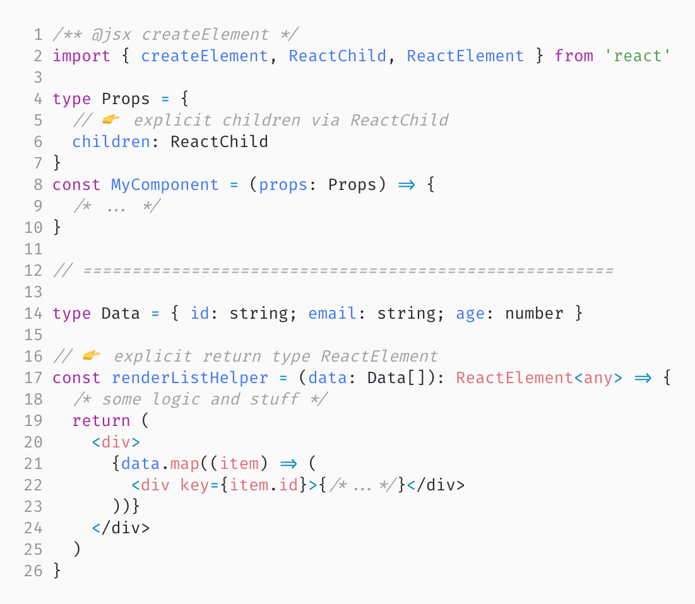

### Why?

*   globals are bad ☝️💥
*   TypeScript supports locally scoped JSX to be able to support various JSX factory types and proper JSX type checking per factory. While current react types use still global JSX namespace, it’s gonna change in the future.
*   explicit types over generalized ones

## 19. Use type alias instead of interface for declaring Props/State

### Don’t

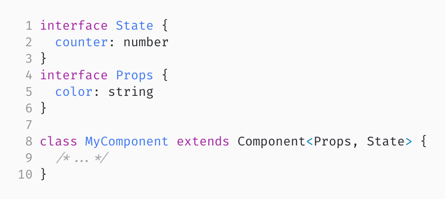

### Do

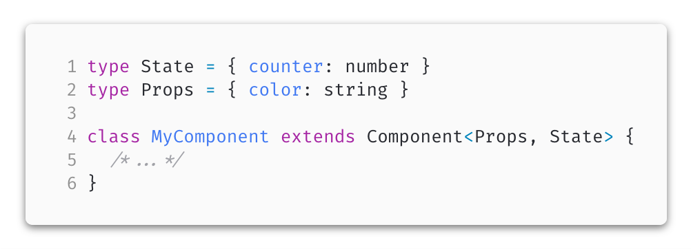

### Why?

*   consistency/clearness. Let’s say we use tip no.8 (defining state type from implementation). If you would like to use interface with this pattern, you’re out of luck, as that’s not allowed within TypeScript.

<span id="734f" class="ho hp co at hq b bl hr hs r ht">// $ExpectError ❌  
interface State extends typeof initialState {}</span>
<span id="be8f" class="ho hp co at hq b bl of og oh oi oj hs r ht">const initialState = {  
  counter: 0  
}</span>

*   interface cannot be extended by types created via union or intersection, so you would need to refactor your State/Props interface to type alias in that case.
*   interfaces can be extended globally via declaration merging, if you wanna provide that kind of capabilities to your users you’re doing it wrong (exposing “private” API)

## 20. Don’t use `FunctionComponent<P>`/`FC<P>` to define a function component

### Don’t

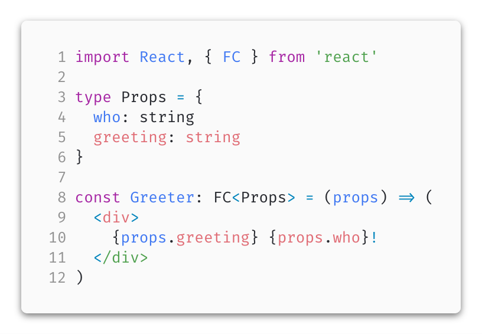

### Do

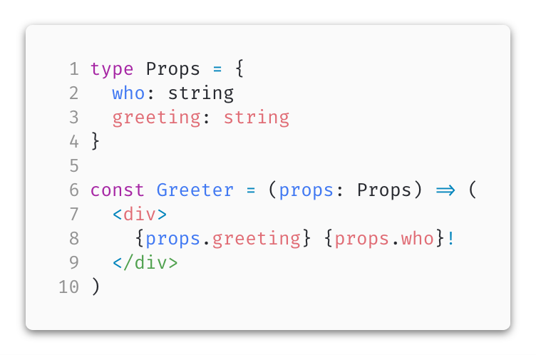

### Why?

*   consistency/simplicity (always prefer familiar vanilla JavaScript patterns without too much type noise/magic)
*   `FC` defines optional `children` on props, which is not what your API may support as explained in **_tip no 8_**. API should be explicit!
*   `FC` breaks `defaultProps` type resolution (introduced in TS 3.1) and unfortunately all other "static" props as well 👉(`propTypes`,`contextTypes`,`displayName`)

**_How FC breaks defaultProps and friends ?_**

```typescript jsx
type Props = {
  who: string
} & typeof defaultProps

const defaultProps = {
  greeting: 'Hello',
}

const Greeter: FC<Props> = (props) => (
  <div>
    {props.greeting} {props.who}!
  </div>
)

// 🚨 This won't work. 
// Greeter components API will not mark `greeting` as optional</span><span id="12de" class="ho hp co at hq b bl of og oh oi oj hs r ht">Greeter.defaultProps = defaultProps

const Test = () => (
  <>
    {/**
      ExpectError ❌
      Property 'greeting' is missing
    */}
    <Greeter who="Martin" />
  </>  
)
```

> To fix this you would have to re-define default props, which makes your code a mess… 🤒 Look for yourself! 👉

```typescript jsx
const Greeter: FC<Props> & { defaultProps: typeof defaultProps } = ( props ) => {
  /*...*/
}
```

*   `FC` cannot be used to define a generic component

> while we can define generic functional component(because it’s just a function):

```typescript jsx
type Props<T extends object> = {
  data: T
  when: Date
}

const GenericComponent = <T extends object>(props: Props<T>) => {
  return (
    <div>
      At {props.when} : {JSON.stringify(props.data)}
    </div>
  )
}
```

> following won’t work and we’ll get compiler error:

```typescript jsx
type Props<T extends object> = {  
  data: T  
  when: Date  
}

// $ExpectError ❌
// 🚨 FC cannot set generic Props type.
// We got TS error as T (generic), cannot be possibly defined/inferred
const GenericComponent: FC<Props<T extends object>> = (props) => {
  return (
    <div>
      At {props.when} : {JSON.stringify(props.data)}
    </div>
  )
}
```

* * *

## Summary

That’s it for today! Hope you gonna apply those patterns sooner than later within your code base or even better use them as part of your project style guide. If you do please lemme know how it goes ! 😎

> [And remember. ☝ Respect, is everything! 😅](https://www.youtube.com/watch?v=EloDnA1_XEU)

* * *

As always, don’t hesitate to ping me if you have any questions here or on Twitter (my handle [@martin_hotell](https://twitter.com/martin_hotell)) and besides that, happy type checking folks and ‘till next time! Cheers! 🖖 🌊 🏄


*   [JavaScript](/tag/javascript)
*   [Typescript](/tag/typescript)
*   [React](/tag/react)
*   [React Native](/tag/react-native)
*   [Patterns](/tag/patterns)

---

## 翻译中的事
原文最初写于 2018-10-29，自那以后 Typescript 和 React 都有很多更新，文中有些内容已不再适用。而且我觉得本文中有些建议，包括 Typescript 本身，过于追求了严格和限制，反而丧失 Javascript 的灵活优势(双刃剑吧)。没有深入使用过，所以还抱着怀疑的态度在学习中。

技术文章有很多术语，翻译后反而不容易理解，原有单词放在英语语境中反而容易理解，有时候一整句保留所有术语后，翻译出来的中文就是几个"的"、"在"、"上"、"使用"，都怀疑还有没有必要翻译。

有部分类容我反复结合上下文理解，但仍不会通畅翻译，就保留了原文。

## 相关：

- [TypeScript 入门教程](https://ts.xcatliu.com/)
- [Typescript 中的 interface 和 type 到底有什么区别](https://juejin.im/post/5c2723635188252d1d34dc7d)
