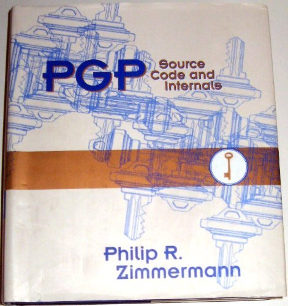
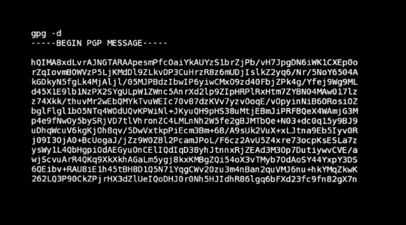

<!-- endExcerpt -->

[GNU Privacy Guard (GnuPG 或 GPG)](https://en.wikipedia.org/wiki/GNU_Privacy_Guard) 是赛门铁克 [PGP](https://zh.wikipedia.org/wiki/PGP) 加密套件的自由软件替代品。

关于 GPG(PGP) 有两则轶事。

作者齐默尔曼差点因 PGP 的强加密功能而被指控为“没有授权的军需品出口”。军需品——枪支、炸药、飞机和软件的出口是被限制的，齐默尔曼就使用了一种富有想象力的方法来对抗这一规定。他将 PGP 的全套源代码出版成一本书，于是作为书本出口，受到[第一修正案](https://zh.wikipedia.org/wiki/%E7%AC%AC%E4%B8%80%E4%BF%AE%E6%AD%A3%E6%A1%88)的保护。



另一则，在[纪录片《第四公民(Citizen Four)》](https://citizenfourfilm.com/)（[在 BiliBili上观看](https://www.bilibili.com/video/av24623314/)）画面中配有使用 GPG 解密消息的画面，Edward Snowden 就是通过 GPG 与记者进行加密通讯的。



下面记载一些使用 GPG 的教程与常见问题。

---

## 通俗易懂的 GPG 教程

- [GPG入门教程](https://www.ruanyifeng.com/blog/2013/07/gpg.html)
- [从 keyserver 获取其他人的 GPG 公钥](https://vimacs.wehack.space/openpgp-about.html)

## 最佳实践

[GPG Subkeys](https://oguya.ch/posts/2016-04-01-gpg-subkeys/) 的建议。使用子密钥，仅当需要如下情景时才用主密钥对：

- 创建新子密钥
- 改变一个 UID 的首选项
- 吊销 UID 或 子密钥
- 为密钥签名或撤销现有签名
- 创建新的 UID 或将现有的 UID 标记为主要
- 更改主密钥或其任何子密钥的过期日期

请参考如下最佳实践文章：

- [如何创建完美的GPG密钥对](https://github.com/mdrights/Digital-rights/blob/master/T%E6%95%99%E7%A8%8B%E5%92%8C%E7%AC%94%E8%AE%B0/2017-01-01-%E5%A6%82%E4%BD%95%E5%88%9B%E5%BB%BA%E5%AE%8C%E7%BE%8E%E7%9A%84GPG%E5%AF%86%E9%92%A5%E5%AF%B9-2xiangzi.md)
- [OpenPGP 数字签名最佳实践](https://github.com/mdrights/Digital-rights/blob/master/T%E6%95%99%E7%A8%8B%E5%92%8C%E7%AC%94%E8%AE%B0/2019-04-17-OpenPGP-%E6%95%B0%E5%AD%97%E7%AD%BE%E5%90%8D%E6%9C%80%E4%BD%B3%E5%AE%9E%E8%B7%B5-Mailfence.md)
- [GnuPG: 用多个sub keys保护primary key](https://jackqqcn.wordpress.com/2008/06/22/gnupg-%E7%94%A8%E5%A4%9A%E4%B8%AAsub-keys%E4%BF%9D%E6%8A%A4primary-key/)
- [GPG Subkeys](https://oguya.ch/posts/2016-04-01-gpg-subkeys/)
- [Create GnuPG key with sub-keys to sign, encrypt, authenticate](https://blog.tinned-software.net/create-gnupg-key-with-sub-keys-to-sign-encrypt-authenticate/)

## 只能上传一个 subkey 到 keyserver

有的 keyserver 只支持一个 subkey，在文章[GnuPG: 用多个sub keys保护primary key](https://jackqqcn.wordpress.com/2008/06/22/gnupg-%E7%94%A8%E5%A4%9A%E4%B8%AAsub-keys%E4%BF%9D%E6%8A%A4primary-key/)中有提及。

## 简便易用的 GUI for GnuPG

- 参见 [GnuPG Software Frontends](https://www.gnupg.org/software/frontends.html)

## 警告：签名的子密钥 ... 未经交叉验证

```shell
WARNING: signing subkey ... is not cross-certified
```

验证签名的警告，下面给出的链接有很清楚的[解决方案与说明](https://gnupg.org/faq/subkey-cross-certify.html)
