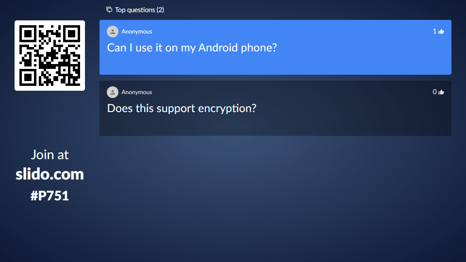

<!-- endExcerpt -->

## 初识互动演示工具

参加过一次 [Gatsby](https://www.gatsbyjs.org/) 线上讨论会，会后提问环节用 [Slido](https://www.sli.do/) 互动收集问题，主持人解答了投票数最高的几个问题，当时这款 Slido 工具清爽得界面和简单实用给我留下很深印象。

Slido 的提问互动演示界面
  

这类软件在国内多被称为“现场/大屏互动”工具，[Hi现场](https://www.hixianchang.com)是这类产品的代表。这类产品功能丰富且贴近国情（微信、弹幕、摇一摇），同样界面也很接地气——眼花缭乱、纷繁复杂😵。我很不喜欢这种玩具化的界面，令人想起 2000年国内站长热时候的“[网页特效](https://museum.berlinchan.com/2003/08/16/star-land-v2/#%E5%8F%8D%E6%80%9D)”，**炫丽动感的界面吸引人们的注意力，反而降低有效信息传递的能力**，甚至从心理上引导人们的思考方式，将严肃交流讨论的思维活动变成一场儿戏——[媒介即隐喻](https://www.zhihu.com/question/39259317)。当然，就其本身定位为用于娱乐领域，这并不是问题。

## 什么是互动演示工具

简言之，**互动演示工具让演示者与其观众双向沟通**。详细的介绍请参见《[What Is Interactive Presentation Software And How Should You Use It?](https://ahaslides.com/blog/what-is-interactive-presentation-software-and-how-should-you-use-it/)》。

还有不少 [Slido 类似的工具](https://alternativeto.net/software/sli-do/)，功能大同小异，且国内都可正常访问，推荐大家使用。

---

> 结合我常用的开发工具，从零开始创建一个以“简洁、易用、安全”为标准的多端互动演示工具。我们且叫它为 Askent，一个代号好记而已。好吧，既然又开始“造轮子”了，也不介意再造一个新词了😆，开始吧！

## 开发工具
- TypeScript
- Node.js
- Prisma2
- Apollo
- React
- Material UI

## 设计

### 架构设计

#### 后端架构
#### 前端架构

### 数据库表设计
### API 设计
### UI 设计

## 开发
