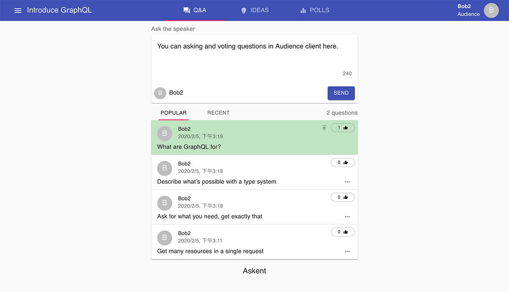

<!-- endExcerpt -->

武汉新冠状病毒肆掠，春节在家待着，休息期间继续给[之前立的项目 Askent](/2019/12/create-presentation-tool-from-scratch) 添砖加瓦，目前实现增删活动、观众端提问、审核编辑提问、提问增删改实时同步。还差展示大屏端功能，现有功能也只是实现了雏形，working in progress...

项目是模仿 [Sli.do](https://sli.do/) 做的，随着功能开发深入研究后，
越发觉得这是一款[精心设计和开发](https://blog.sli.do/slido-brand-refresh/)的产品👍。

Repository: [https://github.com/BerlinChan/askent](https://github.com/BerlinChan/askent)

## Screenshots

管理后台新增活动

管理后台，预览审核编辑问题

观众端提问与投票

## Tech-stack

- Typescript
- GraphQL
- Apollo
- Prisma2
- Nexus
- React
- MaterialUI

Askent 也是我的一个技术探索实践项目，所以技术选型偏激进，
特别是还在 preview 版本的 [Prisma2](https://github.com/prisma/prisma2/)，
很多 [aggregation 查询](https://github.com/prisma/prisma-client-js/issues/5)都还未实现，
且存在严重 bug，但活跃的社区应该能逐渐完善它。
我也借此以一位深入使用者的身份，旁观一个开源项目的发展。

[`Apollo-Client`](https://www.apollographql.com/docs/react/) + [`Subscription`](https://www.apollographql.com/docs/apollo-server/data/subscriptions/) 是消息实时同步的绝佳使用场景，来开发提问的多端实时同步非常方便。
它实质是 WebSocket 的 API 高级封装，在[授权](https://www.apollographql.com/docs/react/data/subscriptions/#authentication-over-websocket)、[订阅过滤](https://www.apollographql.com/docs/apollo-server/data/subscriptions/#subscription-filters)方面使用更加方便。
