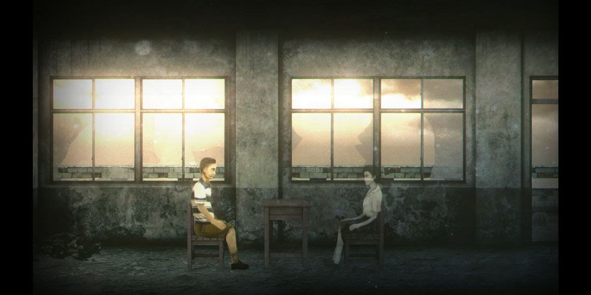

<!-- endExcerpt -->

我是个胆小怕玩恐怖游戏的人，小时候狂风大雨的夜晚，吓得翻出不敢玩的生化危机光盘 💿，果断掰断后才敢睡觉。但《返校》这种程度我还很能接受，唯二两次被吓到是，第一次在礼堂外被鬼追，第二次是在厕所镜子前，可以说恐怖程度很轻，易于让大众接受的。掌握鬼和灯笼鬼的规律就很容易对付了，游戏后两章甚至都没有鬼。

配合美术风格、音效，游戏营造出的恐怖氛围令人压抑，场景中的建筑、生活物品、日记行文，很有年代和文化氛围的特点，我非常喜欢。

> [『返校 - Detention』及『還願 - Devotion』兩款作品，同時成為哈佛大學燕京圖書館的館藏內容之一](https://www.facebook.com/redcandlegames/posts/2266742710294344)

游戏的恐怖在视听效果上只是轻量，**最令人毛骨悚然的在于游戏背景所影射真实历史中，也是正在我们身边，很多人却无法察觉的恐怖**。

当可以思想多样迥异、观点自由碰撞，老师不再怕被讲授不同见解丢饭碗时，恐怖才算消散。当旁边小朋友问我在玩什么游戏，我告诉他后，他能自己在 Store 中找到，才能让我不再愤怒。

我玩出的是 Good Ending，也就是上图那一幕作为结尾。然后我在网上搜，看到简体中文版被修改或阉割对比，我觉得在此游戏上的审核事情，显得格外讽刺。

`video: https://youtu.be/YfV8AX8PAL8`
