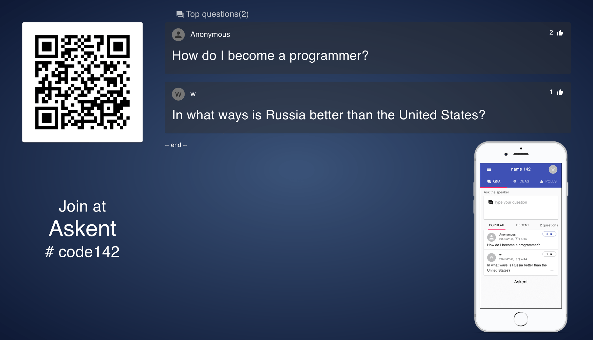

<!-- endExcerpt -->

## 进展

[继上篇](/2020/02/project-askent-admin-audience-client)后新完成大屏演示端、消息订阅、部分 API 分页。



<center>大屏演示端界面及观众移动端界面</center>

## 问题

随着功能开发深入细节，仍在 Preview 开发状态，功能未完善的 ORM 工具 [Prisma2](https://github.com/prisma/prisma2) 问题凸显。我对数据库、ORM 没经验，这些问题在之前的选型中确实未考虑到，用到的 [Nexus](https://github.com/prisma-labs/nexus) 框架也还在重度开发中，[经常有 breaking changes](https://github.com/prisma-labs/nexus-prisma/releases/tag/0.10.0)，导致项目框架变动频繁，不过 Askent 项目一开始是作为我技术实践学习用的，折腾期间已学到很多。

开发中的 Prisma2 关键功能严重缺失，导致产品功能无法实现，如今到了要“弃坑”的时候。缺失关键功能如下：

1. 关联表不支持 field 名自定义

我的 `prismal.schema` 中有如下 model 定义：

```graphql
model User {
  id             String     @default(cuid()) @id
  votedQuestions Question[] @relation(name: "VotedUsersUserTable")
}

model Question {
  id           String  @default(cuid()) @id
  votedUsers   User[]  @relation(name: "VotedUsersUserTable")
}
```

`User` 和 `Question` 多对多时会创建关联表，用 `@relation(_name: String?, references: Identifier[]?)` [定义关联表名](https://github.com/prisma/prisma2/blob/master/docs/relations.md/#the-relation-attribute)，但无法自定义 field 名，只是无意义的 `A` 和 `B`，如下

关系表 `VotedUsersUserTable`:

| A   | B   |
| --- | --- |
| id  | id  |

不知道 AB 哪个是 userId，哪个是 questionId，虽然比较一下能确定，但这样也太不明确了，也就不好统计 `Question。votedUsers` 的 `Count`。

2. 查询排序不支持多条件。详情见 [issue: Order by multiple fields](https://github.com/prisma/prisma/issues/62)。
3. 不支持 Aggreation 查询。详情见 [issue: Aggregations](https://github.com/prisma/prisma-client-js/issues/5)。
4. Count 查询不支持条件。详情见 [issue: Parameterized `.count()` queries](https://github.com/prisma/prisma-client-js/issues/252)。

这些功能将会在以后逐渐完善，但并没有具体的实践计划，所以为了让 Askent 功能开发继续，暂只能弃坑，准备用成熟的 [Sequelize](https://sequelize.org) 替换之，参照 [ts-apollo-sequelize](https://github.com/dooboolab/ts-apollo-sequelize) 项目。

同时数据库准备用 MySQL 替换 SQLite，之前用 SQLite 是为简化开发环境。

我很喜欢 `prisma.schema` 定义 model 的方式，屏蔽麻烦的数据库的建表工作，还有自动生成 [PrismaClient](https://github.com/prisma/prisma-client-js)，极大简化访问数据库操作。依旧很看好 Prisma2 的发展，期待看到它逐渐完善后的样子。
