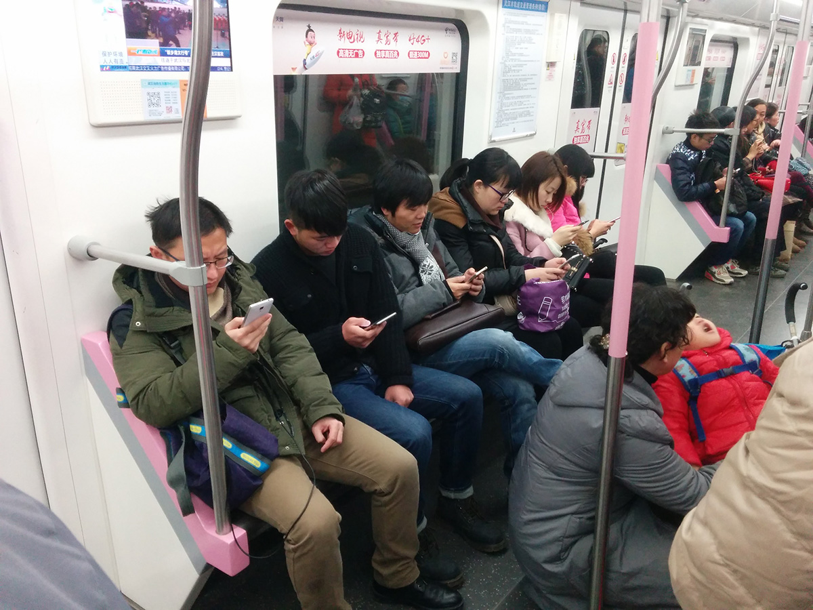

<!-- endExcerpt -->

“猎奇猎色、匪夷所思、荒诞无稽、耸人听闻”，5年前，我在大楚网地方频道做编辑的一次内部产品说明会上，这样形容我每天编辑处理的资讯，但未深入地讨论，无奈这些内容是经过长期市场 PV/UV 反馈检验，而受到同事们所默认的。

是受众的偏好造就媒体产品的选题方向，还是媒体的水平培养读者的品味？当时我自己反思的简单结论认为，这是一个互相反馈促进的系统。

最近看到一些文章/视频(如下，都墙🧱)，让我再次思考起这个话题。

`video: https://youtu.be/rAh5TftvRlk`

[人民該替爛媒體的形成負多少責任？](https://readandanalyse.blogspot.com/2013/04/blog-post_17.html)

这些文章的见解比我专业深刻得多，令我更好理解了这个话题，下面是我的一些浅显再思考（不想浪费时间，只看上面的链接就够了）。

---

人骨子里喜欢简单容易的事情，比如刷低俗无意义短视频，几秒钟一个，几乎不需要动脑子思考，本能地拇指向上一划，就能从中获取视觉听觉上直截了当的感官刺激，愉悦而令人上瘾。相比需要弄清楚错综复杂的人物关系、事件背景、历史渊源，才能理解的内容，前者更易于使人接受。

**劣质资讯内容就是抓住了人的这种心理，引诱精神脆弱、空虚的读者，令他们人性中的堕落与贪婪暴露无遗。**

写这篇文章一边与朋友简单交谈后，他删掉了手机中的抖音，这是一个好的开始，但在他提高自律、找到充实自己的方法前，还有很多家劣质媒体平台在觊觎着他的注意力，准备乘虚而入。
