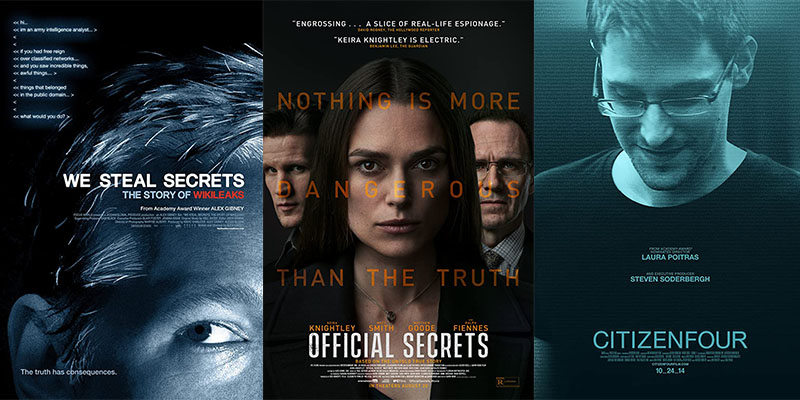
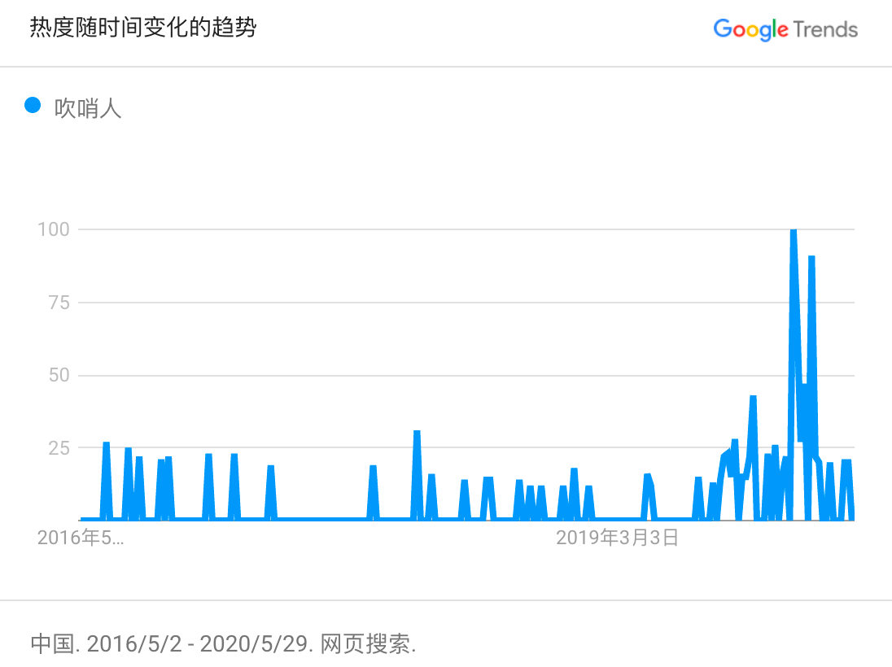

Recently I saw the movie "[Official Secret](https://www.imdb.com/title/tt5431890/)", it's based on a true story about Katharine Teresa Gun, who the British whistleblower, leaked information to the press about an illegal NSA spy operation designed to push the UN Security Council into sanctioning the 2003 invasion of Iraq.

This reminds me other two movies I have seen:

<!-- endExcerpt -->

- [Citizenfour](https://www.imdb.com/title/tt4044364/)
- [We Steal Secrets: The Story of WikiLeaks](https://www.imdb.com/title/tt1824254/)

## 由来

"吹哨人"这个说法的来源，引用 [wiki](https://zh.wikipedia.org/zh-hans/%E5%90%B9%E5%93%A8%E4%BA%BA)：

> “吹哨人”（Whistleblower）这个词起源自19世纪警察发现有罪案发生时会吹哨子的动作，以引起同僚以及民众的注意。而从此延伸出来，目前我们所指的“吹哨人”是为使公众注意到政府或企业的弊端，以采取某种纠正行动的人。

由此看，whistleblower 翻译为的“吹哨人”是个舶来词汇。我的印象中，该词在李文亮医生的相关报道中，被首次大量使用，从 [Google Trends](https://trends.google.com/trends/explore?date=2016-05-02%202020-05-29&geo=CN&q=%2Fm%2F0857g) 上看，**该词语的趋势在[李文亮医生于2月7日去世](https://www.bbc.com/zhongwen/trad/chinese-news-51403740)后2天到达峰值**。

I recommend these three movies to you, the people with sense of justice, hope you 能！明白！
