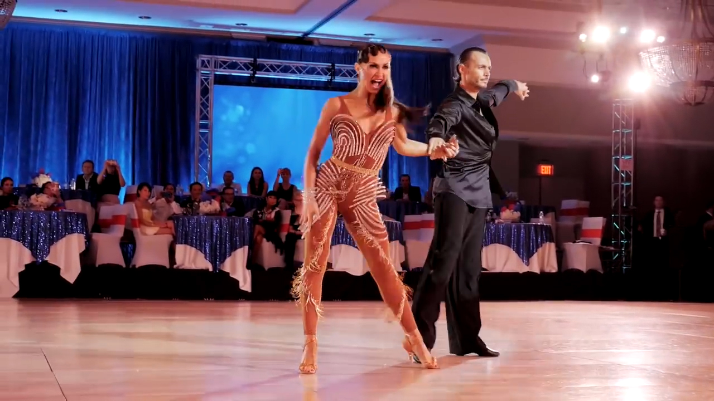
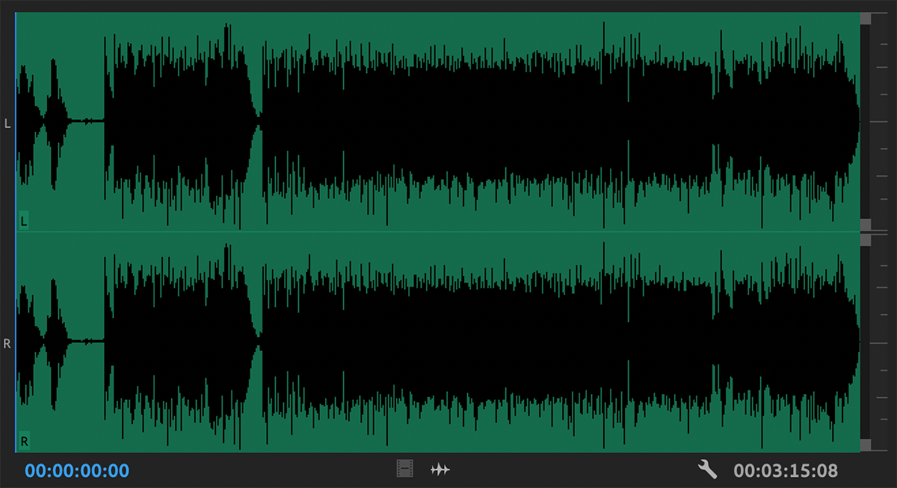

<!-- endExcerpt -->

## 一、音乐是舞蹈的灵魂

2006年，在武汉体育学院本科学体育舞蹈时，维也纳华尔兹课上总是伴随一些耳熟能详的圆舞曲练习方步，这些甚至我都叫不出名字的优美旋律令我陶醉，每次聆听都不禁想迈出舞步。专业课虽然包含视唱练耳，但只止步于基础乐理的认识五线谱，我记得最后几节课开始提到大调与小调，并且通过听老师的弹奏来区分它们，没有进一步深入赏析我们舞蹈所使用舞曲。

> 音乐是舞蹈的灵魂，舞蹈是音乐的回声。

**我理解，作为灵魂的音乐正是舞蹈所要表现的情绪与涵义的最核心的根源**，在这个层面上，它同编舞者一样重要，指导着肢体动作。当我随音乐跳起华尔兹，却不知道音乐（或歌词）在表达什么的时候，我确实可以被形容为头脑简单，四肢发达。不巧的是，作为舶来文化的体育舞蹈，所用的舞曲大部分也来自于西方，特别是歌曲里唱的都是英文歌词的时候，我常常听不懂在唱什么。

欣赏像 Slavik & Karina 这类高水平运动员表演的时候，常看到他们的嘴形跟着舞曲一起唱，我想那一定是基于理解音乐内容的基础上完全投入的自然舞蹈流露，才会令这些小动作看起来那么自然且动情。

[Slavik Kryklyvyy & Karina Smirnoff - Samba, Miami 2017](https://www.youtube.com/watch?v=F9FMjkflII4)

细心的同学很快就把小动作“学”到了，听一位同学半开玩笑说“不知道嘴巴怎么动，就一边跳一边念拼音 a b c d”。可最后呈现的效果做作又可笑，后来老师实在看不下去了，课上专门强调叫我们跳舞时候嘴巴不要乱念叨。**盲目模仿流于表面，仿若东施效颦**。

自那以后我慢慢意识到，**要跳好体育舞蹈，需要更多的理解音乐，除学好英语之外，就是要学会聆听音乐了**。同时，也为我舞学的不好找了个理由🤣。

## 二、飘渺神秘

在报社做摄影工作时经常用 Photoshop，当一张照片呈现在屏幕上，你可以很直观的在平面空间中观察和反复修改它，无论整体还是放大局部，都能在修改后一眼看出变化，具体又直观。

在我对照片处理方式习以为常后，偶尔处理声音文件，立刻就被它**飘渺神秘的特性[^1]**难住。面对声音处理软件中呈现出来的一串波形图，除了音量大小之外我看不出来任何东西（废话，声音当然是要用听的🙄）。

处理声音只能先一遍遍地回放它找到位置，修改后再一遍遍回放来比较效果。不像照片将画面凝固在某一时间，声音虽然也可以被录制“凝固”下来，但与照片不同——时间完全凝固时就听不到什么了。**声音只存在时间流逝中，稍纵即逝的神秘令我难受又好奇**。

## 三、离别时刻

坐在离别的火车上听 Time to say goodbye，感触颇深。这个已经在[另外一篇](/2019/09/piano-solo-time-to-say-goodbye)中写过了。

`video: https://www.youtube.com/watch?v=q0chGWzSBrU`

## 四、音乐无需懂

在 [WeThinker 《聆听音乐》读书会](https://mp.weixin.qq.com/s?src=11&timestamp=1603938565&ver=2673&signature=7G2p26EnAb-iVzZVvB3pleQm8a0NTbndQT83sPZRQCzPy0VqCC*xSWHPgkhy12eQUtqEkaytcQN18LqNXSbN8CfVPL**edE4JW9f29lqwlOJpYif2f9KVGagdUqTFm0g)上，主读人张娜老师在预热分享上讲的话，让我产生的一点联想，下面是群消息摘录：

### 我：

> 昨天张娜老师说她的老师讲一句话“古典音乐不需要懂”，让我想起来电影[天能（Tenet）](https://www.imdb.com/title/tt6723592/)一句台词：Don't try to understand it, feel it.
> 想解读古典音乐，就像想搞懂克里斯托弗·诺兰烧脑的电影剧情一样困难。我这个门外汉也能听出古典音乐中所蕴含的情绪，并陶冶其中，也确实不用学究其中的原理。但就像烧脑电影中的惊人谜题一样，越深入研究越有趣。
> 分享个我为什么想学习它的原因之一。

### 张娜：

> “音乐无需懂”，首要是不必以追求“懂”艺术音乐而在渐近之前就设定一个无形的障碍和门槛。
> 如果能够在反复聆听作品的过程中，与个人的感性直觉体验、知识储备——无论是否音乐领域的、经历阅历，运用充分积极的想象加以链接，艺术音乐一定可以“懂”的。
> 谢谢大家贡献了那么多非常优质的资料资源，我们不已经都在艺术音乐的大门里了吗？再不是门外汉。
> 搬走这个无形的障碍，甚至它根本不存在，“Don't try to understand it, feel it.”

## 五、寻回想象力

童年末期，我开始对一些动画片感到索然无味（猫和老鼠至今都看不厌），但仍想通过看动画片抓住想象力的魔力。可时间留不住，年龄和理性增长同时想象力不免减退，对我而言，**想象力是创造力和快来的来源**，所以当我聆听古典音乐，思绪飞翔进入想象力的天空时，我仿佛找回了那个天真的年代[^2]。

[^1]: 见《聆听音乐》中文第5版，前言，插图小节。中文第7版没有这一小节了。还有第5版第1章末尾赏析《查拉图斯特拉如是说》，直接写“在用做斯坦利·库布里克的电影《2001年太空漫游》一片中的音乐时”，而第7版则含糊写成“被用来作为一部电影的配乐”，这些改变不知是原版还是翻译造成的，后面还未看完，至此觉得中文第7版很多主题在目标周围绕，就是没命中上去。

[^2]: 《聆听音乐》中文第5版第1章的“为什么听古典音乐？”小节中，公众的典型回答其中有 - 3.“在欣赏交响曲时，我的思绪飞扬到美妙的儿童时代。”。中文第7版中把这个例证去掉了。
