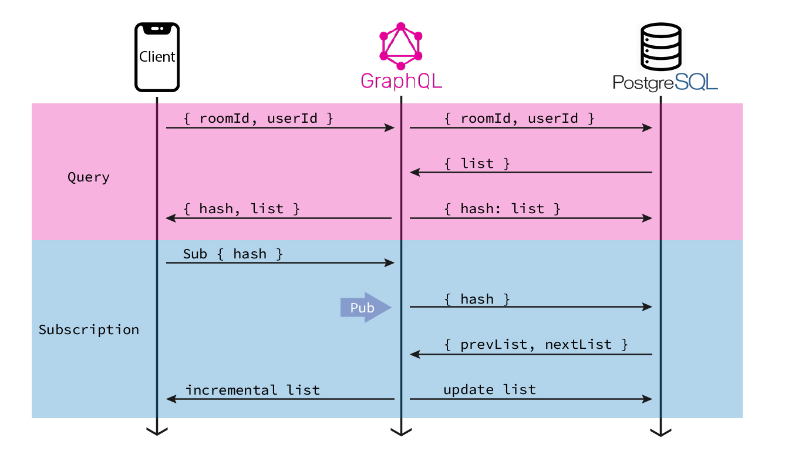

<!-- endExcerpt -->

## 问题

在项目 [Askent](/2020/03/real-time-multi-device-collaboration-devtools) 开发中，需要同步管理后台、客户端、演示大屏，三端上的消息显示，继之前[使用 Apollo Subscription 基于 Pub/Sub 开发遇到问题](/2020/03/real-time-multi-device-collaboration-devtools)，然后参照 [DeepStream 的 Realtime Search 思路](https://deepstream.io/blog/20191104-realtime-search/)实现一版后，仍有一个严重的性能问题无法解决——每个客户端会话权限、查询变量各不同，因此一个提问的 Pub 事件需要为每个客户端执行一次（实际是两次，见下文流程图）查询，再计算 diff 后向对应客户端推送增量数据。虽未进行压力测试，但可以预见这是个严重耗费性能的不好的设计。

## 目前实现

该实时搜索实现的流程如下图：

它总体分为两步：

1. 首先请求提问列表，服务端根据请求参数生成一个 hash，并与提问列表结果一同返回
2. 客户端用 hash 订阅提问列表

## Hasura

偶然看到文章 [GraphQL tools & libraries](https://blog.graphqleditor.com/graphql-tools-partone/) 中介绍 Hasura - instant realtime GraphQL APIs on any Postgres database。

看了文档 [Scaling to 1 million active GraphQL subscriptions (live queries)](https://github.com/hasura/graphql-engine/blob/master/architecture/live-queries.md#scaling-to-1-million-active-graphql-subscriptions-live-queries)([中文](/2021/03/Scaling-to-1-million-active-GraphQL-subscriptions))，发现它正是我需要的。

目前替换提问列表的实时查询，包含用户权限的请求待验证。

其他可用的实时查询、实时数据库工具：

- [GraphQL Live Query](https://github.com/n1ru4l/graphql-live-query)
- [TimescaleDB](https://www.timescale.com/)
