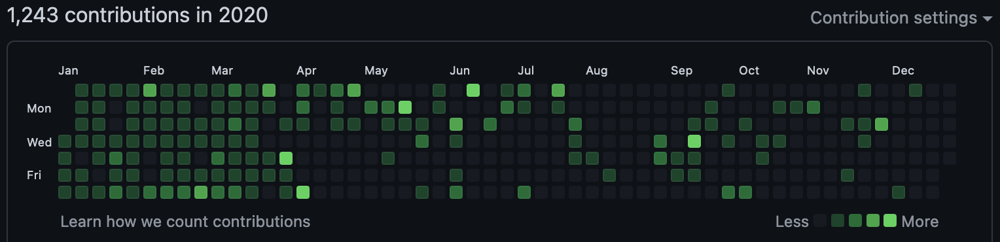

I have a personal project named [Askent](https://github.com/BerlinChan/askent), which is actually a clone of [Sli.do](https://www.sli.do/).

<!-- endExcerpt -->

The idea was comes from a webinar hosted by [GatsbyJs](https://www.gatsbyjs.com/). At that meeting, the host use [Sli.do](https://www.sli.do/) as a tool to interact with audiences, let them ask questions, and make a survey at the end of the meeting.

Sli.do's easy-to-use and elegant design impressed me a lot when I first saw it. And at that time, I was learning [GraphQL](https://graphql.org/) by myself, so I decided to make a clone of it as an exercise project.

In project Askent, I've tried many new Front-End techs like [PrismaJs](https://www.prisma.io/), [ReactJs](https://reactjs.org/), [Apollo](https://www.apollographql.com/), [DeepStream](https://deepstream.io/), [Hasura](https://hasura.io/), etc ...

The project was funded in December 2019, when before the outbreak of COVID-19. and when I was locked down at my wife's hometown in Spring festival vacation and nowhere to go, I've been spent a lot of time on it, try a variety of tools to store data persistence(like MySQL, MongoDB, and PostgreSQL), figure out how to send/receive messages in realtime on all clients(GraphQL subscriptions based on Pub/Sub model, DeepStream, Hasura), and how to create a user authenticate service(JWT).

Through all of these trials, I've been learned a lot, and maybe I can name myself not only a front-end developer but also a full stack web developer too(maybe too much early ^_^).

Nowadays, the Askent was [deployed at Github Pages](https://askent.berlinchan.com/), and server-side runs on my home's server so it will not costs me an arm and a leg, ~~and regards of security of the home network, the server has not published to the Internet which I'm still working on it.~~ I've deployed the server to the Internet in my spare time, which with a lot of bugs, still WIP(update on July, 7th).

## About the name

Askent = Ask + Event

## Related topics on project Askent

- [Askent 实时消息搜索的问题及 Hasura 替代](/2021/03/askent-realtime-search-implement-and-hasura)
- [借助 GraphQL 承载 100万并发活动订阅（实时查询）](/2021/03/Scaling-to-1-million-active-GraphQL-subscriptions)
- [Askent 项目进展及准备弃用 Prisma2](/2020/03/askent-give-up-prisma2)
- [几款多端实时协作、同步的开发工具](/2020/03/real-time-multi-device-collaboration-devtools)
- [互动演示工具 Askent 已开发出管理与观众端雏形](/2020/02/project-askent-admin-audience-client)
- [从零开始，创建一个多端互动演示工具](/2019/12/create-presentation-tool-from-scratch)
