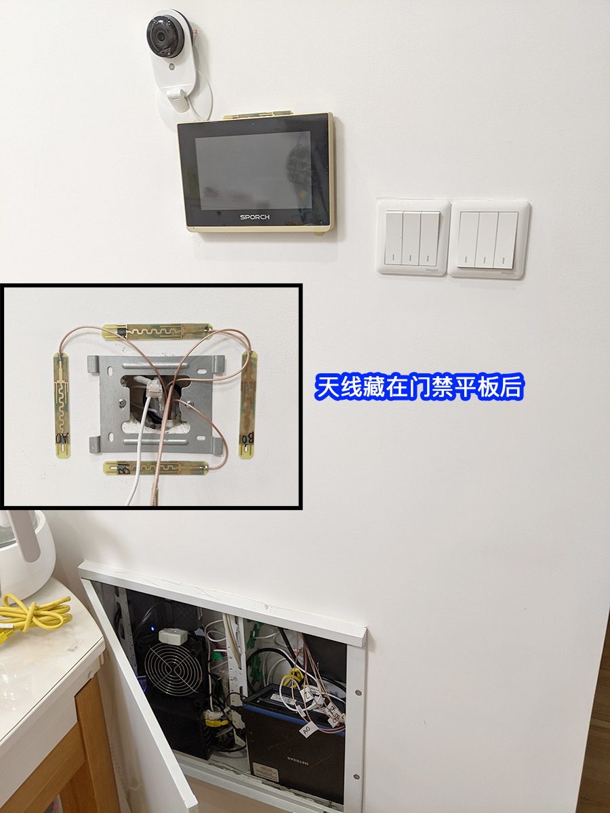

## 问题

Wi-Fi 放在金属弱电箱内，隔一堵墙 6m 远就连不上，房间面积小没必要用 AC+AP，也不想接中继或者 Mesh 而到处扯线，于是把 R6300v2 的内置天线延长外接出来。

<!-- endExcerpt -->

## 施工

房间除去公摊实际面积 68m2，弱电箱状况如下图，内含光猫、软路由、路由器、门禁设备，图中路由器是 Netgear WNDR4500，临时拿来用的。

R6300v2 拆开来看到 6条天线，天线接口是 IPEX一代，我找了下资料未区分开哪些是 2.4G，哪些是 5G天线，后面接延长天线，只按左右两边分开来交替摆放天线。

在某宝上买了 6条馈线长 1.5m的内置天线，特性如下：

电气特性/Electrical Characteristics

- 工作频率/Frequency： 2400~2500MHz 4900~5900MHz
- 驻波比/S.W.R.： <= 1.8
- 天线增益/Antenna Gain： 8 dBi
- 辐射模式/Radiation： 全方位/Omni-directional
- 极化方向/Polarization： 水平极化/Linear
- 输入阻抗/Impedance： 50 欧姆

物理特性/Material & Mechanical Characteristics

- 振子材料： PCB板覆铜
- PCB板规格： 95mm*13.5mm*0.55mm
- 线材材料： RG178镀银高温线
- 线材长： 1.5m
- 接口方式： IPEX 1代
- 工作温度/Operation Temperature： -40℃ ~ +65℃
- 储存温度/Storage Temperature： -40℃ ~ +80℃

不像外置的那种一根棒棒，内置天线尺寸更小。正好弱电箱上有个门禁对讲平板，将天线从暗线线管穿到平板后，天线贴背胶粘在墙上，平板装上去遮挡住不影响整洁美观。

## 完工

完工后的样子。未进行系统测试前后对比信号数据，效果就是在屋内之前连不上 Wi-Fi 的地方都可以连上了，而且测速还不错！隔一堵墙 6米远下载测速约 200Mbps。

## 其他

Netgear R6300v2 真是神机，特别是在 Koolshare 论坛的 coolshine 发布的固件，可以让其用上改版梅林 386.2_4固件（截至发稿时），原帖地址 [[教程] 【重获新生】让R6300V2支持384.17！变身RT-AC6300v2](https://koolshare.cn/thread-182286-1-2.html)。

弱电箱里这么多设备闷在一起，散热是个问题。夏季 R6300v2 不开风扇 CPU温度 80℃ 以上。一直开着风扇在冬天又很蠢，手动开关很麻烦，在某宝上买了个温控器，调到超过 30℃ 自动开启风扇，低温时自动停止很好用。现在放在软路由上，软路由温度手摸不烫，但 R6300v2吹不到还是很烫，应该需要在弱电箱门上开几个进风口，有合理的风道散热效果会更好些吧。

