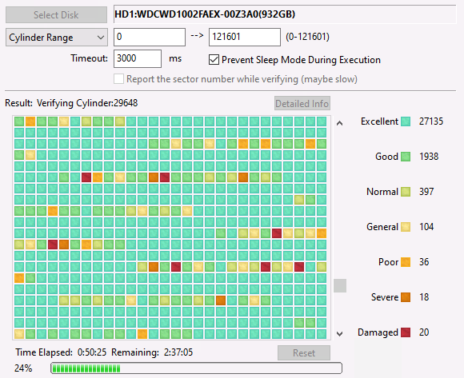
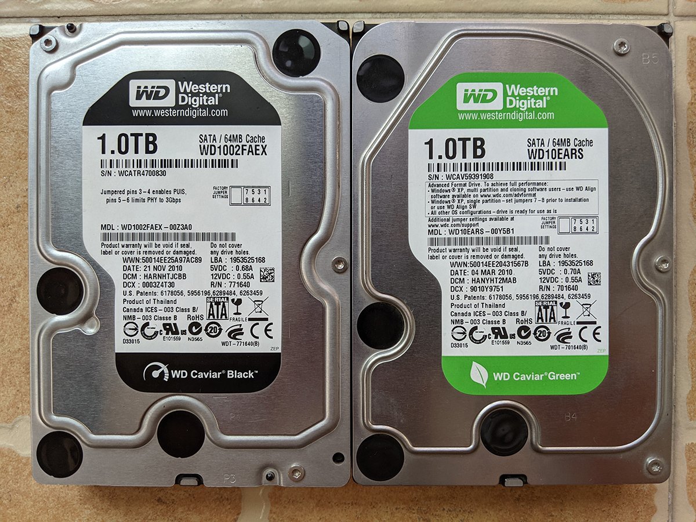
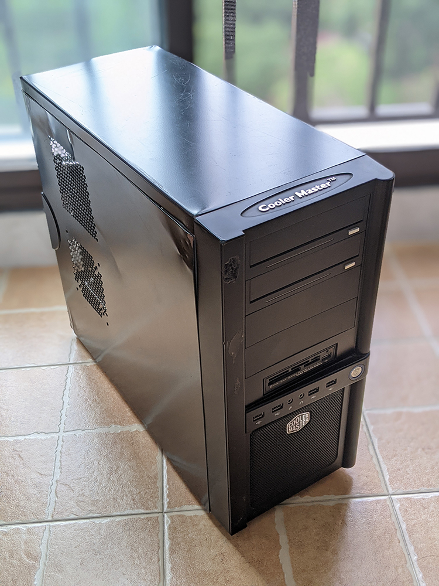

I have two Western Digital HDDs, one is Caviar Black and another is Caviar Green serial, both capacities are 1TB. Because **uncorrectable sectors** occurred, it's time for them to retire.

<!-- endExcerpt -->

These two hard disks have been bought in 2010, which was for my third computer, also the first self-assemble PC. In this ten-year occupation, they're mostly idle, because their **Power On Hours count is just about 7000+ hours**. I didn't find the MTBF(mean time between failures) specification about the product serial, but I don't think it should break down in so much short time using, or maybe just BAD luck.

It almost ruined a very important video of mine, which scared me badly.

I have a strong impression of a BBS post before I've decided to buy the Caviar Black 1TB disk, it said "the data stored on the Black disk could never lose." Haha, it's hard to say NEVER.

With these two HDDs in use, I mostly use them to do some photography work, video editing, and 3D animation. I've moved important data to a new NAS with 2 Seagate 8T disks. How do they doing? We'll see.

And also it's time to say goodbye to the old PC, thanks for working alongside me for so many years, from Yichang to Wuhan!

---

## PC Specifications

- Mother Board : Gigabyte P55-UD3R
- CPU : Intel Core i5 750
- RAM : 12GB DDR3 1600
- Graphics Card : Nvidia Quadro 2000
- Optical Drive : ASUS DVD RW

## HDD Specifications

### WDC WD1002FAEX-00Z3A0

- Model : WDC WD1002FAEX-00Z3A0
- Firmware : 05.01D05
- Serial Number : WD-WCATR4700830
- Disk Size : 1000.2 GB (8.4/137.4/1000.2/1000.2)
- Queue Depth : 32
- Number of Sectors : 1953525168
- Interface : Serial ATA
- Major Version : ATA8-ACS
- Transfer Mode : SATA/600
- Power On Hours : 7728 hours
- Power On Count : 2528 count
- Health Status : Caution
- Features : S.M.A.R.T., AAM, NCQ

#### S.M.A.R.T.

| ID | Cur | Wor | Thr | RawValues | Attribute Name |
|----|-----|-----|-----|-----------|----------------|
| 01 | 198 | 198 | _51 | 0000000102CB | Read Error Rate |
| 03 | 209 | 164 | _21 | 0000000009E5 | Spin-Up Time |
| 04 | _98 | _98 | __0 | 000000000A19 | Start/Stop Count |
| 05 | 191 | 191 | 140 | 000000000041 | Reallocated Sectors Count |
| 07 | 200 | 200 | __0 | 000000000000 | Seek Error Rate |
| 09 | _90 | _90 | __0 | 000000001E30 | Power-On Hours |
| 0A | 100 | 100 | __0 | 000000000000 | Spin Retry Count |
| 0B | 100 | 100 | __0 | 000000000000 | Recalibration Retries |
| 0C | _98 | _98 | __0 | 0000000009E0 | Power Cycle Count |
| C0 | 200 | 200 | __0 | 000000000172 | Power-off Retract Count |
| C1 | 200 | 200 | __0 | 0000000008A6 | Load/Unload Cycle Count |
| C2 | 104 | _95 | __0 | 00000000002B | Temperature |
| C4 | 141 | 141 | __0 | 00000000003B | Reallocation Event Count |
| C5 | 200 | 200 | __0 | 000000000001 | Current Pending Sector Count |
| C6 | 200 | 200 | __0 | 00000000005A | Uncorrectable Sector Count |
| C7 | 200 | 200 | __0 | 000000000000 | UltraDMA CRC Error Count |
| C8 | _61 | __1 | __0 | 000000006D39 | Write Error Rate |

### WDC WD10EARS-00Y5B1

- Model : WDC WD10EARS-00Y5B1
- Firmware : 80.00A80
- Serial Number : WD-WCAV59391908
- Disk Size : 1000.2 GB (8.4/137.4/1000.2/----)
- Queue Depth : 32
- Number of Sectors : 1953525168
- Interface : Serial ATA
- Major Version : ATA8-ACS
- Transfer Mode : SATA/300
- Power On Hours : 7516 hours
- Power On Count : 2414 count
- Health Status : Caution
- Features : S.M.A.R.T., AAM, NCQ

#### S.M.A.R.T.

| ID | Cur | Wor | Thr | RawValues | Attribute Name |
|----|-----|-----|-----|-----------|----------------|
| 01 | 200 | 197 | _51 | 000000000000 | Read Error Rate |
| 03 | 180 | 100 | _21 | 000000000F7E | Spin-Up Time |
| 04 | _96 | _96 | __0 | 0000000012F2 | Start/Stop Count |
| 05 | 200 | 200 | 140 | 000000000000 | Reallocated Sectors Count |
| 07 | 200 | 200 | __0 | 000000000000 | Seek Error Rate |
| 09 | _90 | _90 | __0 | 000000001D5C | Power-On Hours |
| 0A | 100 | 100 | __0 | 000000000000 | Spin Retry Count |
| 0B | 100 | 100 | __0 | 000000000000 | Recalibration Retries |
| 0C | _98 | _98 | __0 | 00000000096E | Power Cycle Count |
| C0 | 200 | 200 | __0 | 00000000013D | Power-off Retract Count |
| C1 | 172 | 172 | __0 | 000000014D52 | Load/Unload Cycle Count |
| C2 | 108 | _94 | __0 | 000000000027 | Temperature |
| C4 | 200 | 200 | __0 | 000000000000 | Reallocation Event Count |
| C5 | 200 | 197 | __0 | 000000000003 | Current Pending Sector Count |
| C6 | 200 | 198 | __0 | 000000000000 | Uncorrectable Sector Count |
| C7 | 200 | 200 | __0 | 000000000000 | UltraDMA CRC Error Count |
| C8 | 200 | 196 | __0 | 000000000001 | Write Error Rate |
