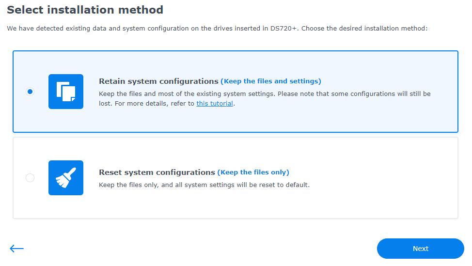
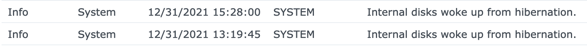
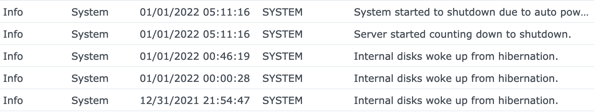

<!-- endExcerpt -->

I have a J3455-itx motherboard based NAS installed with Xpenology. Recently, I tried to upgrade the DSM from 6.2.3 to 7.0.1-42218 using the RedPill loader. After upgrading, I found the NAS couldn't auto poweroff which I enabled the auto poweroff time to 4 hours. I have checked the log, found the disks have been waking up almost immediately just after hibernation. So, I'm gonna try to figure it out.

## Upgrade Xpenology to DSM 7.0.1-42218

Operated following this tutorial, [黑群晖升级DSM7的教程（黑群晖DS918-6.23升级到DS918-7.01保姆级教程）](https://wp.gxnas.com/11305.html). I choose Retain system configurations(Keep the files and settings).



## Fix disks wake up frequently

Searched on the Internet, in post [PVE直通SATA控制器硬盘无法休眠！](http://www.gebi1.com/thread-300625-1-1.html) comments, I found something useful. Quoted some parts of it here:

> 解决办法2：
> 
> 修改 /etc.defaults/syslog-ng/patterndb.d/message.conf 和 /etc.defaults/syslog-ngpatterndb.d/kernel.conf 文件，把 /var/log/messages 和 /var/log/kern.log 日志文件分都设置到 /tmp/messages 和 /tmp/kern.log ，然后重启系统即可。
> 
> 最好也把 /etc.defaults/logrotate.d/syslog-ng 里的 messages 和 kern.log 路径也做相应修改，否则这两个日志文件的大小可能会无休止的增长。

I did these operates followed the comment and inspired by this comment, I continue to analyze the `/var/log/hibernationFull.log`, to find what interrupted the hibernation:

```log
[20078.480642] <redpill/smart_shim.c:684> Expected to copy HDIO_DRIVE_CMD header of 4 bytes from           (null) - it failed
[20078.492686] <redpill/smart_shim.c:684> Expected to copy HDIO_DRIVE_CMD header of 4 bytes from           (null) - it failed
[20079.725404] <redpill/override_symbol.c:239> Obtaining lock for <GetHwCapability+0x0/0x110 [apollolake_synobios]/ffffffffa0256490>
[20079.737718] <redpill/override_symbol.c:246> Writing original code to <ffffffffa0256490>
[20079.746002] <redpill/override_symbol.c:239> Released lock for <ffffffffa0256490>
[20079.753621] <redpill/override_symbol.c:207> Obtaining lock for <GetHwCapability+0x0/0x110 [apollolake_synobios]/ffffffffa0256490>
[20079.765761] <redpill/override_symbol.c:217> Writing trampoline code to <ffffffffa0256490>
[20079.774277] <redpill/override_symbol.c:207> Released lock for <ffffffffa0256490>
[20079.782018] <redpill/bios_hwcap_shim.c:65> proxying GetHwCapability(id=5)->support => real=0 [org_fout=0, ovs_fout=0]
[20079.944380] <redpill/pmu_shim.c:310> Got 1 bytes from PMU: reason=1 hex={2d} ascii="-"
[20080.094384] <redpill/pmu_shim.c:310> Got 1 bytes from PMU: reason=1 hex={37} ascii="7"
[20080.102730] <redpill/pmu_shim.c:239> Executing cmd OUT_STATUS_LED_OFF handler cmd_shim_noop+0x0/0x31 [redpill]
[20080.113113] <redpill/pmu_shim.c:45> vPMU received OUT_STATUS_LED_OFF using 1 bytes - NOOP
[20140.212198] <redpill/bios_shims_collection.c:43> mfgBIOS: nullify zero-int for VTK_SET_HDD_ACT_LED
[20616.112182] ppid:1(systemd), pid:14337(syslog-ng), dirtied inode 43169 (ovs-vswitchd.log) on md0
[20616.121477] ppid:1(systemd), pid:14337(syslog-ng), dirtied inode 43169 (ovs-vswitchd.log) on md0
[20616.130693] ppid:1(systemd), pid:14337(syslog-ng), dirtied inode 43169 (ovs-vswitchd.log) on md0
```

Same as before, in file `/etc.defaults/syslog-ng/patterndb.d/openvswitch.conf`, edit `/var/log/openvswitch/ovs-vswitchd.log` to `/tmp/log/openvswitch/ovs-vswitchd.log`.

Then, hibernation time last longer for more than 2 hours,



```log
[18650.562808] ppid:1(systemd), pid:1416(syslog-ng), dirtied inode 30459 (scemd.log) on md0
[18650.571354] ppid:1(systemd), pid:1416(syslog-ng), dirtied inode 30459 (scemd.log) on md0
[18650.579863] ppid:1(systemd), pid:1416(syslog-ng), dirtied inode 30459 (scemd.log) on md0
[18656.121265] ppid:2(kthreadd), pid:5185(jbd2/md0-8), WRITE block 2136272 on md0 (8 sectors)
[18656.130018] ppid:2(kthreadd), pid:2746(kworker/2:2), READ block 4980352 on sda1 (8 sectors)
[18656.138904] ppid:2(kthreadd), pid:2746(kworker/2:2), READ block 4980352 on sdb1 (8 sectors)
[18656.138955] ata1: wake up from deepsleep, reset link now
[18656.154211] ppid:2(kthreadd), pid:4804(md0_raid1), WRITE block 4980352 on sda1 (8 sectors)
[18656.162927] ppid:2(kthreadd), pid:4804(md0_raid1), WRITE block 4980352 on sdb1 (8 sectors)
[18657.923813] ppid:1(systemd), pid:7042(syno_hibernatio), dirtied inode 33099 (hibernation.log) on md0
[18657.933470] ppid:1(systemd), pid:7042(syno_hibernatio), dirtied inode 33099 (hibernation.log) on md0
[18657.943076] ppid:1(systemd), pid:7042(syno_hibernatio), dirtied inode 33099 (hibernation.log) on md0
[18657.953053] ppid:1(systemd), pid:7042(syno_hibernatio), dirtied inode 32851 (hibernationFull.log) on md0
[18657.963047] ppid:1(systemd), pid:7042(syno_hibernatio), dirtied inode 32851 (hibernationFull.log) on md0
[18657.972997] ppid:1(systemd), pid:7042(syno_hibernatio), dirtied inode 32851 (hibernationFull.log) on md0
[18659.139845] ata1: wake up successful, the reset fail can be ignored
uptime : [18656.162927]
======Idle 7636 seconds======
*** *** ** 15:27:37 CST 2021
```

In file `/etc.defaults/syslog-ng/patterndb.d/scemd.conf`, edit `/var/log/scemd.log` to `/tmp/log/scemd.log`. And in file `/etc.defaults/syslog-ng/patterndb.d/synocrond.conf`, edit `/var/log/synocrond.log` to `/tmp/log/synocrond.log`.

**When you change the log destination, don't forget to change the logrotate config correspondently under the path `/etc.defaults/logrotate.d`**.

Now, the disks can hibernate without being woken up frequently, and the NAS can auto poweroff.




## Problems

The RedPill loader is not yet stable. In my case, I found some problems.

### Synology Drive is indexing over and over constantly

There is a Reddit post that discussed this problem, [Synology Drive is indexing over and over constantly](https://www.reddit.com/r/synology/comments/pcu4x5/synology_drive_is_indexing_over_and_over/). So I uninstall the Synology Drive Package.

### Process `synoscgi` cpu usage 100%

Sometimes the process `synoscgi` cpu usage 100% and froze the system. I heard some discussion that this problem was caused by docker, so I uninstalled the Docker package.


## References

- [黑群晖升级DSM7的教程（黑群晖DS918-6.23升级到DS918-7.01保姆级教程）](https://wp.gxnas.com/11305.html)
- [群晖硬盘不断唤醒（无法休眠）的一些折腾](https://bugxia.com/1498.html)
- [PVE直通SATA控制器硬盘无法休眠！](http://www.gebi1.com/thread-300625-1-1.html)
- [黑群晖7.0修复photos中视频不生成缩略图的问题](https://hexianjie.cn/archives/610)
- [Tutorial: How to access DSM's Data & System partitions](https://xpenology.com/forum/topic/7004-tutorial-how-to-access-dsms-data-system-partitions/)
- [How can I use a PC to recover data when my Synology NAS malfunctions?](https://kb.synology.com/en-global/DSM/tutorial/How_can_I_recover_data_from_my_DiskStation_using_a_PC)
