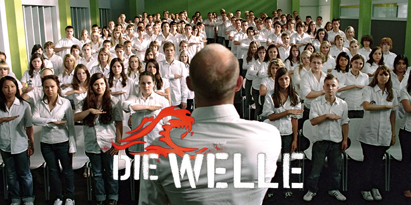

> What are the requirements for an autocratic system? An ideology, control, surveilliance, social injustice, extreme nationalism.

<!-- endExcerpt -->
 
> What else is important for a dictatorship? Discipline, discipline is power.

Some lines quoted from the movie [The Wave](https://www.imdb.com/title/tt1063669/) answered my question for why I felt nervous and depressed since I was in school, and how we got brainwashed little by little.

This movie is based on a true story that once happened in spring 1967, in Palo Alto, California, high school history teacher Ron Jones conducted a social experiment in fascism with his class. There is a [website](https://www.thewavehome.com/) to document and share the original experiment and variations on the Wave story over the years, and to support the discussion of this dark and never-ending side of human nature.

## My Favorite Lines

> What are we supposed to rebel against nowadays?
> 
> Nothing means anything anymore.
> 
> We all just want to have fun.
> 
> What our generation lacks is a common goal to unite us.

> Autocracy comes from the Greek and means self-rule. From auto, "self", and kratia, "power", "rule"... In an autocracy, the ruler or rulers have unlimited power to change the law as they like. Can you think of any examples?

> We're not talking about guilt. It's a historical responsibility.

My thoughts: This recalls me of another movie that explored national historical trauma: [A Taxi Driver](https://www.imdb.com/title/tt6878038/). And also some historical tragedies happened in my country that we still can't discuss in public today. An ethnic just like a person, if he/she can't face the past mistake, he/she can't go further too.

> I could see myself getting a regular job, marrying the right girl, having two or three kids and living my life in some townhouse. Does that sound stupid?

> If you've learnt one thing this week, it's the value of sticking together.
