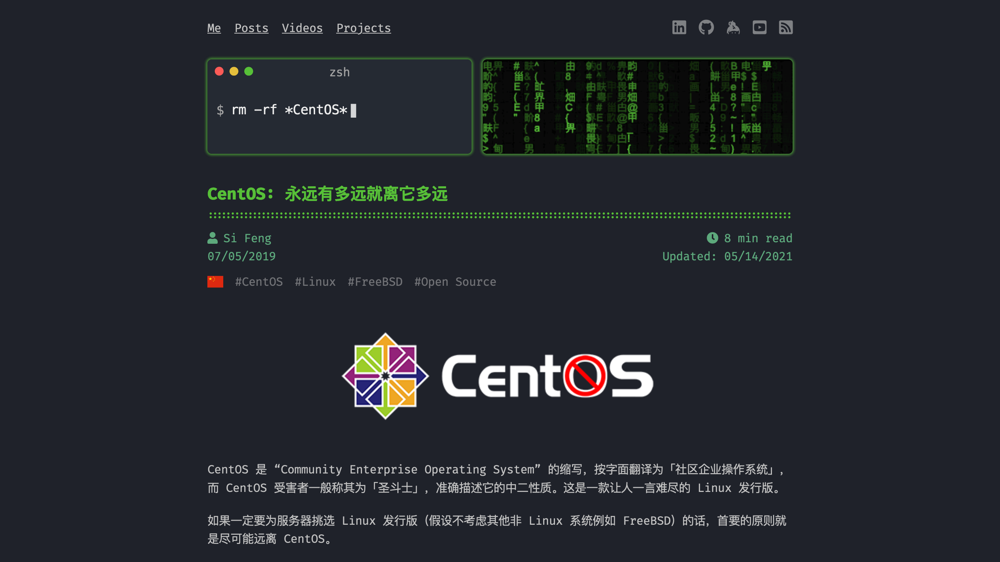

<!-- endExcerpt -->

## [feng.si](https://feng.si/)

I found it by one of the author's project named [CFEditor: Make Routers Great Again](https://cfeditor.feng.si/), it's a ASUS router CFE modify tool. There is a terminal window on every top of the post, and the command-line described the gist of each post, it's very interesting!
