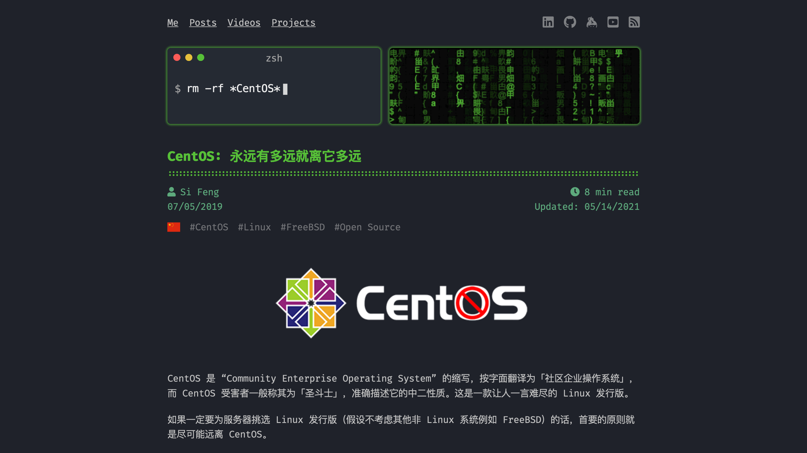

When I surf on the Internet, I found some interesting, useful, impression, inspired blogs/sites occassionally, sometimes I want to find it out and read it again, but I had nothing clues to find them, that's really made me feel frustrate.

<!-- endExcerpt -->

Next time when I find something like this, I'll jot it down here.

## [feng.si](https://feng.si/)

I found it by one of the author's project named [CFEditor: Make Routers Great Again](https://cfeditor.feng.si/), it's a ASUS router CFE modify tool. In the site, there is a terminal window on every top of the post, and the command-line described the gist of each post, it's very interesting! There is a post explained [why you should keep away from CentOS](https://feng.si/posts/2019/07/centos-the-last-linux-distro-you-should-ever-consider/), the author's point of view is unique.
 
 ## The stories behind 3 great business mantras

[The stories behind 3 great business mantras](https://theweek.com/articles/462863/stories-behind-3-great-business-mantras)

Google: `Don't be evil`

Facebook:

- `Code wins arguments`
- `Move fast and breaking things`
- `Done is better than perfect`

Apple: `Think different`

 ## To Be Continued
