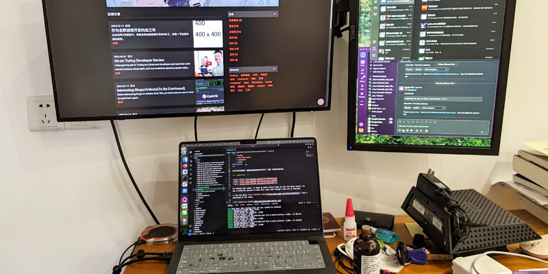

从2022年4月起至今，我做全职远程前端开发已快3年。从一开始的抱尝试心态到成为我的求职首选，我逐渐爱上这种工作方式，记载一下这段有趣的经历。

<!-- endExcerpt -->

## 一封邀请信

大约2021年10月，我收到一封来自 Turing.com 的注册邀请信，信的内容大概是说在 GitHub 上看到我的项目，觉得很不错，而且根据代码认为我的技能适合他们对前端开发者的招聘需求。对于信中提到的 GitHub 项目，我猜是 [Askent](https://www.berlinchan.com/2021/07/where-the-askent-comes-from/)，这个我在疫情期间创建的个人实验探索项目。最初，我没太把这个信当回事，只是记得有 Turing 这么个网站。但接下来的几个月，我断断续续看了它的官网，觉得它提供的全职远程供职于北美公司的开发工作很吸引人——知名公司、前沿技术、精英同事、英语环境、全职远程、多元文化，当然还有有竞争力的薪水。我当时正参加 [Keith](https://www.youtube.com/@EnglishSpeakingSuccess) 的 IELTS 英语口语课，抱着尝试和在实际应用中学习的心态，我完成了 Turing 的线上测试和编码测试并完善英文简历，记不清楚了，可能一周后果然就有 Turing 的工作人员联系我！

当时我是又紧张又激动，这可是我头一回在课堂外，实战用英语与人视频交流。在视频会议中，我有时会主动拿自己的 poor English skills 开玩笑，但无论是 Turing 工作人员、技术面试官，还是客户公司 CEO，都鼓励、包容我并且耐心与我交谈，这点令我十分感激。经过数轮面试，4月1日，我成功匹配岗位并入职，作为供应商方，为 VF Corporation 的顶级服装品牌 The North Face、 Vans、 OTW、 Timberland 开发电商网站。

回想起来，我顺利入职有部分要归功于**幸运**。因为当时似乎是 Turing 大规模招聘阶段，我正好在对的时间出现在对的地方。

## 务实的工作文化

VFC 有一个非常强大的核心开发团队，一线开发者也很专业。依照 SCRUM 的指导有

> “人们被热情驱使的时候，就能把工作做到最好。要是他们能享受工作的乐趣，更是如此”
> ——《只是为了好玩，Linus自传》

我很享受这种工作方式。

## 打工人在办公室，我带娃娃在公园

因为服务的客户位于北美，上班的时间对我来说正好日夜颠倒，这一点是我很喜欢的，哦，除了凌晨 3点起来开会，或因为紧急任务熬通宵的时候。但总体来说，还是喜欢更多一些。

工作日的白天，打工人都一窝蜂冲进办公室的时候，外面的世界是多么的宽敞。可以开车一路通畅来到空空如也的东湖停车场，轻松的带着家人在安静又干净的草坪上晒太阳吃东西。要知道，在武汉遇到天气好的周末，这类场所人满为患的可怕，出游体验极差。日夜颠倒和灵活的工作时间，让我有错峰出行的机会。

在我的娃还没到上幼儿园的岁数，只要有机会，特别是春秋季节，我就带妈妈和娃开着我们的老爷车出去玩。看着娃欢笑嬉戏，那是我这段时间最美的记忆了。即使没有出去玩，在厨房洗碗时候，望向窗外就能看见奶奶带着娃在楼下玩，也是一阵开心涌上心头。

这种自由，甚至说是某一方面的特权，让我想起来高中时候，我为备考体育舞蹈艺术招生，每到晚自习同学们都必须在自己位置上坐好时，我则离身去参加训练。有时侯教练老师来晚了，我们一帮人还会偷懒，在空操场上闲逛或在教室外走廊上慢慢吃东西喝水，对教室里的同学做鬼脸。那种特殊化、与众不同的优越感令我记忆犹新。也许那种一瞬的开心，带来的是后面人生长期的痛苦，谁知道呢？如果是的话，那就把它当作代价吧。**但自由和反主流是我内心一直追寻的东西。现在的情形与当时如出一辙**。

全职远程开发工作为我打开一扇新窗口，让我了解到原来有这种生活方式，而且还是很大一个群体。我在

