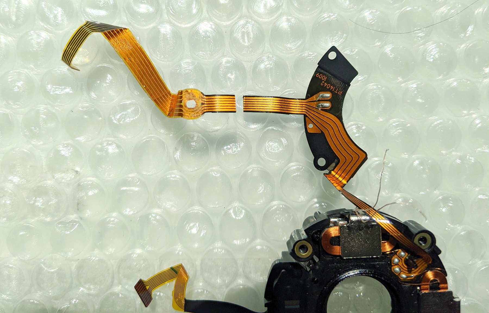

<!-- endExcerpt -->

`video: https://youtu.be/pU-NngSMhJM`

大概 2009年购入的 Nikon 55-200 VR 镜头防抖坏了，使用率很低，但偶尔出去玩的时候给儿子拍些运动的照片还是有用处的。找维修师傅竟然被拒“没有维修价值”。据说维修镜头这事，一看就会，一拆就废。之前已经[拆费过一个 18-55 狗头](https://youtu.be/8Y48-AidUsI)，这次还是斗胆自己拆机维修试试看。

拆机前我在网上搜了一下，看到别人也有同样的问题，有的自己动手成功修复，有的没有下文。从镜头后部能看到断开的排线，能确定故障的原因，但不知道这个排线的型号。拆开后照样子在 Taobao 买到排线配件，花一整天自己焊接飞线，但还是失败告终，估计是飞线未焊好，最后作罢原模原样装回去。

