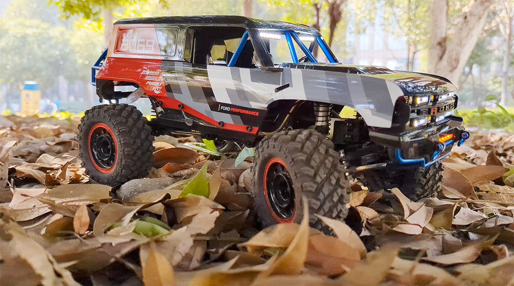
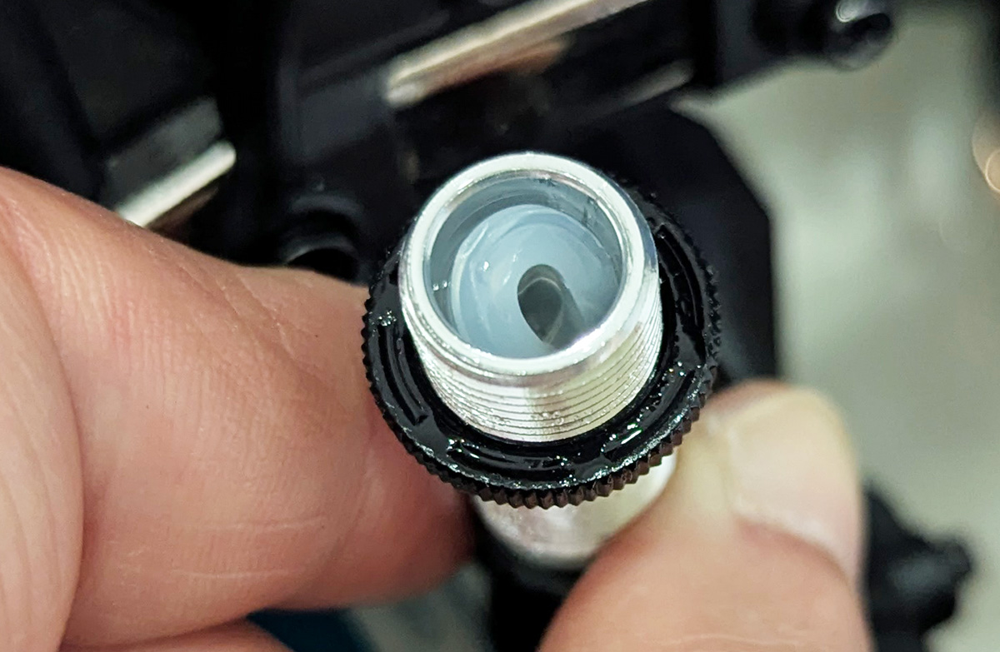
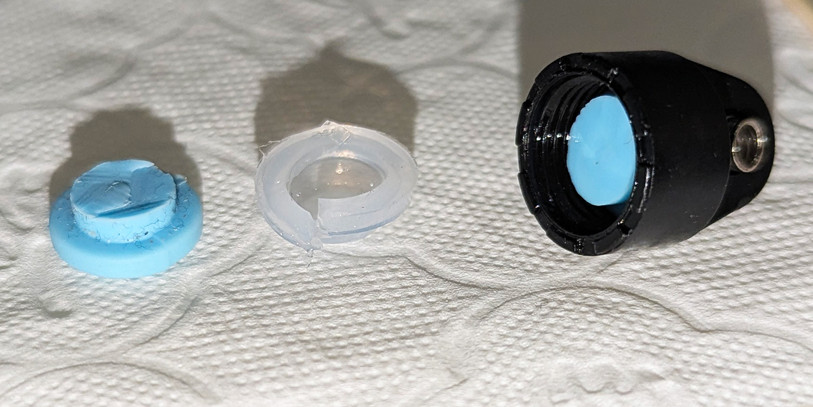
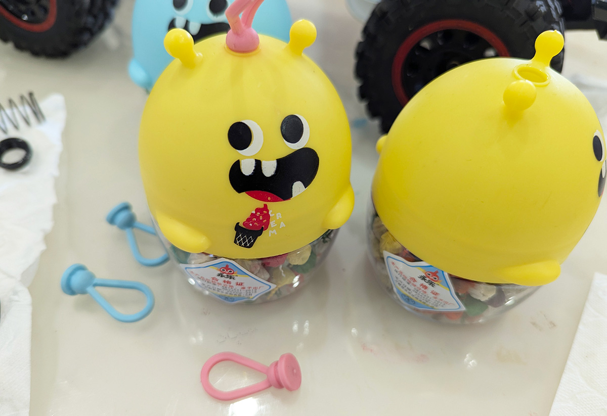

<!-- endExcerpt -->

买美嘉欣 H12P 作为圣诞节礼物给儿子。Ford Bronco 福特烈马授权的模型还原度很高，超帅！在公园玩时，总是一道靓丽的风景。

原厂的避震器密封胶圈尺寸不合适，安装时经常从原位置脱落导致漏油。玩的第二天初次发现漏油后，我拆开多个避震器看到胶圈是这种状态，而且有一个胶圈有破损。问卖家说他没有单独的胶圈配件，只能换整只避震器。

儿子的小鞭炮瓶子上的橡胶挂绳尺寸正好，我裁剪了几个换上，再也不漏油。自己裁剪的胶圈没有了气肺结构，所以灌满避震油后，要把弹簧压缩到最紧后再上紧盖子，否则避震桶是没法压缩的。我用的是 300号避震油，使用起来感觉没什么差别（对我这个业余者来说）。关于避震的安装，这个[视频](https://www.youtube.com/watch?v=NoRan7WgA9I)讲得很清楚。

汽车是每个男孩的梦想。给儿子拍一个超酷的短片。短片是模仿 [The All-New 2021 Ford Bronco Return of a legend](https://www.youtube.com/watch?v=dXWLrGkYh8Q)。

`video: https://youtu.be/caV4EUFh0is`
